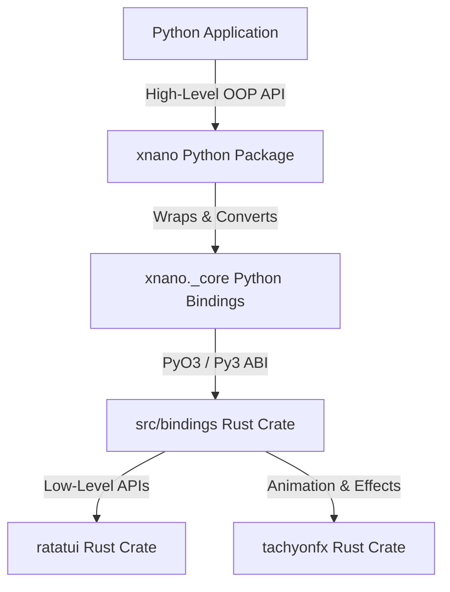

# Architecture and Code Style Guide for `xnano`

This document details the core philosophy, system architecture, native Rust binding structures, and high-level Python code style conventions for the `xnano` package.

---

## 1. Core Philosophy and Package Structure

`xnano` is a Python terminal user interface (TUI) framework that bridges the performance and feature richness of the Rust TUI ecosystem with the developer ergonomics of Python. 

The package is split into two distinct tiers with opposing but complementary design goals:
- **The Engine Tier (`src/` and `_core`)**: Focuses on maximum intersection, low-level fidelity, and raw performance bridging with Rust's `ratatui` and `tachyonfx` libraries.
- **The Ergonomics Tier (`xnano` Python package)**: High-level, pythonic, and object-oriented abstractions that prioritize clarity, readability, and a "Pydantic-like" developer experience.

---

## 2. Low-Level Ecosystem: `ratatui` and `tachyonfx`

### Ratatui
`ratatui` is the premier community-driven Rust library for building terminal user interfaces (a fork and successor of `tui-rs`).
- **Immediate Mode Rendering**: Layouts and widgets are completely declared/re-drawn on every frame cycle.
- **Terminal Backend Abstraction**: Interfaces with `crossterm` for cross-platform raw mode, alternate screen, event polling, and mouse support.
- **Widgets**: Divides widgets into stateless components (e.g., `Paragraph`, `Block`, `Gauge`, `Sparkline`, `BarChart`) and stateful components (e.g., `Table`, `List`) where the widget is drawn by passing a mutable state tracker that persists viewport and selection indexes.
- **Layout & Constraints**: A grid layout system partitioning rectangular regions (`Rect`) using `Constraint`s (`Percentage`, `Ratio`, `Length`, `Max`, `Min`, `Fill`).

### TachyonFX
`tachyonfx` is a layout and shader-like effect system built specifically for `ratatui`.
- **Visual Animations**: Color interpolations, fade-ins, dissolves, wipes, and particle effects on terminal grid cells.
- **Timeline Management**: Orchestrates sequences and groups of timed transitions on the frame buffer before rendering.

---

## 3. The Native Bridge: `src/` and `_core`

### The Rust Bindings (`src/`)
The native Rust implementation uses `pyo3` and `maturin` to build a mixed Python/Rust project targeting the Python Stable ABI (`abi3`) to ensure forward compatibility.

#### Rust File Structure (`src/bindings/`)
1. **`mod.rs`**: Entrypoint for the `_core` PyO3 module definition. Exposes classes, enums, and module-level functions to Python.
2. **`lib.rs`**: Module initialization setup.
3. **`terminal.rs`**: Handles raw terminal setup/restoration, size queries, and hooks into `ratatui`'s draw cycles. 
   - Uses an unsendable `PyFrame` holding a raw pointer (`ptr: usize`) to the underlying `ratatui::Frame` to safely bypass Rust's lifetime limits for Python's immediate callback model.
   - Converts `crossterm` keyboard/mouse events into Python-friendly classes.
4. **`buffer.rs`**: Exposes the `Buffer` and `Cell` abstractions, allowing manual manipulation of individual characters and styling.
5. **`layout.rs`**: Exposes `Rect`, `Layout`, `Margin`, `Constraint`, and related layout enums.
6. **`style.rs`**: Bridges foreground/background colors and modifier flags.
7. **`text.rs`**: Exposes `Span`, `Line`, and `Text` primitives.
8. **`widgets.rs`**: Exposes standard stateless and stateful `ratatui` widgets.
9. **`widgets_extra.rs`**: Exposes complex widgets (e.g. charts, scrollbars, gauges).
10. **`fx.rs`**: Bridges the `tachyonfx` effect system and manager (`PyEffect`, `PyCellFilter`, `PyEffectManager`).
11. **`palette.rs`**: Bridges Tailwind CSS color palettes and color spaces, supplying functions like `color_lerp`, `color_from_hsl`, `color_from_hex`, and `tailwind_color`.
12. **`convert.rs` / `convert_core.rs`**: Python-side type conversion to native Rust equivalents.

### The Python Bindings (`xnano._core`)
`_core` is the compiled Rust extension (`xnano/_core.pyi` provides the type stubs). It exposes *every* possible feature from the underlying Rust crates to Python, optimized for speed and direct mapping.

#### Exposed Core Types and Enums
- **Geometry & Layout**: `Rect`, `Margin`, `Direction`, `Alignment`, `Flex`, `Constraint`, `Offset`, `Size`, `Layout`, `Position`.
- **Text & Styling**: `Color`, `Modifier`, `Style`, `Span`, `Line`, `Text`.
- **Widgets**: `Borders`, `BorderType`, `TitlePosition`, `HighlightSpacing`, `Wrap`, `Block`, `Paragraph`, `ListItem`, `ListDirection`, `RatList`, `ListState`, `Gauge`, `Clear`, `Padding`, `Cell`, `Row`, `RatTable`, `TableState`, `ScrollbarOrientation`, `Scrollbar`, `ScrollDirection`, `ScrollbarState`, `Tabs`, `Sparkline`, `LineGauge`, `Bar`, `BarGroup`, `BarChart`.
- **Context & Lifecycle**: `Terminal`, `Frame`, `Buffer`.
- **Events**: `KeyEventKind`, `KeyModifiers`, `KeyCode`, `MouseEvent`.

---

## 4. The High-Level `xnano` Python Library

### Core Design Philosophy: "Pydantic-CLI"
The main `xnano` package wraps `_core` to present a clean, object-oriented API to Python developers. The core philosophy can be summarized as:
> **"What if Pydantic made a pydantic-cli?"**

Instead of building terminal layouts with immediate-mode function calls, nested builder patterns, or complex functional chains, the developer interacts with high-level Python objects that represent TUI structures.

Key guidelines:
- **Object-Oriented Abstraction**: Prefer descriptive classes, attributes, properties, and configuration objects over builder patterns or functional helpers.
- **Pythonic & Native**: Ensure styling, layouts, and lists feel native to Python (e.g., supporting standard data structures, iterables, and print-like interfaces).
- **Immutability where Possible**: Keep widgets and configurations immutable (e.g. frozen dataclasses) to avoid side-effects in layout calculation, following standard rust immediate-mode safety.

### Code Style Guidelines for `xnano`
To ensure a consistent, premium, and self-documenting API, all code written in the main `xnano` package must strictly follow these rules:

1. **No Shorthand Abbreviations**
   - We **never** use abbreviated variable names, parameter names, or class names.
   - *Example*: Use `Rectangle` (never `Rec` or `Rect`), `horizontal` (never `horiz` or `h`), `vertical` (never `vert` or `v`), `foreground` (never `fg`), `background` (never `bg`), `modifier` (never `mod`).
   
2. **Explicit and Verbose Function Names**
   - Getter/retrieval functions must explicitly use a verb prefix. 
   - *Example*: Use `get_url()` (never `url()`), `get_size()` (never `size()`), `get_area()` (never `area()`).
   
3. **No Builder Patterns**
   - Configure objects via standard constructors with typed keyword-only parameters or configuration classes, rather than chained `.width(10).height(20)` builder patterns.

4. **Preserve docstrings and type annotations**
   - All high-level classes must be fully typed and documented.
