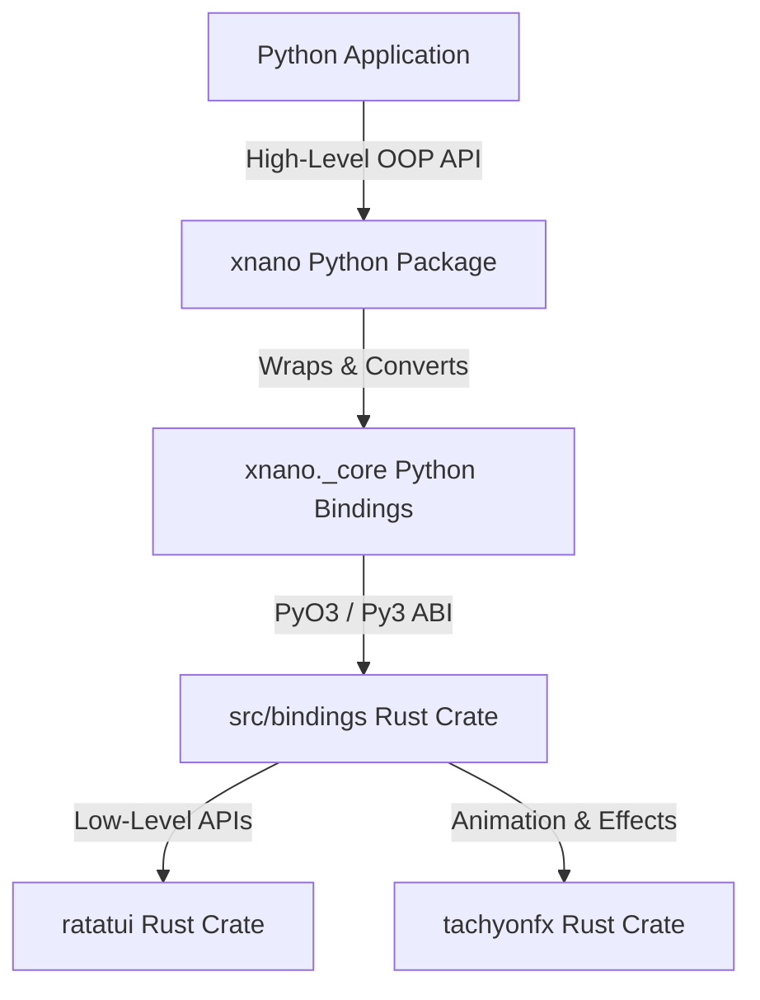

# Architecture and Code Style Guide for `xnano`

This document details the core philosophy, system architecture, native Rust binding structures, and high-level Python code style conventions for the `xnano` package.

---

## 1. Core Philosophy and Package Structure

`xnano` is a Python terminal user interface (TUI) framework that bridges the performance and feature richness of the Rust TUI ecosystem with the developer ergonomics of Python. 

The package is split into two distinct tiers with opposing but complementary design goals:
- **The Engine Tier (`src/` and `_core`)**: Focuses on maximum intersection, low-level fidelity, and raw performance bridging with Rust's `ratatui` and `tachyonfx` libraries.
- **The Ergonomics Tier (`xnano` Python package)**: High-level, pythonic, and object-oriented abstractions that prioritize clarity, readability, and a "Pydantic-like" developer experience.



---

## 2. Low-Level Ecosystem: `ratatui` and `tachyonfx`

### Ratatui
`ratatui` is the premier community-driven Rust library for building terminal user interfaces (a fork and successor of `tui-rs`).
- **Immediate Mode Rendering**: Layouts and widgets are completely declared/re-drawn on every frame cycle.
- **Terminal Backend Abstraction**: Interfaces with `crossterm` for cross-platform raw mode, alternate screen, event polling, and mouse support.
- **Widgets**: Divides widgets into stateless components (e.g., `Paragraph`, `Block`, `Gauge`, `Sparkline`, `BarChart`) and stateful components (e.g., `Table`, `List`) where the widget is drawn by passing a mutable state tracker that persists viewport and selection indexes.
- **Layout & Constraints**: A grid layout system partitioning rectangular regions (`Rect`) using `Constraint`s (`Percentage`, `Ratio`, `Length`, `Max`, `Min`, `Fill`).

### TachyonFX
`tachyonfx` is a layout and shader-like effect system built specifically for `ratatui`.
- **Visual Animations**: Color interpolations, fade-ins, dissolves, wipes, and particle effects on terminal grid cells.
- **Timeline Management**: Orchestrates sequences and groups of timed transitions on the frame buffer before rendering.

---

## 3. The Native Bridge: `src/` and `_core`

### The Rust Bindings (`src/`)
The native Rust implementation uses `pyo3` and `maturin` to build a mixed Python/Rust project targeting the Python Stable ABI (`abi3`) to ensure forward compatibility.

#### Rust File Structure (`src/bindings/`)
1. **`mod.rs`**: Entrypoint for the `_core` PyO3 module definition. Exposes classes, enums, and module-level functions to Python.
2. **`lib.rs`**: Module initialization setup.
3. **`terminal.rs`**: Handles raw terminal setup/restoration, size queries, and hooks into `ratatui`'s draw cycles. 
   - Uses an unsendable `PyFrame` holding a raw pointer (`ptr: usize`) to the underlying `ratatui::Frame` to safely bypass Rust's lifetime limits for Python's immediate callback model.
   - Converts `crossterm` keyboard/mouse events into Python-friendly classes.
4. **`buffer.rs`**: Exposes the `Buffer` and `Cell` abstractions, allowing manual manipulation of individual characters and styling.
5. **`layout.rs`**: Exposes `Rect`, `Layout`, `Margin`, `Constraint`, and related layout enums.
6. **`style.rs`**: Bridges foreground/background colors and modifier flags.
7. **`text.rs`**: Exposes `Span`, `Line`, and `Text` primitives.
8. **`widgets.rs`**: Exposes standard stateless and stateful `ratatui` widgets.
9. **`widgets_extra.rs`**: Exposes complex widgets (e.g. charts, scrollbars, gauges).
10. **`fx.rs`**: Bridges the `tachyonfx` effect system and manager (`PyEffect`, `PyCellFilter`, `PyEffectManager`).
11. **`palette.rs`**: Bridges Tailwind CSS color palettes and color spaces, supplying functions like `color_lerp`, `color_from_hsl`, `color_from_hex`, and `tailwind_color`.
12. **`convert.rs` / `convert_core.rs`**: Python-side type conversion to native Rust equivalents.

### The Python Bindings (`xnano._core`)
`_core` is the compiled Rust extension (`xnano/_core.pyi` provides the type stubs). It exposes *every* possible feature from the underlying Rust crates to Python, optimized for speed and direct mapping.

#### Exposed Core Types and Enums
- **Geometry & Layout**: `Rect`, `Margin`, `Direction`, `Alignment`, `Flex`, `Constraint`, `Offset`, `Size`, `Layout`, `Position`.
- **Text & Styling**: `Color`, `Modifier`, `Style`, `Span`, `Line`, `Text`.
- **Widgets**: `Borders`, `BorderType`, `TitlePosition`, `HighlightSpacing`, `Wrap`, `Block`, `Paragraph`, `ListItem`, `ListDirection`, `RatList`, `ListState`, `Gauge`, `Clear`, `Padding`, `Cell`, `Row`, `RatTable`, `TableState`, `ScrollbarOrientation`, `Scrollbar`, `ScrollDirection`, `ScrollbarState`, `Tabs`, `Sparkline`, `LineGauge`, `Bar`, `BarGroup`, `BarChart`.
- **Context & Lifecycle**: `Terminal`, `Frame`, `Buffer`.
- **Events**: `KeyEventKind`, `KeyModifiers`, `KeyCode`, `MouseEvent`.

---

## 4. The High-Level `xnano` Python Library

### Core Design Philosophy: "Pydantic-CLI"
The main `xnano` package wraps `_core` to present a clean, object-oriented API to Python developers. The core philosophy can be summarized as:
> **"What if Pydantic made a pydantic-cli?"**

Instead of building terminal layouts with immediate-mode function calls, nested builder patterns, or complex functional chains, the developer interacts with high-level Python objects that represent TUI structures.

Key guidelines:
- **Object-Oriented Abstraction**: Prefer descriptive classes, attributes, properties, and configuration objects over builder patterns or functional helpers.
- **Pythonic & Native**: Ensure styling, layouts, and lists feel native to Python (e.g., supporting standard data structures, iterables, and print-like interfaces).
- **Immutability where Possible**: Keep widgets and configurations immutable (e.g. frozen dataclasses) to avoid side-effects in layout calculation, following standard rust immediate-mode safety.

### Code Style Guidelines for `xnano`
To ensure a consistent, premium, and self-documenting API, all code written in the main `xnano` package must strictly follow these rules:

1. **No Shorthand Abbreviations**
   - We **never** use abbreviated variable names, parameter names, or class names.
   - *Example*: Use `Rectangle` (never `Rec` or `Rect`), `horizontal` (never `horiz` or `h`), `vertical` (never `vert` or `v`), `foreground` (never `fg`), `background` (never `bg`), `modifier` (never `mod`).
   
2. **Explicit and Verbose Function Names**
   - Getter/retrieval functions must explicitly use a verb prefix. 
   - *Example*: Use `get_url()` (never `url()`), `get_size()` (never `size()`), `get_area()` (never `area()`).
   
3. **No Builder Patterns**
   - Configure objects via standard constructors with typed keyword-only parameters or configuration classes, rather than chained `.width(10).height(20)` builder patterns.

4. **Preserve docstrings and type annotations**
   - All high-level classes must be fully typed and documented.

---

## 5. The Beta API (`xnano.beta`)

Until version `1.0.0`, all future changes to the API will take place within the `xnano.beta` module. The primary goals and architectural constraints of this beta playground are:

- **Stability & Experimentation**: The main API remains stable, while `xnano.beta` serves as the playground to achieve the "pydantic" developer experience of a TUI library.
- **Drop-in Replacement**: `xnano.beta` is structured as a drop-in replacement for `xnano` itself. Everything inside `xnano.beta` is named and structured as if `beta` were `xnano`. It is completely decoupled from the main API, except for its dependency on the native `xnano._core` bindings (and the corresponding `xnano._core.pyi` stubs).
- **Binding Isolation & Core Intersection Layer**: A primary focus of the beta API is ensuring that no native `_core` types touch anything in the main public API surfaces. To achieve this, rather than updating the original `xnano._convert.py`, all of its functionality is integrated into `xnano.beta.core/` (the core/intersection layer of the beta API) along with many of the internal operations that public surfaces like `xnano.terminal` and `xnano.widgets` must perform. This ensures that the public surface API remains extremely clean and focused strictly on what the library looks like and what it can do.

# [!! IMPORTANT !! - CODE SEMANTICS] 

All code written within the ``xnano.beta`` module must strictly follow these following rules and conventions:

## Code Style & Formatting Rules

### Import Patterns

Imports follow a very strict and opinionated pattern:

1. For **all** imports of the standard library, **aside from ``typing``**, the module must always be imported directly.
   1. Incorrect: ``from dataclasses import dataclass`` ``import typing``
   2. Correct: ``import abc`` ``import dataclasses`` ``from typing import Any``

2. For **external libraries**
   1. If the library is a single module, **or** it is used **only** for functions that are exposed at the top level of the library, the module must always be imported directly.
      1. This rule also follows up for external libraries where it is being used primarily for methods at the top level, along with one or two additional classes. These cases **must** use both import patterns.
      If it is approriate or allowed to import the associated class (even if it is available at the top level) from a lower level module, then that pattern is the perferred option.
      Example: ``import mylib\nfrom mylib.types import ImportantType``
   2. For all other libraries the library must be imported with the ``from <library_name> import <module_name>`` pattern.

All import lines above 79 characters must be wrapped in parantheses
with new lines.

### Shorthand Abbreviation Rules

Class, function, method and property names never abbreviate common words or concepts.

  - **Incorrect**: ``Rect``, ``Term``, ``caps``
  - **Correct**: ``Rectangle``, ``Terminal``, ``capabilities``
  - This rule may be broken **only** in situations where the operation or abbreviation directly maps to a stdlib python name (such as ``repr``)

### Function Naming Standardization Rules

All functions must be named using the following conventions:

 - Function names that are not class methods **must never** be a single word.
   - NOTE: This is not a rule 100% of the time. For example, one of the ``zyx`` library's main user facing abstractions are called `semantic operations`, which are llm-powered operations that perform various tasks on python objects. **ONLY IF** a function is intended or implemented as one of the core features and/or user facing abstractions **AND** it's usage is presented in documentation as ``import module`` then ``module.fn()`` ``module.fn2()`` then it may be a single word.
     - Example: The semantic operations in ``zyx`` are named ``zyx.edit(...)`` (uses an LLM to edit python objects), ``zyx.parse(...)`` (confidence based LLM parsing), ``zyx.run(...)`` (standard agent loop).
  
Below is a structured list of common function types and how they should be named:

**Case**: For class methods that return one of their own properties and/or
fields.
**Pattern**: ``get_<property_name>()``
**Example**: ``get_name()``

**Case**: For class methods that return themselves, or a copy of themselves (or their entire/main value) in a mutated format.
**Pattern**: ``as_<mutated_format>()``
**Example**: ``Color(<some_content>).as_rgb()``

**Case**: For class methods that return a copy of one of their own properties and/or fields in a mutated format.
**Pattern**: ``get_<property_name>_as_<mutated_format>()``
**Example**: ``get_name_as_rgb()``

**Case**: For class methods that directly modify itself in place.
**Pattern**: ``<verb>``
**Example**: ``normalize()``, ``capitalize()``

### **Documentation**

### Module Headers

Documentation is **essential** to ``xnano`` and follows a very strict standardization.

**Module / Script Naming**

All modules (scripts) must contain a header docstring that follows
the following format:

**Case 1: If No Notes are Required (Most Cases)**

```python
"""<path>.<to>.<module>"""
```

**Case 2: If **ANY** Non-Title Content is Necessary**

```python
"""<path>.<to>.<module>

---

<additional content / notes only if necessary or if
this is an __init__.py to a core subpackage>
"""
```

Notes:

1. All scripts must contain the header docstring.
2. There is no ``.py`` extension in module name.
3. ``__init__.py`` files never contain ``__init__`` just the module name.
4. Additional content / notes must always be separated with a divider and new lines, the first line must always only be the path of the module.

### Classes (& Class Style Guide [IMPORTANT])

Classes are the core building blocks of ``xnano``'s design philosophy and follow ``pydantic``'s design conventions and ideas. Classes should be **preferred** to be defined as dataclasses over classes with their own
``__init__`` methods when possible.

Classes are **heavily** attribute based, specifically the attributes they
are initialized with.

Properties must only be used to represent attributes that are initialized
within the class as private attributes, **computed on post initialization**,
and represent a derived representation of one or more of the class's main
attributes.
   - Example:

      ```python
      @dataclasses.dataclass
      class MyClass:
         # NOTES;
         # The first line(s) must only be to describe the main (and short)
         # purpose of the class and cannot be more than 2 sentences.
         """This is a class that does some stuff.

         Attributes:
            property: This is a property
            another_property: This is another property
         """

         # NOTES:
         # no additional lines between docstrings/fields
         # only primary fieds must recieve a docstring, these docstrings should be more detailed than what was described on 'Attributes:'
         # If docstring is more than a line, the end `"""` must be on a
         # new line, for a 1 line docstring it is on the same line.
         property: str
         """This is a property."""
         another_property: int
         """A very important very detailed thing that does a lot of
         very important stuff.

         Heres what it does wow look how cool!
         """

         # NOTES:
         # single space separating main init level fields from private attributes
         # only important private attributes require docstrings, otherwise
         # not needed
         # private attributes **must NEVER** be on the iniialization list
         # or available as init args
         _some_private_attribute: int = dataclasses.field(init=False)
         _another_private_attribute: int = dataclasses.field(init=False)

         def __post_init__(self):
            self._new_private_attribute = self.property + 1

         # NOTES:
         # Only important private attributes or computed proeprties
         # that represent a derived representation of one or more of the
         # class's main attributes can be properties.
         @property
         def new_private_attribute(self) -> int:
            """This is a property."""
            # properties do not include 'Returns:' in their docstring
            return self._new_private_attribute

         # even though tis is a private attribute, it recieves a dcostring
         # because it is a function
         def get_some_private_attribute(self) -> str:
            """This is a property.
            
            Returns:
               The value of the attribute.
            """
            return self._some_private_attribute
      ```

### Functions

Function docstrings are structured using the standard `Args:`, `Returns:` and `Raises:` sections.

### Types

``xnano.beta`` **HEAVILY** utilizes type aliases, and especially ``typing.Union`` and ``typing.Literal`` based types. Any types that are defined inline must be annotated with an associated docstring **and separated by 2 lines from other content (same as all other item types except for class methods which are 1 new line and class fields/attributes which are no new lines unless going from init attributes to private attributes)

Whenever applicatble ``xnano.beta`` uses the ``|`` syntax over ``typing.Union`` following a strict set of conditions based on where the type is
being used.

**Case 1: If the type is used as a class attribute or field**:
   Unless the type is something simple such as ``int | bool`` , the type must be defined as a ``TypeAlias`` outside the class first.

**Case 2: If the type is used as a function parameter or return type**:
   If it is a on-off type, it may be annotated inline within a function parameter **untill or unless** it goes far enough to cause a new line within the function signature.

   In this case it must be defined as a ``TypeAlias`` outside the function first.

   **Bad Example**

   ```python
   def my_function(my_type : (
      int | bool | SomeModel | SomeOtherModel
   )) -> ...
   
   def my_function(
      my_type: (
         int
         | bool
         | ...
      )
   )
   ```

   **Good Example**

   ```python
   MyType: TypeAlias = int | bool | ...
   """This is a ..."""

   # if the union is more than a single line, it must be wrapped in
   # paranthesis with this format
   MyType: TypeAlias = (
      int
      | bool
      | ...
   )
   """This is a ..."""

   def my_function(
      my_type: MyType
   ) -> MyType:
      """This is a function."""
      return my_type
   ```