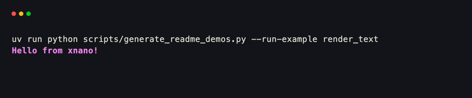
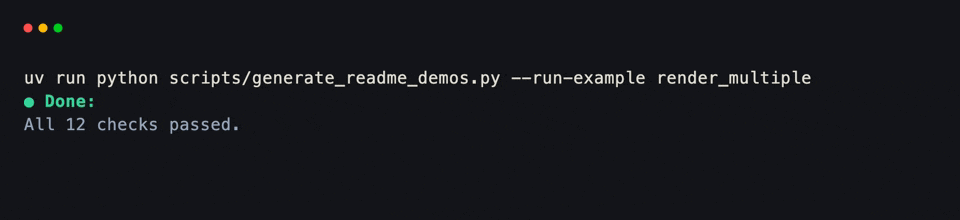
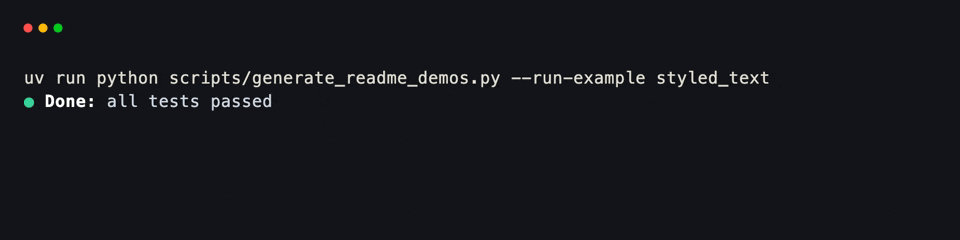
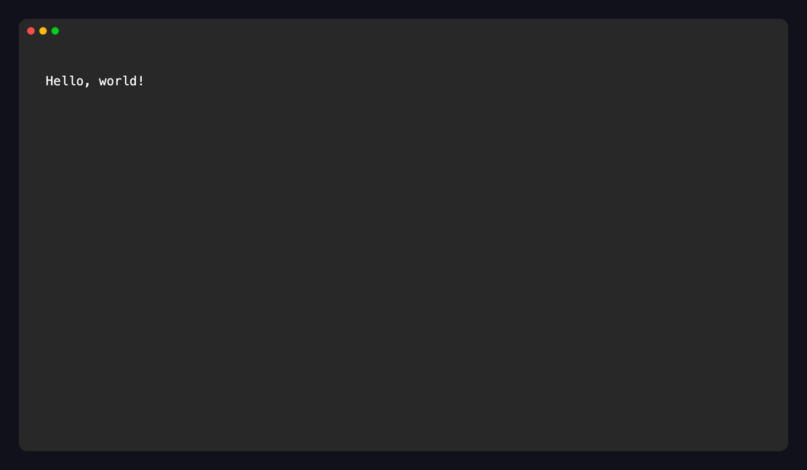
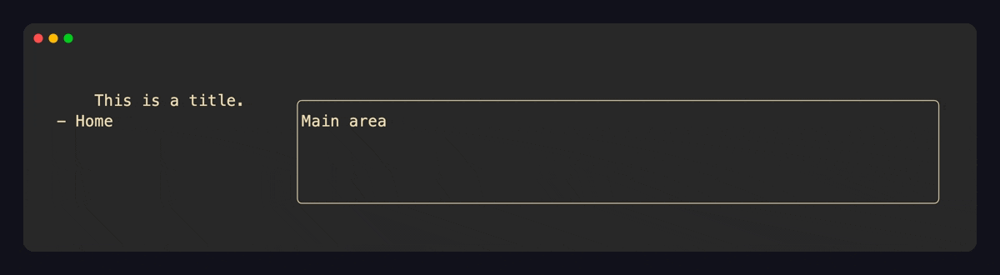
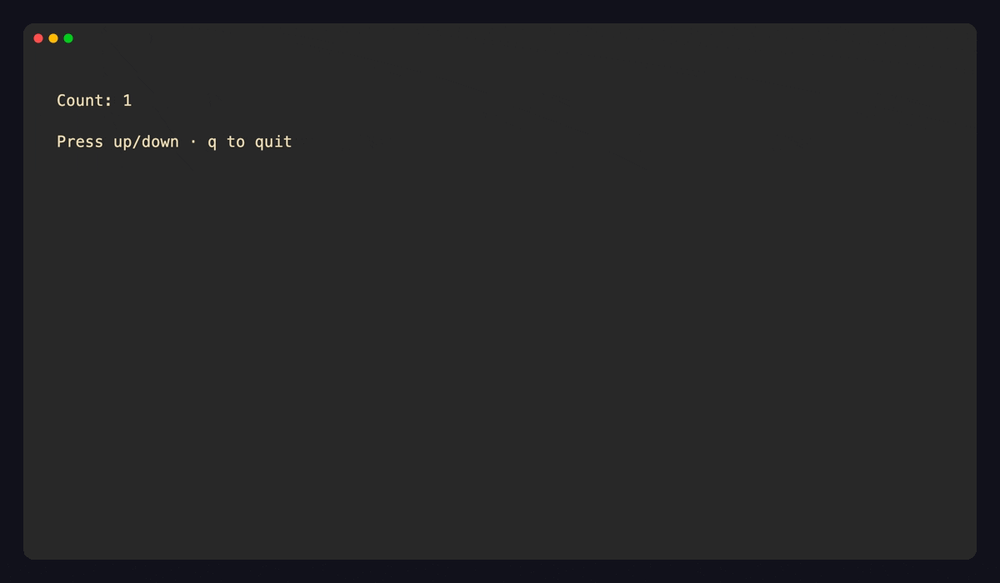
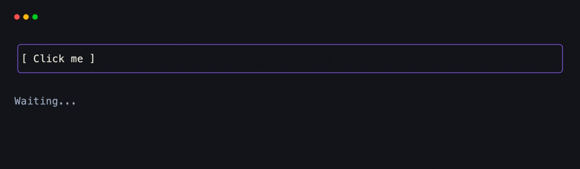
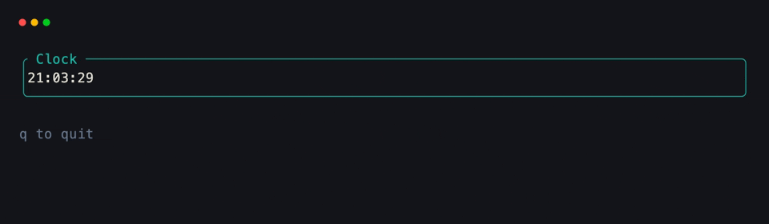
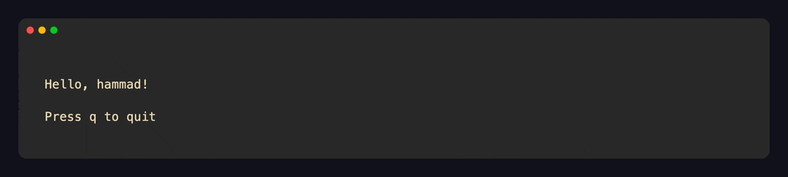
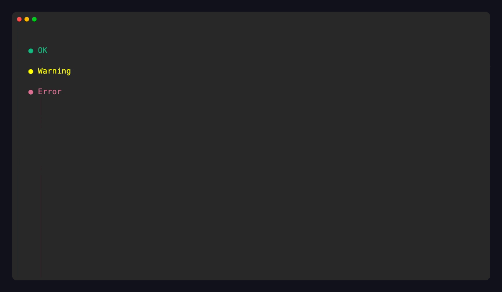

# __xnano__

> A simple python **tui** framework built on top of the [ratatui](https://ratatui.rs) and [tachyonfx](https://github.com/ratatui/tachyonfx) rust libraries.

> [!NOTE]
> Documentation with examples that are runnable & editable in-browser are now available at [https://xnano.hammad.app](https://xnano.hammad.app)!

xnano is a modern, lightweight and incredibly declarative TUI framework for Python. It is built on top of the [xnano-core](https://github.com/hsaeed3/xnano/tree/main/xnano-core) rust library, which provides the core rendering and event handling capabilities through:

- [ratatui](https://ratatui.rs) A Rust library for building terminal user interfaces.
- [tachyonfx](https://github.com/ratatui/tachyonfx) Rust library for adding effects and animations to ratatui applications.

Furthermore, `xnano` itself uses the [`pydantic-core`](https://github.com/pydantic/pydantic/tree/main/pydantic_core) library for type validation and similar operations.

## Installation

```bash
pip install "xnano>=1.0.13"
```

Or use ``uv``:

```bash
uv add "xnano>=1.0.13"
```

> [!TIP]
> Try running the `python -m xnano` or `uv run xnano` commands to test out the built in demo application.

---

## Examples

You can view the code for these examples here: [examples](./examples).


### Your first render

The easiest way to get started is the print-like `render()` helper — no
session, no event loop. It writes styled content to the terminal and returns.

```python
from xnano import render
from xnano.components.text import Text

render(
    Text("Hello from xnano!", color="violet", modifiers=["bold"])
)
```



You can pass multiple renderables — they stack vertically:

```python
from xnano import render
from xnano.components.text import Text

render(
    Text("● Done: ", color="emerald-400", modifiers=["bold"]),
    Text("All 12 checks passed.", color="slate-400"),
)
```



---

### Styled text

`Text` composes rich inline content with colors, modifiers, and nesting:

```python
from xnano import render
from xnano.components.text import Text

message = Text([
    Text("● ", color="emerald-400"),
    Text("Done: ", color="white", modifiers=["bold"]),
    Text("all tests passed\n", color="slate-300"),
])

render(message)
```



Colors accept Tailwind names (`"violet-500"`), hex strings (`"#a78bfa"`), or plain names (`"white"`, `"red"`).

---

### Hello World

The minimal xnano app. Define a `BaseGrid` subclass with annotated `Field`
slots, then pass an instance to `Terminal().run()`. The terminal takes over
the screen, renders each frame, and cleans up on exit.

```python
from xnano.grid import BaseGrid
from xnano.fields import Field
from xnano.tui import Terminal
from xnano.context import Context
from xnano.color import tailwind_color
from xnano.events import on_tick, on_keyboard

class App(BaseGrid):
    message: str = Field(
        default="Hello, world!",
        color=tailwind_color("sky", 500),
    )
    current_color: str = Field(default="sky", state=True)

    @on_tick(1000)
    def update_color(self) -> None:
        if self.current_color == "sky":
            self.current_color = "white"
            self.grid_set_field("message", color="white")
        else:
            self.current_color = "sky"
            self.grid_set_field(
                "message",
                color=tailwind_color("sky", 500),
            )

    @on_keyboard("q")
    def quit(self, ctx: Context) -> None:
        ctx.terminal.request_exit()

Terminal().run(App())
```



---

### Strict Type Safety

Any field with a type annotation is set with `Field(strict=True)` and is validated through the `pydantic-core` library by default.

### Layout & Nesting

Grids compose naturally — nest one `BaseGrid` inside another as a `Field`
value. Direction (`"horizontal"` / `"vertical"`) and `gap` control how fields
are laid out. Use `width` / `height` (absolute cells, `"50%"`, or `"1fr"`) to
proportion each slot.

```python
from xnano.grid import BaseGrid
from xnano.fields import Field
from xnano.tui import Terminal
from xnano.context import Context
from xnano.events import on_keyboard

class SidebarTitle(BaseGrid, align="center"):
    title: str = Field("This is a title.", align="center")

class Sidebar(BaseGrid, direction="vertical"):
    title: SidebarTitle = Field(
        default_factory=SidebarTitle,
        height="10%",
    )
    nav: str = Field(default="- Home", height="1fr")

class App(BaseGrid, direction="horizontal", gap=1):
    sidebar: Sidebar = Field(
        default_factory=Sidebar,
        width="25%",
    )
    content: str = Field(
        default="Main area",
        width="1fr",
        border="rounded",
    )

    @on_keyboard("q")
    def quit(self, ctx: Context) -> None:
        ctx.terminal.request_exit()

Terminal().run(App())
```



---

### Keyboard Events

Use `@on_keyboard` to bind methods to key names or sequences. The decorated
method receives an optional `Context` argument that exposes the live terminal.
State fields (`state=True`) hold app data without rendering — update them and
reference them from layout fields.

```python
from xnano.grid import BaseGrid
from xnano.fields import Field
from xnano.tui import Terminal
from xnano.context import Context
from xnano.events import on_keyboard

class Counter(BaseGrid, direction="vertical", gap=1):
    label: str = Field(
        default="Count: 0",
        height=1,
        border="rounded",
        border_color="violet-500",
    )
    hint: str = Field(
        default="  ↑ / ↓ to count  ·  q to quit",
        height=1,
        color="slate-500",
    )
    count: int = Field(default=0, state=True)

    @on_keyboard("up")
    def increment(self) -> None:
        self.count += 1
        self.label = f"Count: {self.count}"

    @on_keyboard("down")
    def decrement(self) -> None:
        self.count -= 1
        self.label = f"Count: {self.count}"

    @on_keyboard("q")
    def quit(self, ctx: Context) -> None:
        ctx.terminal.request_exit()

Terminal().run(Counter())
```



---

### Click Handlers

Pass `mouse_events=True` to `Terminal` to enable mouse input. Use
`@on_click("field_name")` to scope a handler to the rendered area of a
specific field — the handler fires only when that region is clicked.

```python
from xnano.grid import BaseGrid
from xnano.fields import Field
from xnano.tui import Terminal
from xnano.context import Context
from xnano.events import on_click, on_keyboard

class App(BaseGrid, direction="vertical", gap=1):
    button: str = Field(
        default="  [ Click me ]  ",
        height=3,
        border="rounded",
        border_color="violet-500",
    )
    status: str = Field(
        default="  Waiting...",
        height=1,
        color="slate-400",
    )

    @on_click("button")
    def on_button(self, ctx: Context) -> None:
        self.status = "  Clicked!"

    @on_keyboard("q")
    def quit(self, ctx: Context) -> None:
        ctx.terminal.request_exit()

Terminal(mouse_events=True).run(App())
```



---

### Timed Updates

`@on_tick(interval_ms)` fires a method on a recurring timer. Use it for
clocks, progress indicators, polling, or any periodic UI refresh without
blocking the event loop.

```python
import time
from xnano.grid import BaseGrid
from xnano.fields import Field
from xnano.tui import Terminal
from xnano.context import Context
from xnano.events import on_tick, on_keyboard

class Clock(BaseGrid, direction="vertical", gap=1):
    time_display: str = Field(
        default="",
        height=3,
        border="rounded",
        border_color="teal-500",
        title=" Clock ",
    )
    hint: str = Field(
        default="  q to quit",
        height=1,
        color="slate-500",
    )

    def __post_init__(self) -> None:
        self.time_display = f"  {time.strftime('%H:%M:%S')}"

    @on_tick(1000)
    def update_time(self) -> None:
        self.time_display = f"  {time.strftime('%H:%M:%S')}"

    @on_keyboard("q")
    def quit(self, ctx: Context) -> None:
        ctx.terminal.request_exit()

Terminal(tick_interval=1000).run(Clock())
```



---

### State & Context Manager

Pass any object as `state` to `Terminal` to thread shared data through the
session. Every `BaseGrid` instance can read it via `self.state`. Override
`grid_render()` to recompute field values once per frame — useful when
display depends on state that changes externally.

```python
from dataclasses import dataclass
from xnano.grid import BaseGrid
from xnano.fields import Field
from xnano.tui import Terminal
from xnano.context import Context
from xnano.events import on_keyboard

@dataclass
class AppState:
    username: str = "guest"

class App(BaseGrid, direction="vertical", gap=1):
    header: str = Field(
        default="",
        height=1,
        color="white",
        background="violet-900",
    )
    body: str = Field(
        default="Press q to quit",
        color="slate-400",
    )

    def grid_render(self) -> None:
        self.header = f"  Hello, {self.state.username}!"

    @on_keyboard("q")
    def quit(self, ctx: Context) -> None:
        ctx.terminal.request_exit()

with Terminal(state=AppState(username="hammad")) as t:
    t.run(App())
```



---

### Custom Components

`AbstractComponent` lets you build reusable widgets that map directly to the
render tree. Prefer implementing `compose()` to return interface-neutral
content; `get_terminal_node()` remains a compatibility adapter that can return
any `AbstractTerminalNode` (paragraph, list, progress bar, table, etc.).
Components slot into `BaseGrid` fields like any other value.

```python
import dataclasses
from xnano.grid import BaseGrid
from xnano.fields import Field
from xnano.tui import Terminal
from xnano.context import Context
from xnano.color import tailwind_color, pydantic_color
from xnano.events import on_keyboard
from xnano.components.abstract import (
    AbstractComponent,
    ComponentRenderContext,
)
from xnano.tui.nodes import ParagraphNode, AbstractTerminalNode

@dataclasses.dataclass
class Badge(AbstractComponent):
    label: str = ""
    color: str = "white"

    def get_terminal_node(
        self,
        ctx: ComponentRenderContext,
    ) -> AbstractTerminalNode:
        return ParagraphNode(text=self.label, color=self.color)

class StatusBoard(BaseGrid, direction="vertical", gap=1):
    ok: Badge = Field(
        default_factory=lambda: Badge(
            label="● OK",
            color=tailwind_color("emerald", 500),
        ),
        height=1,
    )
    warn: Badge = Field(
        default_factory=lambda: Badge(
            label="● Warning",
            color="yellow",
        ),
        height=1,
    )
    err: Badge = Field(
        default_factory=lambda: Badge(
            label="● Error",
            color=pydantic_color("palevioletred"),
        ),
        height=1,
    )

    @on_keyboard("q")
    def quit(self, ctx: Context) -> None:
        ctx.terminal.request_exit()

Terminal().run(StatusBoard())
```


