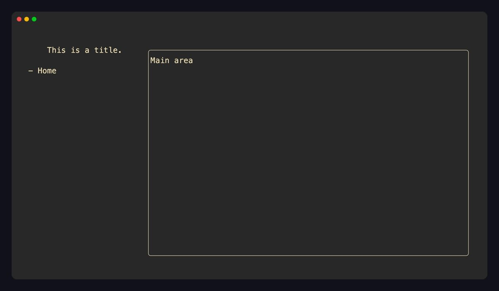

# __xnano__

A simple python **tui** framework built on top of the [ratatui](https://ratatui.rs) and [tachyonfx](https://github.com/ratatui/tachyonfx) rust libraries.

> [!IMPORTANT]
> The ``xnano`` library is currently going through a complete rebuild of it's primary purpose and API. As the
> package is still in beta, expect frequent changes from all package versions ``0.99.xx`` and above until
> the stable ``1.0.0`` release.
>
> Docs will soon be available at: [xnano.hammad.app](https://xnano.hammad.app).
>

xnano is a modern, lighweight and incredibly declarative TUI framework for Python. It is built on top of the [xnano-core](https://github.com/hsaeed3/xnano/tree/main/xnano-core) rust library, which provides the core rendering and event handling capabilities through:

- [ratatui](https://ratatui.rs) A Rust library for building terminal user interfaces.
- [tachyonfx](https://github.com/ratatui/tachyonfx) Rust library for adding effects and animations to ratatui applications.

Furthermore, `xnano` itself uses the [`pydantic-core`](https://github.com/pydantic/pydantic/tree/main/pydantic_core) library for type validation and similar operations.

## Installation

> [!WARNING]
> Ensure to install the ``0.99.6``+ version of ``xnano`` to ensure correct
> dependency and API resolution.

```bash
pip install "xnano>=0.99.6"
```

Or use ``uv``:

```bash
uv add "xnano>=0.99.6"
```

---

## Examples

### Hello World

The minimal xnano app. Define a `Grid` subclass with annotated `Field` slots, then pass an instance to `Terminal().run()`. The terminal takes over the screen, renders each frame, and cleans up on exit.

```python
# xnano may remind you of `pydantic` in many places, this is
# one of them.
from xnano.beta import Grid, Field, Terminal
from xnano.beta.color import tailwind_color
from xnano.beta.hooks import on_tick

class App(Grid):
    message: str = Field(default="Hello, world!", color=tailwind_color("sky", 500))
    current_color: str = Field(default="sky", state=True)

    @on_tick(1000)
    def update_color(self) -> None:
        if self.current_color == "sky":
            self.current_color = "white"
            self.grid_set_field("message", color="white")
        else:
            self.current_color = "sky"
            self.grid_set_field("message", color=tailwind_color("sky", 500))

Terminal().run(App())
```


---

### Strict Type Safety

Any field with a type annotation is set with `Field(strict=True)` and is validated through the `pydantic-core` library by default.

### Layout & Nesting

Grids compose naturally — nest one `Grid` inside another as a `Field` value. Direction (`"horizontal"` / `"vertical"`) and `gap` control how fields are laid out. Use `size` (absolute columns/rows or a `0.0–1.0` fraction) and `flex` (fill weight) to proportion each slot.

```python
from xnano.beta import Grid, Field, Terminal, Context
from xnano.beta.hooks import on_keyboard

class SidebarTitle(Grid, align="center"):
    title: str = Field("This is a title.", align="center")

class Sidebar(Grid, direction="vertical"):
    title: SidebarTitle = Field(default_factory=SidebarTitle, size=0.1)
    nav: str = Field(default="- Home", size=0.9, flex="flex-auto")

class App(Grid, direction="horizontal", gap=1):
    sidebar: Sidebar = Field(default_factory=Sidebar, size=0.25)
    content: str = Field(default="Main area", flex=1, border="rounded")

    @on_keyboard("q")
    def quit(self, ctx: Context) -> None:
        ctx.terminal.request_exit()

Terminal().run(App())
```



---

### Keyboard Events

Use `@on_keyboard` to bind methods to key names or sequences. The decorated method receives an optional `Context` argument that exposes the live terminal. State fields (`state=True`) hold app data without rendering — update them and reference them from layout fields.

```python
from xnano.beta import Grid, Field, Terminal, Context
from xnano.beta.hooks import on_keyboard

class Counter(Grid, direction="vertical", gap=1):
    label: str = Field(default="Count: 0", size=1)
    hint: str = Field(default="Press up/down to change, q to quit", size=1)

    count: int = Field(default=0, state=True)

    @on_keyboard("up")
    def increment(self) -> None:
        self.count += 1
        self.label = f"Count: {self.count}"

    @on_keyboard("down")
    def decrement(self) -> None:
        self.count -= 1
        self.label = f"Count: {self.count}"

    @on_keyboard("q")
    def quit(self, ctx: Context) -> None:
        ctx.terminal.request_exit()

Terminal().run(Counter())
```


---

### Click Handlers

Pass `mouse_events=True` to `Terminal` to enable mouse input. Use `@on_click("field_name")` to scope a handler to the rendered area of a specific field — the handler fires only when that region is clicked.

```python
from xnano.beta import Grid, Field, Terminal, Context
from xnano.beta.hooks import on_click, on_keyboard

class App(Grid, direction="vertical", gap=1):
    button: str = Field(default="[ Click me ]", size=3, border="rounded")
    status: str = Field(default="Waiting...", flex=1)

    @on_click("button")
    def on_button(self, ctx: Context) -> None:
        self.status = "Clicked!"

    @on_keyboard("q")
    def quit(self, ctx: Context) -> None:
        ctx.terminal.request_exit()

Terminal(mouse_events=True).run(App())
```


---

### Timed Updates

`@on_tick(interval_ms)` fires a method on a recurring timer. Use it for clocks, progress indicators, polling, or any periodic UI refresh without blocking the event loop.

```python
from xnano.beta import Grid, Field, Terminal, Context
from xnano.beta.hooks import on_tick, on_keyboard
import time

class Clock(Grid, direction="vertical"):
    time_display: str = Field(default="", size=3, border="rounded")

    def __post_init__(self) -> None:
        self.time_display = time.strftime("%H:%M:%S")

    @on_tick(1000)
    def update_time(self) -> None:
        self.time_display = time.strftime("%H:%M:%S")

    @on_keyboard("q")
    def quit(self, ctx: Context) -> None:
        ctx.terminal.request_exit()

Terminal().run(Clock())
```


---

### State & Context Manager

Pass any object as `state` to `Terminal` to thread shared data through the session. Every `Grid` instance can read it via `self.state`. Override `grid_render()` to recompute field values once per frame — useful when display depends on state that changes externally.

```python
from dataclasses import dataclass
from xnano.beta import Grid, Field, Terminal, Context
from xnano.beta.hooks import on_keyboard

@dataclass
class AppState:
    username: str = "guest"

class App(Grid, direction="vertical", gap=1):
    header: str = Field(default="", size=1)
    body: str = Field(default="Press q to quit", flex=1)

    def grid_render(self) -> None:
        self.header = f"Hello, {self.state.username}!"

    @on_keyboard("q")
    def quit(self, ctx: Context) -> None:
        ctx.terminal.request_exit()

with Terminal(state=AppState(username="hammad")) as t:
    t.run(App())
```


---

### Custom Components

`AbstractComponent` lets you build reusable widgets that map directly to the render tree. Subclass it as a dataclass and implement `get_node()` — return any `RenderNode` (paragraph, list, progress bar, table, etc.) and xnano handles the rest. Components slot into `Grid` fields like any other value.

```python
import dataclasses
from xnano.beta import Grid, Field, Terminal, Context
from xnano.beta.color import tailwind_color, pydantic_color
from xnano.beta.hooks import on_keyboard
from xnano.beta.components.abstract import AbstractComponent, ComponentRenderContext
from xnano.beta.core.nodes import ParagraphNode, RenderNode


@dataclasses.dataclass
class Badge(AbstractComponent):
    label: str = ""
    color: str = "white"

    def get_node(self, ctx: ComponentRenderContext) -> RenderNode:
        return ParagraphNode(text=self.label, color=self.color)


class StatusBoard(Grid, direction="vertical", gap=1):
    ok: Badge = Field(default_factory=lambda: Badge(label="● OK", color=tailwind_color("emerald", 500)), size=1)
    warn: Badge = Field(default_factory=lambda: Badge(label="● Warning", color="yellow"), size=1)
    err: Badge = Field(default_factory=lambda: Badge(label="● Error", color=pydantic_color("palevioletred")), size=1)

    @on_keyboard("q")
    def quit(self, ctx: Context) -> None:
        ctx.terminal.request_exit()


Terminal().run(StatusBoard())
```


