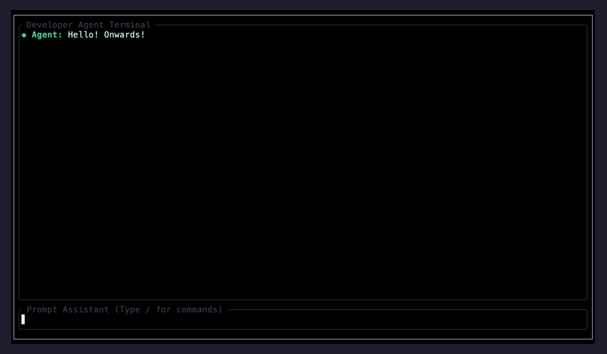
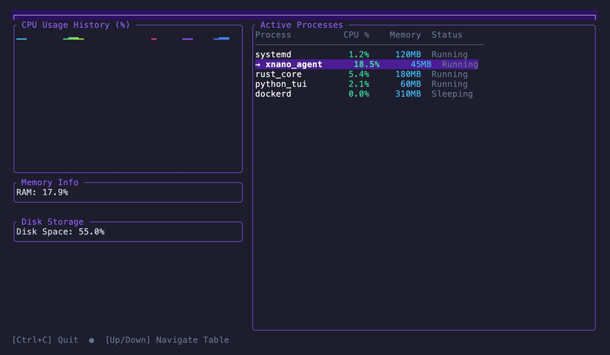
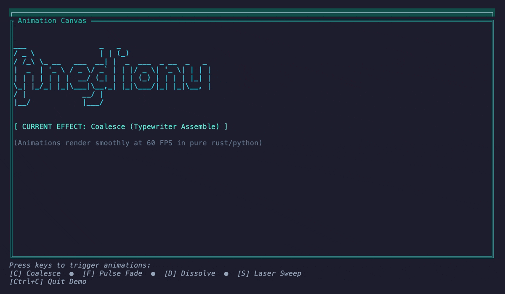
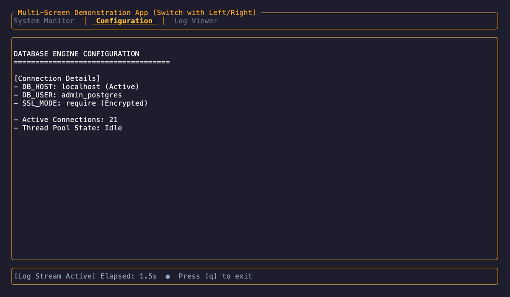

# __xnano__

A simple python **tui** framework built on top of the [ratatui](https://ratatui.rs) and [tachyonfx](https://github.com/ratatui/tachyonfx) rust libraries.

> [!IMPORTANT]
> The ``xnano`` library is currently going through a complete rebuild of it's primary purpose and API. As the
> package is still in beta, expect frequent changes from all package versions ``0.99.xx`` and above until
> the stable ``1.0.0`` release.
>
> Docs will soon be available at: [xnano.hammad.app](https://xnano.hammad.app).
>

xnano is a **zero dependency** (aside from rust crates) python library that ports various capabilities of the [ratatui](https://ratatui.rs) and [tachyonfx](https://github.com/ratatui/tachyonfx) rust terminal UI libraries into an API that aims to feel as pythonic as possible.

---

## Installation

> [!IMPORTANT]
> Ensure all versions of `xnano` installed are above `0.99.0`

```bash
pip install 'xnano>=0.99.0'
```

---

## Examples

**Agent Chat**

[View Example](https://github.com/hsaeed3/xnano/blob/main/examples/agent_chat.py)



### Dashboard

[View Example](https://github.com/hsaeed3/xnano/blob/main/examples/dashboard.py)



### Effects Demo

[View Example](https://github.com/hsaeed3/xnano/blob/main/examples/effects_demo.py)



### Tab Navigation

[View Example](https://github.com/hsaeed3/xnano/blob/main/examples/tabs_nav.py)



---

## Quick Start

```python
import time
from xnano.terminal import Terminal

with Terminal() as terminal:
    start_time = time.time()
    frames = 0
    while time.time() - start_time < 3.0:
        frames += 1
        elapsed = time.time() - start_time
        fps = frames / elapsed if elapsed > 0 else 0.0

        # Draw a large screen of dynamic text instantly (~200+ updates per second)
        # Behind the scenes, this compiles directly to a native Rust frame buffer!
        terminal.draw(
            f"  Demo Application\n"
            f"  ==================================\n\n"
            f"  Frame: {frames}\n"
            f"  Elapsed: {elapsed:.2f}s\n"
            f"  Speed: {fps:.1f} FPS\n\n"
            f"  This runs synchronously with zero frame-dropping lag."
        )
        time.sleep(0.005)
```

### 2. Shorthand Named Layouts

```python
import time
from xnano.terminal import Terminal
from xnano.widgets import Block
from xnano.layout import Layout

# Explicitly define named layout regions using a dictionary
layout = Layout(
    direction="vertical",
    constraints={
        "header": 3,
        "body": "fill",
        "footer": 3
    }
)

with Terminal() as terminal:
    start_time = time.time()
    while time.time() - start_time < 3.0:
        elapsed = time.time() - start_time

        # Explicit, self-documenting mapping from layout keys to widgets/strings
        # Uses frame.area() dynamically to adapt to any terminal window size
        terminal.draw(
            lambda frame: layout.map(
                frame.area(),
                widgets={
                    "header": "  Dashboard Header",
                    "body": Block(borders="all", title=f" Main Content - {elapsed:.2f}s "),
                    "footer": "  Status: Active"
                }
            )
        )
        time.sleep(0.016)  # ~60 FPS
```
