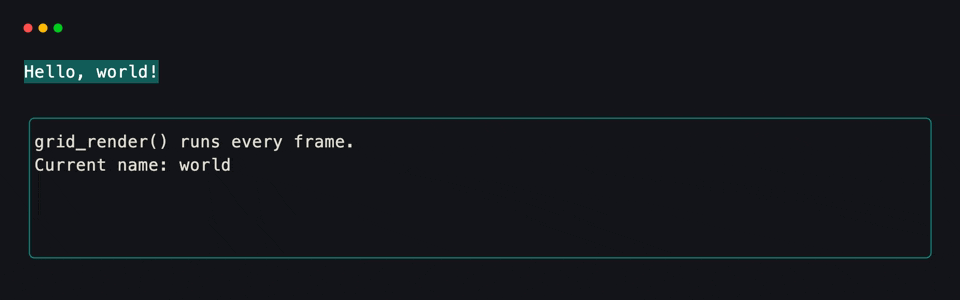
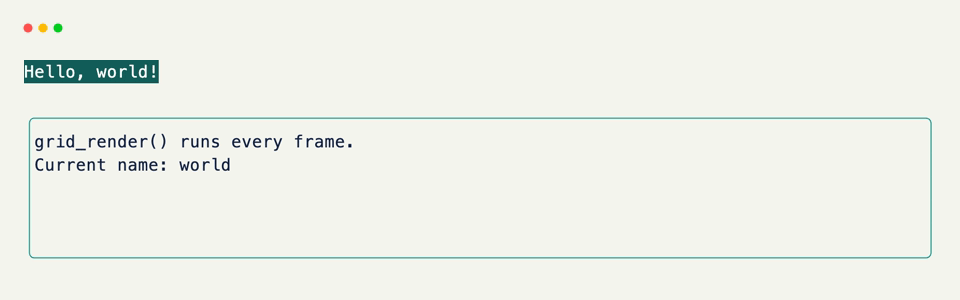

# Grid & Fields

A `Grid` is the main building block of an xnano app. You subclass it, add typed fields, and xnano turns those fields into a live terminal layout. Field declaration order is layout order — changing one field value is enough to trigger a repaint.

---

## The basics

Every field you declare becomes one slot in the grid. The type annotation tells xnano what kind of content to expect; `str` fields render as text, nested `Grid` subclasses render as sub-layouts. The `Field()` call controls every display option — sizing, color, border, title, alignment.

```python title="app.py"
from xnano import Field, Grid, Terminal
from xnano.hooks import on_keyboard

class App(Grid, direction="vertical"):
    header: str = Field(default="My App", height=1, color="white", background="violet")
    body:   str = Field(default="Hello, world!")
    footer: str = Field(default="[q] quit", height=1, color="slate-500")

    @on_keyboard("q")
    def quit(self, ctx) -> None:
        ctx.terminal.request_exit()

Terminal().run(App())
```

<div class="xnano-demo" markdown>
{.demo-dark}
{.demo-light}
</div>

---

## Grid options

The `Grid` subclass declaration accepts a few keyword arguments that control the layout itself:

```python title="Horizontal toolbar with gap"
class Toolbar(Grid, direction="horizontal", gap=2, background="slate-900"):
    ...
```

| Option | Values |
|---|---|
| `direction` | `"vertical"` (default) · `"horizontal"` |
| `gap` | int — empty cells between fields |
| `background` | color string applied to the whole grid area |

---

## Field options

### Appearance

Fields support a full set of display options. All of these can also be updated at runtime via `grid_set_field()`.

```python title="Field display options"
Field(
    default="My field",
    color="white",
    background="slate-800",
    modifiers=["bold", "italic"],
    align="center",            # (1)!
    border="rounded",          # (2)!
    border_color="violet-500",
    title=" My Title ",
    padding=(1, 2),            # (3)!
)
```

1. `"left"` · `"center"` · `"right"`
2. `"plain"` · `"rounded"` · `"double"` · `"thick"`
3. `(vertical, horizontal)` in cells.

### Sizing

Fields accept `width=` and `height=` in any unit. The default, when neither is set, is to fill the remaining space.

```python title="Sizing options"
Field(default="Fixed",   height=3)       # always 3 rows
Field(default="Quarter", height="25%")   # 25% of available space
Field(default="Fill",    height="1fr")   # remaining space
Field(default="Compact", height="fit")   # shrink to content
```

See [Sizing](sizing.md) for a full breakdown of how units interact.

### State

`#!python state=True` makes a field reactive — changing it triggers a repaint:

```python title="Reactive fields" hl_lines="3"
class Counter(Grid, direction="vertical"):
    label: str = Field(default="0", height=1)
    count: int = Field(default=0, state=True) # (1)!
```

1. Any assignment to `self.count` automatically schedules a repaint. Fields without `state=True` are read by `grid_render()` on the next frame but don't trigger one themselves.

---

## Nesting

Grids compose. Use a `Grid` subclass as the type annotation for a field, and xnano renders it as a sub-layout inside the parent. This is how you build complex layouts — a sidebar alongside a main area, a header with an embedded tab bar, and so on.

The key thing to get right when nesting is `default_factory=`. A class default (like `default=Sidebar()`) would be shared across all instances. `default_factory=Sidebar` creates a fresh instance for each parent, so nested grids never accidentally share state.

```python title="Nested grids" hl_lines="1 2 3 5 6 7"
class Sidebar(Grid, direction="vertical"):
    nav:    str = Field(default="  — Home\n  — About\n  — Settings", border="rounded", border_color="slate-600")
    status: str = Field(default="  Ready", height=1, color="slate-500")

class App(Grid, direction="horizontal", gap=1):
    sidebar: Sidebar = Field(default_factory=Sidebar, width="25%") # (1)!
    main:    str     = Field(default="Main content area.", width="1fr", border="rounded", border_color="violet-500", title=" Content ")

    @on_keyboard("q")
    def quit(self, ctx) -> None:
        ctx.terminal.request_exit()

Terminal().run(App())
```

1. Use `default_factory=` for nested grids — it's called fresh each time an instance is created, so instances don't share state.

<div class="xnano-demo" markdown>
{.demo-dark}
{.demo-light}
</div>

---

## `grid_render()`

`grid_render()` is called once per frame, just before painting. It's the place to compute derived field values — anything that depends on other fields, terminal dimensions, or app state. Think of it as a reactive render function: read your state, write your fields.

```python title="grid_render()" hl_lines="5 6"
class App(Grid, direction="vertical", gap=1):
    header: str = Field(default="", height=1, color="white", background="teal-800")
    body:   str = Field(default="", border="rounded", border_color="teal-600")
    name:   str = Field(default="world", state=True)

    def grid_render(self) -> None: # (1)!
        self.header = f"  Hello, {self.name}!"
        self.body   = f"  grid_render() runs every frame.\n  Current name: {self.name}"
```

1. Runs every frame, before painting. Keep it fast — it runs on the render thread.

<div class="xnano-demo" markdown>
{.demo-dark}
{.demo-light}
</div>

---

## Updating styles at runtime

You can update a field's display options — not just its content — using `self.grid_set_field("field_name", **options)`. This is useful for conditional styling: turning a status border red on error, highlighting an active selection, changing a field's background on hover.

```python title="Dynamic field styling"
def grid_render(self) -> None:
    if self.error:
        self.grid_set_field("status", border_color="red-500", color="red-400")
        self.status = "Error!"
    else:
        self.grid_set_field("status", border_color="emerald-500", color="emerald-400")
        self.status = "OK"
```

---

## Grid dimensions

`#!python self.rows` and `#!python self.columns` are available inside `grid_render()` and any hook. They reflect the actual rendered size of the grid at the current frame. Use them when you need to build content that adapts to the terminal size — sparklines, progress bars, truncated text, dynamic padding.

```python
def grid_render(self) -> None:
    self.chart = build_sparkline(self.data, width=self.columns - 4)
```
