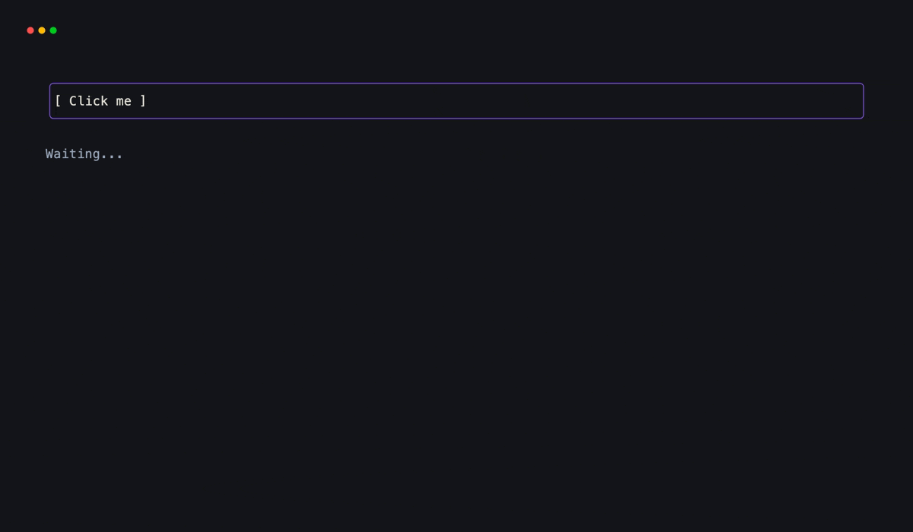
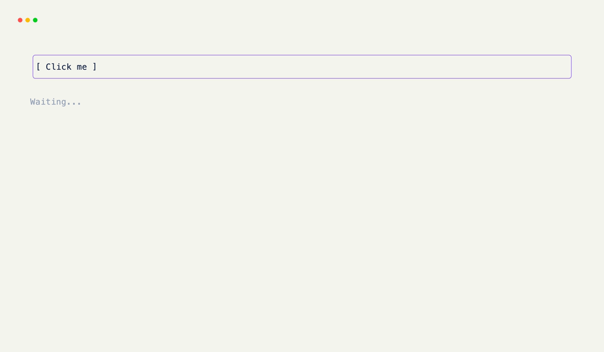

# Hooks

Hooks are methods on your `Grid` decorated with `@on_keyboard`, `@on_tick`, `@on_click`, or `@on_state`. xnano calls them from the Rust event loop when the matching event fires — you never write a poll loop, select statement, or event queue. Just decorate the method and return.

---

## `@on_keyboard`

Respond to a key press by decorating any method with `@on_keyboard("key")`. The method is called once per matching key event. Multiple methods can match the same key and will all fire in declaration order.

```python title="keyboard.py"
from xnano.beta.hooks import on_keyboard

class App(Grid, direction="vertical"):
    @on_keyboard("q")
    def quit(self, ctx) -> None:
        ctx.terminal.request_exit()

    @on_keyboard("enter")
    def submit(self) -> None:
        self.status = "Submitted!"

    @on_keyboard("ctrl+c")
    def force_quit(self, ctx) -> None:
        ctx.terminal.request_exit()
```

A counter app that increments and decrements with the arrow keys shows the pattern clearly:

```python title="counter.py"
from xnano.beta import Field, Grid, Terminal
from xnano.beta.hooks import on_keyboard

class Counter(Grid, direction="vertical", gap=1):
    label: str = Field(default="Count: 0", height=1, border="rounded", border_color="violet-500", title=" Counter ")
    hint:  str = Field(default="  ↑ / ↓ to count  ·  q to quit", height=1, color="slate-500")

    count: int = Field(default=0, state=True)

    @on_keyboard("up")
    def inc(self) -> None:
        self.count += 1
        self.label = f"Count: {self.count}"

    @on_keyboard("down")
    def dec(self) -> None:
        self.count -= 1
        self.label = f"Count: {self.count}"

    @on_keyboard("q")
    def quit(self, ctx) -> None:
        ctx.terminal.request_exit()

Terminal().run(Counter())
```

<div class="xnano-demo" markdown>
{.demo-dark}
{.demo-light}
</div>

### Key strings

| String | Key |
|---|---|
| `"q"`, `"a"`, `"1"` | Character keys |
| `"enter"` | Enter |
| `"backspace"` | Backspace |
| `"tab"` | Tab |
| `"esc"` | Escape |
| `"up"` `"down"` `"left"` `"right"` | Arrow keys |
| `"f1"` … `"f12"` | Function keys |
| `"ctrl+q"`, `"shift+up"`, `"alt+enter"` | Modifier combos |

### Catch-all

Calling `@on_keyboard` without a key string makes the method catch every key event. Use this to build text inputs or command palettes — get the raw character from `ctx.keyboard`.

```python
@on_keyboard
def on_any_key(self, ctx) -> None:
    char = getattr(ctx.keyboard, "character", None)
    if char and len(char) == 1:
        self.input += char
```

---

## `@on_tick`

`@on_tick` fires on a timer. Pass a millisecond interval and xnano calls the method at that cadence. Use it for clocks, progress updates, polling loops, or anything driven by time rather than user input.

```python title="clock.py"
import time
from xnano.beta import Field, Grid, Terminal
from xnano.beta.hooks import on_keyboard, on_tick

class Clock(Grid, direction="vertical", gap=1):
    display: str = Field(default="", height=3, border="rounded", border_color="teal-500", title=" Clock ")
    hint:    str = Field(default="  q to quit", height=1, color="slate-500")

    @on_tick(1000)   # every 1000ms
    def update(self) -> None:
        self.display = f"  {time.strftime('%H:%M:%S')}"

    @on_keyboard("q")
    def quit(self, ctx) -> None:
        ctx.terminal.request_exit()

Terminal(tick_interval=1000).run(Clock())
```

<div class="xnano-demo" markdown>
{.demo-dark}
{.demo-light}
</div>

!!! note
    Without a millisecond argument, `@on_tick` fires at the `Terminal`'s `tick_interval`. Set that when constructing:
    ```python
    Terminal(tick_interval=16).run(App())
    ```

---

## `@on_click`

`@on_click` responds to mouse clicks on a named field. Requires `Terminal(mouse_events=True)`. Pass the field name as a string — the method fires when the user clicks anywhere inside that field's rendered area.

```python title="click.py"
from xnano.beta import Field, Grid, Terminal
from xnano.beta.hooks import on_click, on_keyboard

class App(Grid, direction="vertical", gap=1):
    button: str = Field(default="  [ Click me ]  ", height=3, border="rounded", border_color="violet-500")
    result: str = Field(default="  Waiting...", height=1, color="slate-400")

    @on_click("button")
    def clicked(self) -> None:
        self.result = "  Clicked!"
        self.grid_set_field("result", color="emerald-400")

    @on_keyboard("q")
    def quit(self, ctx) -> None:
        ctx.terminal.request_exit()

Terminal(mouse_events=True).run(App())
```

<div class="xnano-demo" markdown>
{.demo-dark}
{.demo-light}
</div>

---

## `@on_state`

`@on_state` fires when a `state=True` field changes value. Use it to react to state changes without putting logic in every place that writes the field — keep the side effects in one place.

```python title="on_state.py"
from xnano.beta.hooks import on_state

class App(Grid, direction="vertical"):
    display: str = Field(default="", height=1)
    count:   int = Field(default=0, state=True)

    @on_state("count")
    def on_count_change(self) -> None:
        self.display = f"Count is now {self.count}"
```

---

## The context object

Any hook can take `ctx` as a second argument. It's optional — omit it if you don't need it.

```python
@on_keyboard("enter")
def submit(self, ctx) -> None:
    ctx.terminal   # Terminal instance — call request_exit(), etc.
    ctx.keyboard   # crossterm KeyEvent — raw key details
    ctx.mouse      # crossterm MouseEvent — or None for non-click hooks
    ctx.state      # app-level state (if set on Terminal)
    ctx.grid       # root Grid instance
```

---

## Execution order

Multiple hooks matching the same event fire in declaration order. Parent grid hooks fire before child grid hooks when nested layouts are in use.

!!! warning
    Exceptions raised inside hooks propagate out of the event loop and leave the terminal in raw mode. Use `ctx.terminal.request_exit()` to stop cleanly, or raise `xnano.beta.exceptions.Exit` as a last resort. Never let an uncaught exception escape a hook in production code.
