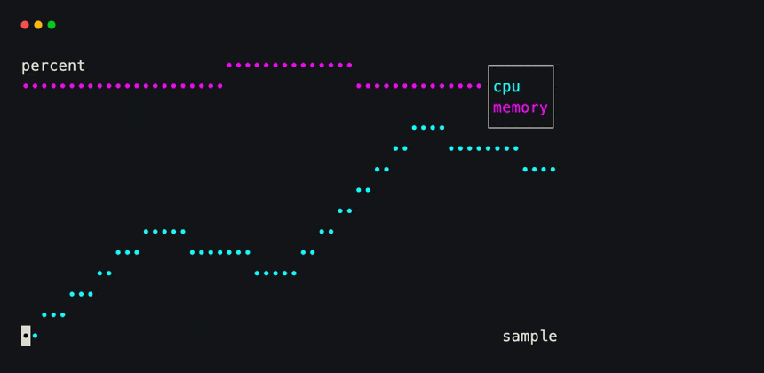
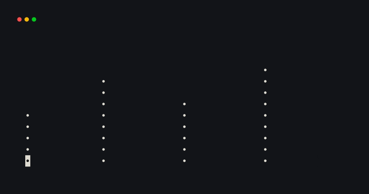
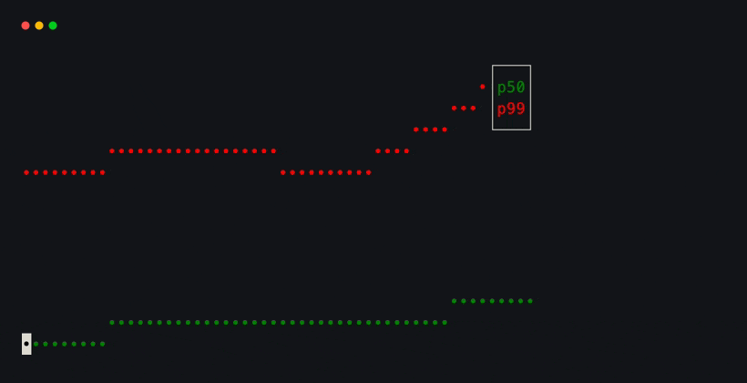

# Chart

`Chart` draws several named data series. A series can contain `(x, y)` pairs
or bare y-values; bare values receive their list index as x. Axis bounds and
series colors are inferred by default.

```python title="chart.py"
from xnano.components.chart import Chart
from xnano.terminal import Terminal

usage = Chart(
    series={
        "cpu": [30, 42, 38, 55, 49],
        "memory": [60, 61, 63, 62, 65],
    },
    x_label="sample",
    y_label="percent",  # (1)!
)

Terminal(width=58, height=14).run(usage)
```

1. Named series also supply legend labels. Set `legend=False` to hide it.

<div class="xnano-demo" markdown>
{ width="860" }
</div>

<!-- Demo key: components/chart-lines; viewport: 58x14 cells. -->

Set `kind` to `"line"`, `"scatter"`, or `"bar"`. Explicit `x_bounds` and
`y_bounds` are useful when several frames need a stable scale.

```python title="bar_chart.py"
from xnano.components.chart import Chart
from xnano.terminal import Terminal

requests = Chart(
    series={"requests": [(0, 18), (1, 31), (2, 24), (3, 40)]},
    kind="bar",  # (1)!
    y_bounds=(0, 50),
    legend=False,
)

Terminal(width=48, height=12).run(requests)
```

1. `kind` is the default for every series in the chart.

<div class="xnano-demo" markdown>
{ width="760" }
</div>

<!-- Demo key: components/chart-bars; viewport: 48x12 cells. -->

## Declare series styles

Subclass `Chart` with `Series` declarations when names and styles form a
reusable schema. A declaration can replace the legend label, color, or chart
kind for one series.

```python title="latency_chart.py"
from xnano.components.chart import Chart
from xnano.components.schema import Series
from xnano.terminal import Terminal

class LatencyChart(Chart):
    median = Series(label="p50", color="green")
    tail = Series(label="p99", color="red", kind="scatter")  # (1)!

chart = LatencyChart(
    series={
        "median": [12, 14, 13, 16],
        "tail": [28, 32, 29, 41],
    }
)

Terminal(width=54, height=14).run(chart)
```

1. Per-series `kind` overrides the chart default, so plot types can be mixed.

<div class="xnano-demo" markdown>
{ width="820" }
</div>

<!-- Demo key: components/chart-declarative; viewport: 54x14 cells. -->
