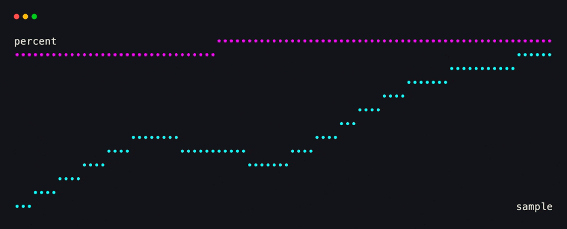
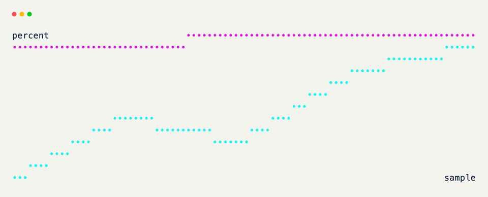
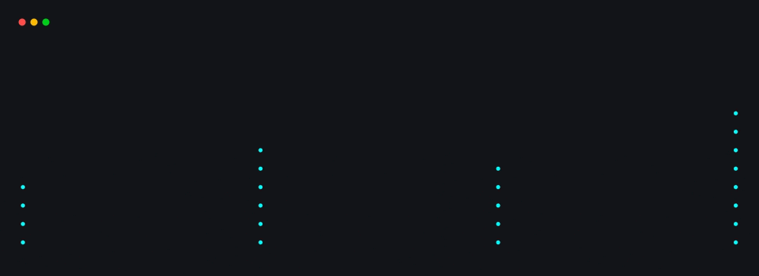
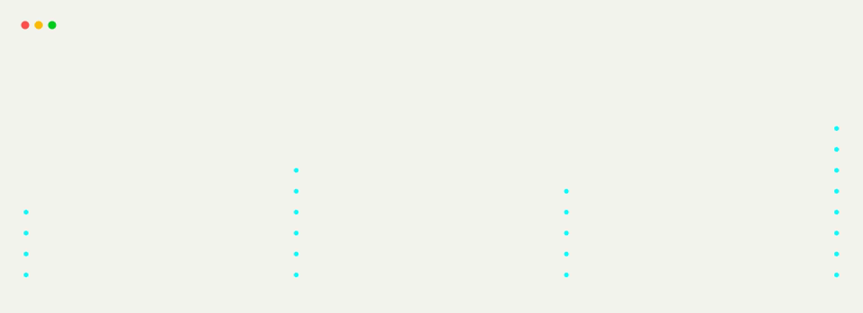

# Chart

`Chart` turns a mapping of series name to points into a line, scatter, or bar plot — legend, axis bounds, and per-series color all derived from the data.

Points can be bare `y` values, with the x-axis becoming the index, or explicit `(x, y)` pairs.

??? example "Interactive Example"

    The following code block is interactive and can be run directly in the browser.

    ```pyodide install="xnano>=1.0.8" hl_lines="4 5 6 7"
    from xnano import Terminal
    from xnano.components.chart import Chart

    Terminal(height=14).render(
        Chart(series={
            "cpu": [30, 42, 38, 55, 61],
            "mem": [60, 61, 63, 62, 64],
        })
    )
    ```

```python title="A Multi-Series Chart" hl_lines="4 5 6 7"
from xnano import Terminal
from xnano.components.chart import Chart

Terminal(height=14).render(
    Chart(series={
        "cpu": [30, 42, 38, 55, 61], # (1)!
        "mem": [60, 61, 63, 62, 64],
    })
)
```

1. One line per key — legend labels, colors, and axis bounds are all inferred, cycling through a built-in palette.

<div class="xnano-demo" markdown>
{.demo-dark}
{.demo-light}
</div>

<br/>

Switch `kind` for a bar plot, or mix explicit points in:

```python title="A Bar Plot" hl_lines="4"
from xnano import Terminal
from xnano.components.chart import Chart

Terminal(height=14).render(
    Chart(series={"load": [(0, 3), (1, 5), (2, 4)]}, kind="bar")
)
```

<div class="xnano-demo" markdown>
{.demo-dark}
{.demo-light}
</div>

<br/>

Give a series its own color or plot kind by subclassing with `Series()` descriptors instead of a bare mapping — see [Schema]{data-preview}.

The full parameter list — axis titles, explicit bounds, legend position, and more — lives on the [Chart]{data-preview} API reference.

??? abstract "Sandbox & API"

    **Sandbox**

    [Graph Types](../sandbox/chart.md#graph-types-and-mixed-charts){data-preview} · [Bounds and Labels](../sandbox/chart.md#explicit-bounds-and-axis-labels){data-preview} · [Legend Positions](../sandbox/chart.md#legend-positions){data-preview}

    **API**

    [`Chart`](../api/xnano/components/chart.md#xnano.components.chart.Chart){data-preview} · [`Series`](../api/xnano/components/schema.md#xnano.components.schema.Series){data-preview} · [`GraphTypeLike`](../api/xnano/_types.md#xnano._types.GraphTypeLike){data-preview}

[Chart]: ../api/xnano/components/chart.md
[Schema]: schema.md
