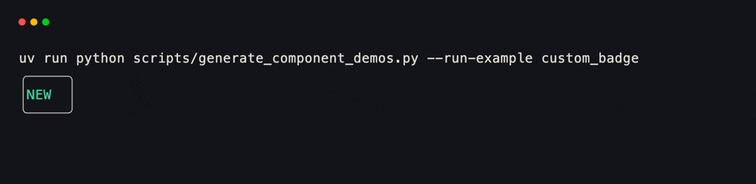
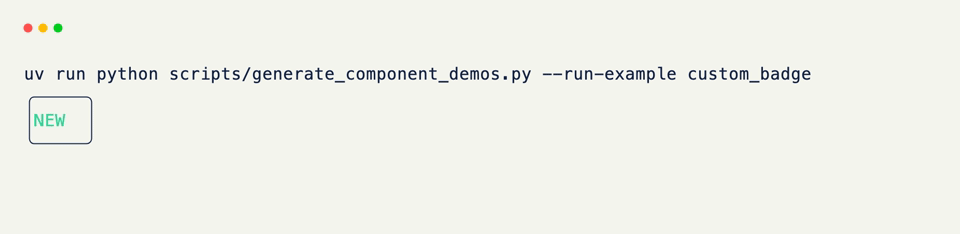

# Components

Every built-in widget xnano ships — `Text`, `Select`, `Table`, `Progress`, `Chart`, `Sparkline`, `Schema` — is an [AbstractComponent]{data-preview} subclass: a small, self-contained class that knows how to measure its own size and describe its own content, independent of whatever grid or field it ends up living in.

A component is the same shape as a [BaseGrid]{data-preview} in spirit — self-contained, host-agnostic — but built for reuse as a *value*, not a whole app. You drop one into a `Field()`, or hand it straight to `render()`, rather than running it.

A component:

- Measures itself <small>(`get_size()` — how much space it wants)</small>
- Describes its own content <small>(`compose()` — what to paint, host-agnostic)</small>
- Renders on any host with no extra code <small>(the same content tree lowers to the same terminal cells for TUI and web canvas)</small>

<div class="grid-concept-diagram" role="img" aria-label="Diagram: a component measures size and composes host-agnostic content, which lowers to terminal cells for both TUI and web canvas">
<svg viewBox="0 0 720 250" xmlns="http://www.w3.org/2000/svg" fill="none">
  <defs>
    <pattern id="cid-cell" width="12" height="12" patternUnits="userSpaceOnUse">
      <path d="M 12 0 L 0 0 0 12" class="gcd-grid-line" />
    </pattern>
    <marker id="cid-arrow" markerWidth="8" markerHeight="8" refX="6" refY="4" orient="auto">
      <path d="M0,0 L8,4 L0,8 Z" class="gcd-arrow-fill" />
    </marker>
  </defs>

  <rect class="gcd-panel gcd-panel-accent" x="40" y="70" width="160" height="100" rx="14" />
  <text class="gcd-label gcd-label-accent" x="120" y="112" text-anchor="middle">component</text>
  <text class="gcd-chrome-label" x="120" y="138" text-anchor="middle">Badge · Progress…</text>

  <line class="gcd-arrow" x1="200" y1="100" x2="248" y2="80" marker-end="url(#cid-arrow)" />
  <line class="gcd-arrow" x1="200" y1="140" x2="248" y2="160" marker-end="url(#cid-arrow)" />

  <rect class="gcd-panel" x="260" y="48" width="160" height="56" rx="12" />
  <text class="gcd-label" x="340" y="72" text-anchor="middle">get_size()</text>
  <text class="gcd-chrome-label" x="340" y="90" text-anchor="middle">preferred cells</text>

  <rect class="gcd-panel" x="260" y="132" width="160" height="56" rx="12" />
  <text class="gcd-label" x="340" y="156" text-anchor="middle">compose()</text>
  <text class="gcd-chrome-label" x="340" y="174" text-anchor="middle">Content tree</text>

  <line class="gcd-arrow" x1="420" y1="160" x2="468" y2="160" marker-end="url(#cid-arrow)" />

  <rect class="gcd-panel" x="480" y="48" width="200" height="64" rx="12" />
  <text class="gcd-chrome-label" x="580" y="76" text-anchor="middle">terminal cells</text>
  <rect class="gcd-grid-fill" x="500" y="88" width="160" height="14" rx="2" />
  <rect x="500" y="88" width="160" height="14" rx="2" fill="url(#cid-cell)" />

  <rect class="gcd-panel" x="480" y="132" width="200" height="64" rx="12" />
  <text class="gcd-chrome-label" x="580" y="160" text-anchor="middle">web canvas cells</text>
  <rect class="gcd-grid-fill" x="500" y="172" width="160" height="14" rx="2" />
  <rect x="500" y="172" width="160" height="14" rx="2" fill="url(#cid-cell)" />
</svg>
</div>

## Defining a Component

A component overrides two methods: `get_size()`, so the grid around it knows how much room to give it, and `compose()`, which returns interface-neutral content — a `Panel`, a `TextBlock`, a `Gauge`, or one of the other primitives xnano lowers for you.

??? example "Interactive Example"

    The following code block is interactive and can be run directly in the browser.

    ```pyodide install="xnano>=1.0.8" hl_lines="5 6 9 10"
    from xnano import render
    from xnano._types import Size
    from xnano.components.abstract import AbstractComponent
    from xnano.core.content import Panel, TextBlock
    import dataclasses

    @dataclasses.dataclass
    class Badge(AbstractComponent):
        text: str = ""
        color: str = "white"

        def get_size(self, ctx):
            return Size(width=len(self.text) + 4, height=3)

        def compose(self, ctx):
            return Panel(child=TextBlock.from_plain(self.text, color=self.color), border="rounded")

    render(Badge(text="NEW", color="emerald-400"))
    ```

```python title="Defining a Component" hl_lines="5 6 9 10"
import dataclasses
from xnano._types import Size
from xnano.components.abstract import AbstractComponent
from xnano.core.content import Panel, TextBlock

@dataclasses.dataclass
class Badge(AbstractComponent):
    text: str = ""
    color: str = "white"

    def get_size(self, ctx): # (1)!
        return Size(width=len(self.text) + 4, height=3)

    def compose(self, ctx): # (2)!
        return Panel(
            child=TextBlock.from_plain(self.text, color=self.color),
            border="rounded",
        )
```

1. `get_size()` returns the component's preferred cell size — here, just wide enough for the text plus its border, three rows tall to fit the frame. `ctx` is a `ComponentRenderContext`, the same render-time scope every component method receives.
2. `compose()` returns *content*, not a widget for one specific host — a `Panel` wrapping a `TextBlock`. Whatever host paints this `Badge` lowers that same tree into terminal cells (TUI or web canvas); there's nothing surface-specific to write.

<div class="xnano-demo" markdown>
{.demo-dark}
{.demo-light}
</div>

<br/>

Neither method is required on its own — a component that skips `get_size()` just measures as `0x0` and relies on its field's own sizing, and one that skips `compose()` paints nothing. Most components implement both.

## Using a Component

A component works as a field's value exactly like a plain string does.

```python title="Using a Component" hl_lines="4"
from xnano import BaseGrid, Field

class Dashboard(BaseGrid, direction="vertical"):
    status: Badge = Field(default_factory=lambda: Badge(text="LIVE", color="red"))
```

It also renders standalone, the same way a bordered string does — `render(Badge(text="NEW"))`, as shown above, needs no grid at all.

## Built-in Components

xnano ships a handful of components ready to use — [Text]{data-preview} for styled strings, editable inputs, ANSI/markdown/syntax display, [Select]{data-preview} for fuzzy-filterable pick lists, [Table]{data-preview} for tabular data, [Progress]{data-preview} for bars and gauges, [Chart]{data-preview} for plots and bar charts, [Sparkline]{data-preview} for compact trend lines, and [Schema]{data-preview} for rendering a Pydantic model's fields directly. Each gets its own page next, starting with `Text` — the one you'll reach for most.

<div class="grid cards" markdown>

-   :material-format-text:{ .lg .middle } **Text**

    ---

    Styled spans, composed lines and paragraphs, editable (multi-line) inputs, plus ANSI, markdown, and syntax-highlight display modes.

    [Text | Guide]{.xnano-card-link data-preview}

-   :material-filter-variant:{ .lg .middle } **Select**

    ---

    Fuzzy-filterable pick lists with match emphasis, keyboard selection, and optional external search.

    [Select | Guide]{.xnano-card-link data-preview}

-   :material-table:{ .lg .middle } **Table**

    ---

    Tabular data with configurable columns, selection, and row highlighting.

    [Table | Guide]{.xnano-card-link data-preview}

-   :material-progress-clock:{ .lg .middle } **Progress**

    ---

    Bars, gauges, and compact indicators for values moving toward a total.

    [Progress | Guide]{.xnano-card-link data-preview}

-   :material-chart-line:{ .lg .middle } **Chart**

    ---

    Line plots and bar charts with multiple series, axes, and legends.

    [Chart | Guide]{.xnano-card-link data-preview}

-   :material-chart-timeline-variant-shimmer:{ .lg .middle } **Sparkline**

    ---

    Small inline trend charts for dense dashboards and live metrics.

    [Sparkline | Guide]{.xnano-card-link data-preview}

-   :material-code-json:{ .lg .middle } **Schema**

    ---

    Declarative columns and series derived from typed model fields.

    [Schema | Guide]{.xnano-card-link data-preview}

</div>

??? abstract "Sandbox & API"

    **Sandbox**

    [Component Gallery](../sandbox.md#live-examples){data-preview}

    **API**

    [`AbstractComponent`](../api/xnano/components/abstract.md#xnano.components.abstract.AbstractComponent){data-preview} · [`ComponentRenderContext`](../api/xnano/components/abstract.md#xnano.components.abstract.ComponentRenderContext){data-preview}

[AbstractComponent]: ../api/xnano/components/abstract.md
[BaseGrid]: ../api/xnano/grid.md
[Text]: ../api/xnano/components/text.md
[Select]: ../api/xnano/components/select.md
[Table]: ../api/xnano/components/table.md
[Progress]: ../api/xnano/components/progress.md
[Chart]: ../api/xnano/components/chart.md
[Sparkline]: ../api/xnano/components/sparkline.md
[Schema]: ../api/xnano/components/schema.md
[Text | Guide]: text.md
[Select | Guide]: select.md
[Table | Guide]: table.md
[Progress | Guide]: progress.md
[Chart | Guide]: chart.md
[Sparkline | Guide]: sparkline.md
[Schema | Guide]: schema.md
