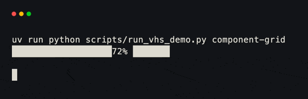
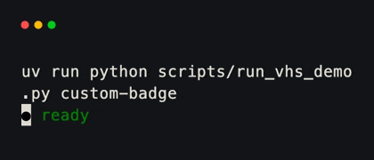

# Components

Components turn Python values into interface-specific render nodes. Put one in
a grid field when the value needs more structure than a plain string: styled
text, a table, a chart, a progress indicator, or a sparkline.

<div class="grid cards" markdown>

-   :material-format-text:{ .lg .middle } **Text**

    ---

    Styled text, composed lines, paragraphs, and editable text fields.

    [:octicons-arrow-right-24: Text](text.md)

-   :material-table:{ .lg .middle } **Table**

    ---

    Tables inferred from data or declared with a typed column schema.

    [:octicons-arrow-right-24: Table](table.md)

-   :material-chart-line:{ .lg .middle } **Chart**

    ---

    Line, scatter, and bar series with automatic bounds and legends.

    [:octicons-arrow-right-24: Chart](chart.md)

-   :material-progress-clock:{ .lg .middle } **Progress**

    ---

    Block and line indicators from a ratio or an absolute total.

    [:octicons-arrow-right-24: Progress](progress.md)

-   :material-chart-timeline-variant:{ .lg .middle } **Sparkline**

    ---

    Compact sample history that fills the field containing it.

    [:octicons-arrow-right-24: Sparkline](sparkline.md)

</div>

## Components and grids

A `BaseGrid` owns layout. A component owns the content painted inside one
layout slot. This separation lets the same component be moved between grids
without rewriting its rendering code.

```python title="component_grid.py" hl_lines="6"
from xnano.components.progress import Progress
from xnano.fields import Field
from xnano.grid import BaseGrid

class BuildStatus(BaseGrid):
    completion: Progress = Field(default_factory=lambda: Progress(0.72))  # (1)!
```

1. The field decides where the component goes; `Progress` decides what is
   drawn there.

<div class="xnano-demo" markdown>
{ width="620" }
</div>

<!-- Demo key: components/component-grid; viewport: 42x3 cells. -->

## Building a component

Subclass `AbstractComponent` and implement the renderer for each interface you
support. Prefer `compose()` for interface-neutral content. Controllers also
accept the compatibility adapter `get_terminal_node()`, which returns an
`AbstractTerminalNode`. The render context carries the current area, terminal,
application state, and component.

```python title="badge.py" hl_lines="10 11 12"
import dataclasses

from xnano.components.abstract import AbstractComponent, ComponentRenderContext
from xnano.tui.nodes import ParagraphNode

@dataclasses.dataclass
class Badge(AbstractComponent):
    label: str = "ready"

    def get_terminal_node(self, ctx: ComponentRenderContext) -> ParagraphNode:
        return ParagraphNode(text=f"● {self.label}", color="green")  # (1)!
```

1. Components describe nodes. The terminal controller is responsible for
   lowering and painting the node tree.

<div class="xnano-demo" markdown>
{ width="420" }
</div>

<!-- Demo key: components/custom-badge; viewport: 18x1 cells. -->

`visible`, `z`, and `fit_content` are shared component options. Override
`get_size()` when content has a preferred cell size, `get_frame()` to supply a
frame, and `before_render()` or `after_render()` only when the component needs
render-time area handling.

Components can also render application state without owning the event loop.
`ComponentRenderContext.state` contains the state attached to `Terminal`, while
the component instance can keep local values in its dataclass fields. Hooks
update those values or shared state; the next frame calls the component again.
This keeps state handling independent from the terminal node implementation
and leaves room for another interface renderer to read the same values.

!!! info "Web rendering"
    The component contract is already split by interface. The
    [Web UI](../webui/index.md) paints the same grids in the browser with
    [web render nodes](../webui/rendering.md) and
    [request hooks](../webui/requests.md). Stable components such as
    `xnano.components.Text` implement `get_web_node` for HTML alongside
    terminal rendering.
