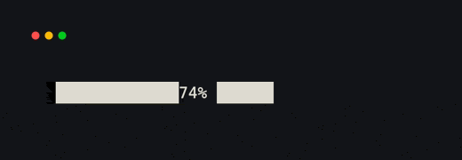
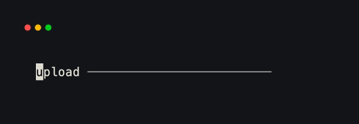

# Progress

`Progress` converts a value into a clamped ratio between `0.0` and `1.0`. Pass
a ratio directly, or provide `total` when the value is an absolute amount.

```python title="progress.py"
import time

from xnano.components.progress import Progress
from xnano.tui import Terminal

Terminal(width=32, height=1).render(
    Progress(value=37, total=50, color="cyan")  # (1)!
)
time.sleep(3)
```

1. The default label is derived from the ratio, so this displays `74%`.

<div class="xnano-demo" markdown>
{ width="520" }
</div>

<!-- Demo key: components/progress-bar; viewport: 32x1 cells. -->

Use `style="line"` for a thin line gauge. Set `label` to custom text or
`False` to hide it. Values outside the valid range are safely clamped.

```python title="line_progress.py"
import time

from xnano.components.progress import Progress
from xnano.tui import Terminal

Terminal(width=32, height=1).render(
    Progress(
        value=0.42,
        style="line",  # (1)!
        label="upload",
        filled_color="violet",
        unfilled_color="gray",
    )
)
time.sleep(3)
```

1. `filled_color` and `unfilled_color` apply to the line style. The block style
   uses `color` and `background`.

<div class="xnano-demo" markdown>
{ width="520" }
</div>

<!-- Demo key: components/progress-line; viewport: 32x1 cells. -->
