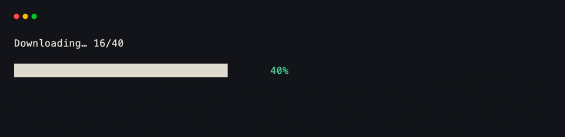
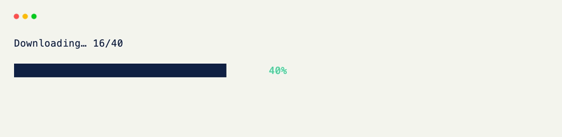
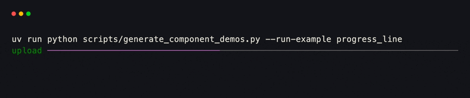
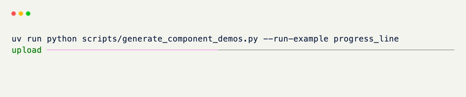

# Progress

`Progress` renders how much of something is done — as a `0.0`–`1.0` ratio, or a `value` out of a `total` — with a percentage label derived automatically.

??? example "Interactive Example"

    The following code block is interactive and can be run directly in the browser.

    ```pyodide install="xnano>=1.0.8" hl_lines="4"
    from xnano import render
    from xnano.components.progress import Progress

    render(Progress(value=0.6, color="emerald-400"))
    ```

```python title="A Progress Bar" hl_lines="4"
from xnano import render
from xnano.components.progress import Progress

render(Progress(value=0.6, color="emerald-400")) # (1)!
```

1. No `total` means `value` is already the ratio — `0.6` renders as a 60% filled bar labeled `"60%"`.

<div class="xnano-demo" markdown>
{.demo-dark}
{.demo-light}
</div>

<br/>

Pass a `total` instead when the raw numbers are more natural than a ratio, and switch `style` for a thinner line gauge:

```python title="Value Over Total" hl_lines="4"
from xnano import render
from xnano.components.progress import Progress

render(Progress(value=340, total=500, style="line", label="downloading"))
```

<div class="xnano-demo" markdown>
{.demo-dark}
{.demo-light}
</div>

<br/>

The full parameter list — colors for the filled and unfilled portions, hiding the label, and more — lives on the [Progress]{data-preview} API reference.

??? abstract "Sandbox & API"

    **Sandbox**

    [Ratio and Value/Total Modes](../sandbox/progress.md#ratio-and-valuetotal-modes){data-preview} · [Every Label Mode](../sandbox/progress.md#every-label-mode){data-preview} · [Both Styles](../sandbox/progress.md#both-styles-and-every-color-control){data-preview}

    **API**

    [`Progress`](../api/xnano/components/progress.md#xnano.components.progress.Progress){data-preview} · [`ProgressStyle`](../api/xnano/components/progress.md#xnano.components.progress.ProgressStyle){data-preview}

[Progress]: ../api/xnano/components/progress.md
