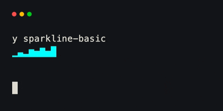
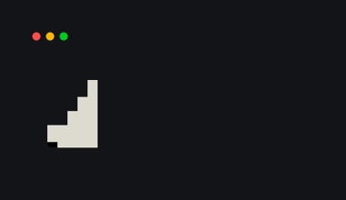

# Sparkline

`Sparkline` shows a sequence of non-negative integer samples in a small area.
It fills the field containing it and scales bar height against the largest
sample, or against `max_value` when you supply one.

```python title="sparkline.py"
from xnano.components.sparkline import Sparkline
from xnano.tui import Terminal

history = Sparkline(
    data=[2, 4, 3, 7, 5, 8, 6, 9],
    color="cyan",
    max_value=10,  # (1)!
)

Terminal(width=20, height=4).run(history)
```

1. A fixed ceiling keeps the visual scale stable as new samples arrive.

<div class="xnano-demo" markdown>
{ width="440" }
</div>

<!-- Demo key: components/sparkline-basic; viewport: 20x4 cells. -->

For per-sample colors, pass a `colors` tuple with exactly one color for each
data point. `absent_value_symbol` and `absent_value_color` control how zero or
missing samples appear.

```python title="sparkline_colors.py"
from xnano.components.sparkline import Sparkline
from xnano.tui import Terminal

heat = Sparkline(
    data=[1, 3, 5, 7, 9],
    colors=("blue", "cyan", "green", "yellow", "red"),  # (1)!
)

Terminal(width=14, height=3).run(heat)
```

1. `colors` and `data` must have the same length.

<div class="xnano-demo" markdown>
{ width="380" }
</div>

<!-- Demo key: components/sparkline-colors; viewport: 14x3 cells. -->
