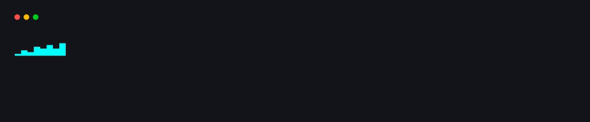
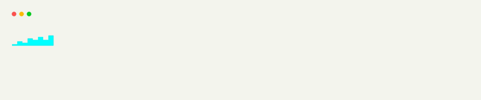
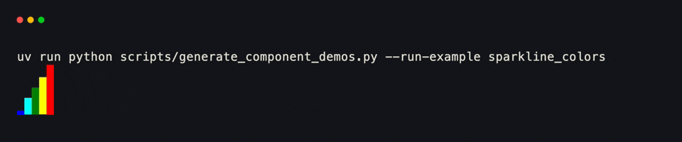
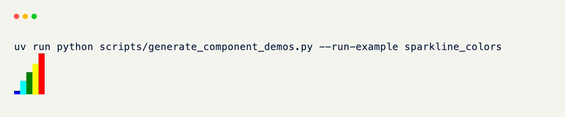

# Sparkline

`Sparkline` compresses a sequence of samples into a compact inline bar chart, scaling every bar to fill whatever slot it's placed in.

??? example "Interactive Example"

    The following code block is interactive and can be run directly in the browser.

    ```pyodide install="xnano>=1.0.8" hl_lines="4"
    from xnano import Terminal
    from xnano.components.sparkline import Sparkline

    Terminal(height=4).render(Sparkline(data=[1, 4, 2, 8, 5, 9, 3, 7]))
    ```

```python title="A Sparkline" hl_lines="4"
from xnano import Terminal
from xnano.components.sparkline import Sparkline

Terminal(height=4).render(Sparkline(data=[1, 4, 2, 8, 5, 9, 3, 7])) # (1)!
```

1. Bar heights auto-scale to the tallest sample — pass `max_value` to fix the ceiling instead, useful when comparing several sparklines against the same scale.

<div class="xnano-demo" markdown>
{.demo-dark}
{.demo-light}
</div>

<br/>

Tint individual bars by passing one color per sample — handy for gradients across a time series:

```python title="Per-Bar Colors" hl_lines="5"
from xnano import Terminal
from xnano.components.sparkline import Sparkline

Terminal(height=4).render(
    Sparkline(data=[1, 4, 2, 8], colors=("slate-500", "slate-400", "amber-400", "red-400"))
)
```

<div class="xnano-demo" markdown>
{.demo-dark}
{.demo-light}
</div>

<br/>

The full parameter list — default/absent-value colors and glyphs — lives on the [Sparkline]{data-preview} API reference.

[Sparkline]: ../api/xnano/components/sparkline.md
