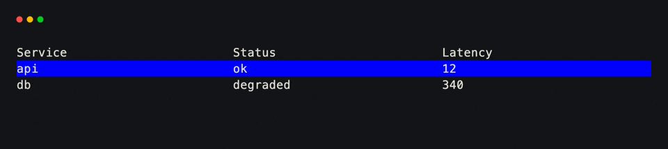
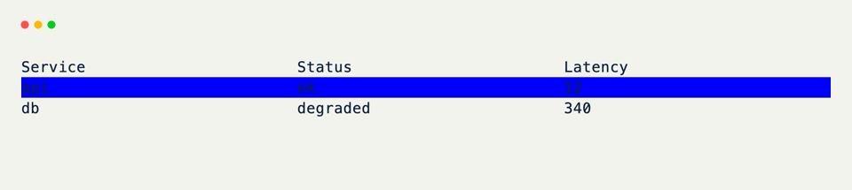
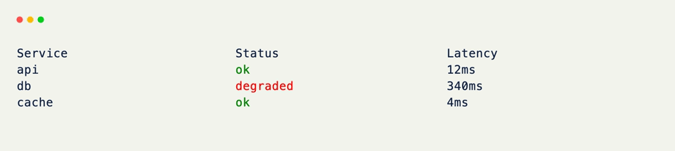

# Table

`Table` turns a list of rows into a scrollable, styled terminal table — no manual column layout required.

Feed it dicts, dataclasses, or any attribute-bearing object and it derives columns straight from the data.

??? example "Interactive Example"

    The following code block is interactive and can be run directly in the browser.

    ```pyodide install="xnano>=1.0.8" hl_lines="4 5 6 7"
    from xnano import render
    from xnano.components.table import Table

    render(
        Table(data=[
            {"service": "api", "status": "ok", "latency": 12},
            {"service": "db", "status": "degraded", "latency": 340},
        ])
    )
    ```

```python title="A Data-Driven Table" hl_lines="4 5 6 7"
from xnano import render
from xnano.components.table import Table

render(
    Table(data=[
        {"service": "api", "status": "ok", "latency": 12},
        {"service": "db", "status": "degraded", "latency": 340},
    ]) # (1)!
)
```

1. Column names, header text, and cell values all come from the dict keys — nothing else to declare.

<div class="xnano-demo" markdown>
{.demo-dark}
{.demo-light}
</div>

<br/>

Override individual columns without giving up the data-driven path — a mapping of field name to header text, formatter, or a full `Column`:

```python title="Overriding Columns" hl_lines="2 3 4 5"
from xnano.components.table import Column, Table

Table(
    data=rows,
    columns={
        "service": "Service",
        "latency": Column(align="right", format="{}ms"),
    },
)
```

<div class="xnano-demo" markdown>
{.demo-dark}
{.demo-light}
</div>

<br/>

For a table whose columns are fixed ahead of time, subclassing with `Column()` descriptors reads more like a schema — see [Schema]{data-preview}.

The full parameter list — selection, highlighting, column spacing, and more — lives on the [Table]{data-preview} API reference.

??? abstract "Sandbox & API"

    **Sandbox**

    [Every Column Form](../sandbox/table.md#every-column-form){data-preview} · [Selection and Highlighting](../sandbox/table.md#selection-and-every-highlight-option){data-preview} · [Every Column Option](../sandbox/table.md#every-column-option){data-preview}

    **API**

    [`Table`](../api/xnano/components/table.md#xnano.components.table.Table){data-preview} · [`ColumnsArg`](../api/xnano/components/table.md#xnano.components.table.ColumnsArg){data-preview} · [`Column`](../api/xnano/components/schema.md#xnano.components.schema.Column){data-preview}

[Table]: ../api/xnano/components/table.md
[Schema]: schema.md
