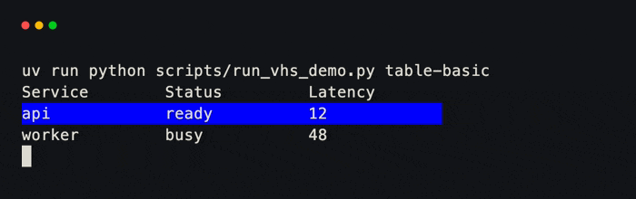
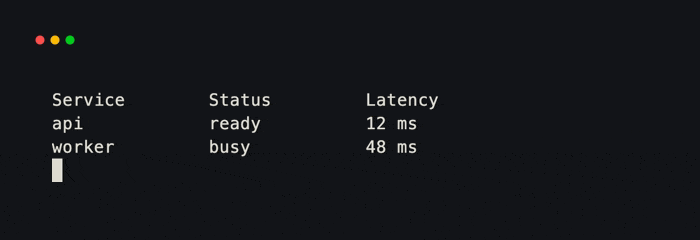
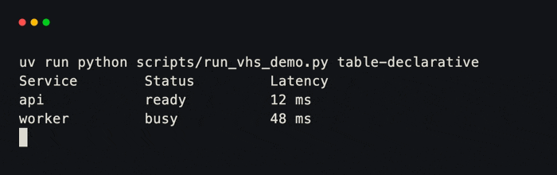

# Table

`Table` accepts dictionaries, dataclass instances, or ordinary objects. With
no column configuration, it reads the first row and preserves that field
order.

```python title="table.py"
from xnano.components.table import Table
from xnano.terminal import Terminal

services = Table(
    data=[
        {"service": "api", "status": "ready", "latency": 12},
        {"service": "worker", "status": "busy", "latency": 48},
    ],
    selected=0,  # (1)!
    highlight_background="blue",
)

Terminal(width=44, height=4).run(services)
```

1. `selected` highlights a row and asks the native table to keep it visible.

<div class="xnano-demo" markdown>
{ width="700" }
</div>

<!-- Demo key: components/table-basic; viewport: 44x4 cells. -->

## Choose and format columns

Pass a list to select and order fields, or a mapping to configure each field.
A mapping value may be a header string, an accessor function, or a `Column`.

```python title="table_columns.py"
from xnano.components.schema import Column
from xnano.components.table import Table
from xnano.terminal import Terminal

services = Table(
    data=[
        {"service": "api", "status": "ready", "latency": 12},
        {"service": "worker", "status": "busy", "latency": 48},
    ],
    columns={
        "service": "Service",
        "status": Column(
            color=lambda value: "green" if value == "ready" else "yellow"
        ),
        "latency": Column(header="Latency", align="right", format="{} ms"),  # (1)!
    },
)

Terminal(width=44, height=4).run(services)
```

1. `format` accepts a `str.format` template or a formatting function.

<div class="xnano-demo" markdown>
{ width="700" }
</div>

<!-- Demo key: components/table-columns; viewport: 44x4 cells. -->

## Declare a reusable table

For a table shape used in several places, subclass `Table` and declare
`Column` values as class attributes. This is the component counterpart to
declaring `Field` values on a `Grid`.

```python title="service_table.py"
from xnano.components.schema import Column
from xnano.components.table import Table
from xnano.terminal import Terminal

class ServiceTable(Table):
    service: str = Column()
    status: str = Column(
        color=lambda value: "green" if value == "ready" else "yellow"
    )
    latency: int = Column(align="right", format="{} ms", width=10)  # (1)!

Terminal(width=44, height=4).run(
    ServiceTable(
        data=[
            {"service": "api", "status": "ready", "latency": 12},
            {"service": "worker", "status": "busy", "latency": 48},
        ]
    )
)
```

1. A column width may be a fixed cell count or a fractional share from `0.0`
   through `1.0`. Widths are sent to the renderer when every column defines
   one.

<div class="xnano-demo" markdown>
{ width="700" }
</div>

<!-- Demo key: components/table-declarative; viewport: 44x4 cells. -->
