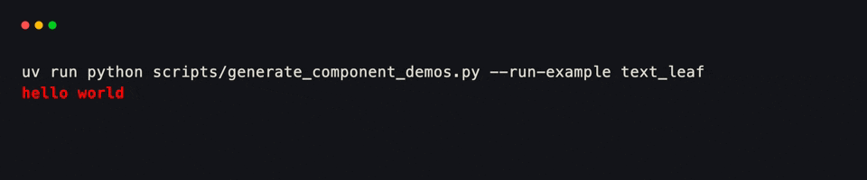
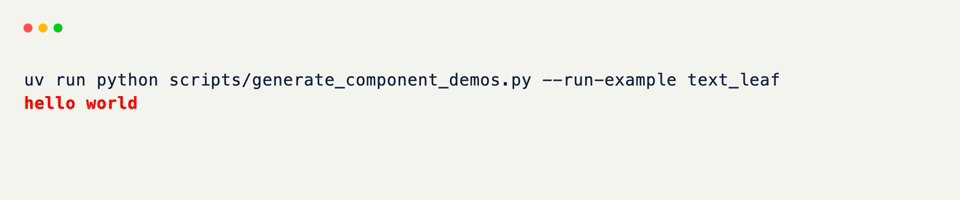
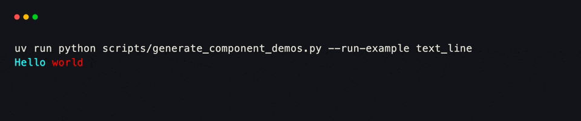
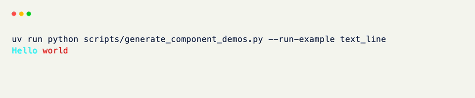
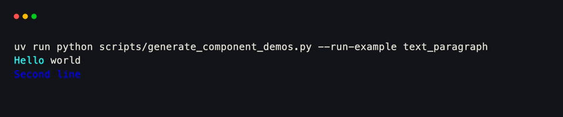
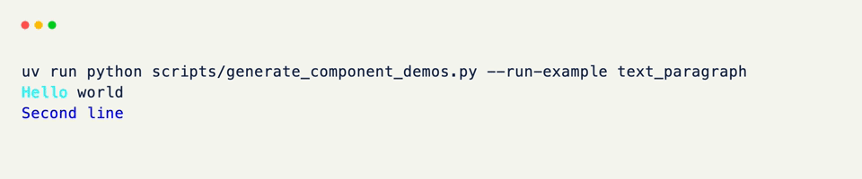
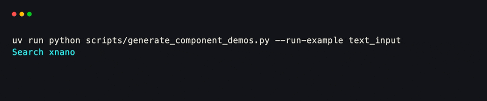
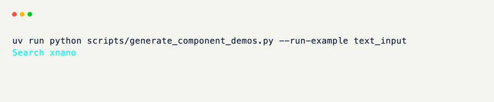

# Text

`Text` is xnano's one component for strings — a single styled span, a line of spans stitched together, a multi-line paragraph, or an editable input, all through the same class.

Every mode is the same constructor, just handed a different shape of `content`: a plain string, a list of `Text` children, or a list of lists. Leaf strings can also opt into display parsers (`ansi`, `markdown`, `language`) or become inputs (`input`, optionally `multiline`).

<div class="grid-concept-diagram" role="img" aria-label="Diagram: Text content shapes — leaf string, line of spans, paragraph of lines">
<svg viewBox="0 0 720 230" xmlns="http://www.w3.org/2000/svg" fill="none">
  <!-- Leaf -->
  <rect class="gcd-panel" x="28" y="36" width="200" height="160" rx="14" />
  <text class="gcd-label" x="128" y="68" text-anchor="middle">leaf</text>
  <text class="gcd-chrome-label" x="128" y="90" text-anchor="middle">str</text>
  <rect class="gcd-cell-highlight-strong" x="52" y="118" width="152" height="36" rx="6" />
  <text class="gcd-z-label gcd-z-label-on" x="128" y="140" text-anchor="middle">hello</text>
  <text class="gcd-z-caption" x="128" y="178" text-anchor="middle">one run · one style</text>

  <!-- Line -->
  <rect class="gcd-panel" x="260" y="36" width="200" height="160" rx="14" />
  <text class="gcd-label" x="360" y="68" text-anchor="middle">line</text>
  <text class="gcd-chrome-label" x="360" y="90" text-anchor="middle">list of leaves</text>
  <rect class="gcd-cell-highlight" x="284" y="118" width="68" height="36" rx="6" />
  <rect class="gcd-cell-highlight-strong" x="360" y="118" width="76" height="36" rx="6" />
  <text class="gcd-z-label gcd-z-label-on" x="318" y="140" text-anchor="middle">Hi</text>
  <text class="gcd-z-label gcd-z-label-on" x="398" y="140" text-anchor="middle">you</text>
  <text class="gcd-z-caption" x="360" y="178" text-anchor="middle">spans side by side</text>

  <!-- Paragraph -->
  <rect class="gcd-panel gcd-panel-accent" x="492" y="36" width="200" height="160" rx="14" />
  <text class="gcd-label gcd-label-accent" x="592" y="68" text-anchor="middle">paragraph</text>
  <text class="gcd-chrome-label" x="592" y="90" text-anchor="middle">list of lines</text>
  <rect class="gcd-cell-highlight" x="516" y="108" width="152" height="28" rx="5" />
  <rect class="gcd-cell-highlight-strong" x="516" y="144" width="120" height="28" rx="5" />
  <text class="gcd-z-caption gcd-z-caption-on" x="592" y="178" text-anchor="middle">rows stacked</text>
</svg>
</div>

## Composing Text

A bare string is a leaf — the simplest form, a single styled run.

```python title="A Leaf" hl_lines="3"
from xnano.components.text import Text

Text("hello world", color="red", modifiers=("bold",))
```

<div class="xnano-demo" markdown>
{.demo-dark}
{.demo-light}
</div>

<br/>

Give it a list of leaf `Text` children instead, and they compose into one line, each keeping its own styling.

```python title="A Line" hl_lines="3 4 5 6"
Text([
    Text("Hello ", color="cyan"),
    Text("world", color="red"),
])
```

<div class="xnano-demo" markdown>
{.demo-dark}
{.demo-light}
</div>

<br/>

Nest a list of lines — where at least one child is itself a line — and `Text` becomes a paragraph, stacking each child on its own row.

```python title="A Paragraph" hl_lines="3 4 5"
Text([
    Text([Text("Hello ", color="cyan"), Text("world")]),
    Text("Second line", color="blue"),
])
```

<div class="xnano-demo" markdown>
{.demo-dark}
{.demo-light}
</div>

`Text` figures out which of the three you mean from the shape of `content` alone — there's no separate `Line` or `Paragraph` class to reach for.

## Styling

`color`, `background`, and `modifiers` work the same at every level of nesting — set them on the outer `Text` to style a whole line or paragraph by default, or on individual children to override just that span.

??? example "Interactive Example"

    The following code block is interactive and can be run directly in the browser.

    ```pyodide install="xnano>=1.0.8" hl_lines="3 4 5"
    from xnano import render
    from xnano.components.text import Text

    render(Text([
        Text("● ", color="emerald-400"),
        Text("Done: ", color="white", modifiers=("bold",)),
        Text("all tests passed", color="slate-300"),
    ]))
    ```

```python title="Styling Spans" hl_lines="1 2 3"
Text([
    Text("● ", color="emerald-400"), # (1)!
    Text("Done: ", color="white", modifiers=("bold",)),
    Text("all tests passed", color="slate-300"),
])
```

1. Each child picks its own `color`; a modifier like `"bold"` only has to be set on the span that needs it.

## Alignment

`align` and `wrap` apply at the paragraph level — they control how a `Text`'s lines sit within whatever space its field or `render()` call gives it, not the styling of individual spans.

```python title="Aligning a Paragraph" hl_lines="2"
Text(
    "Centered inside its field",
    align="center",
)
```

`align` accepts `"left"` (the default), `"center"`, or `"right"`. `wrap` (default `True`) controls whether a line that's too long for its area breaks onto the next row instead of overflowing.

## Editable Input

Set `input=True` on a leaf `Text` placed in a field, and it becomes a real text box — focusable, part of the tab order, and able to receive keystrokes.

```python title="An Editable Field" hl_lines="3"
from xnano import BaseGrid, Field

class Form(BaseGrid, direction="vertical"):
    name: Text = Field(default=Text("", input=True, placeholder="your name"))
```

<div class="xnano-demo" markdown>
{.demo-dark}
{.demo-light}
</div>

<br/>

Nothing else is required to make this work. Every `Text(input=True)` field on a live grid is automatically collected into a tab order — the terminal moves focus between them and routes keystrokes to whichever one is focused, without a hook to write.

`placeholder` shows in place of an empty, unfocused input — a plain string renders dim by default, or pass a styled `Text` to keep full control. `cursor` is the caret's index into `content`; leave it `None` and it tracks the end of the string as the user types.

### Multi-line Editing

Add `multiline=True` (and optional `rows`) alongside `input=True` for a multi-line editor backed by the native `CoreTextEditor` — multi-line content, undo/redo, paste, and an in-buffer caret:

```python title="A Multi-line Input" hl_lines="5 6 7"
from xnano import BaseGrid, Field
from xnano.components.text import Text

class Form(BaseGrid, direction="vertical"):
    notes: Text = Field(
        default=Text("", input=True, multiline=True, rows=5),
    )
```

`rows` is the preferred visible height in lines; leave it `None` to size to the content. Single-line inputs keep the lightweight caret path — only `multiline` switches to the native editor.

### Focus

Inputs participate in field focus through a duck-typed protocol: a truthy `focusable` property and a `handle_keyboard` method. For `Text`, `focusable` is `True` whenever `input=True`.

Live focus state is exposed as `focused` on the component (and on grids for their own focus). Read it in hooks, or watch it with `@on_field("name.focused")`:

```python title="Reacting to Focus" hl_lines="1 5"
@on_focus("name", kind="gained")
def highlight_name_field(self) -> None:
    ...

@on_field("name.focused")
def name_focus_changed(self) -> None:
    if self.name.focused:
        ...
```

The same focus machinery is shared with other focusable components such as [Select]{data-preview}.

## Display Modes

Leaf `Text` can parse its string before styling. These modes are **mutually exclusive** with each other and with `input` — combining them raises `ValueError`:

| Mode | Flag | What it does |
|------|------|----------------|
| ANSI | `ansi=True` | Parse SGR escape sequences into styled runs |
| Markdown | `markdown=True` | Headings, emphasis, lists, fenced code |
| Language | `language="python"` | Pygments syntax highlighting only |

### ANSI

Handy for subprocess output, Rich, pytest, or anything that already emits ANSI SGR sequences:

```python title="ANSI Content" hl_lines="3"
from xnano.components.text import Text

Text("\x1b[32mpassed\x1b[0m  \x1b[31mfailed\x1b[0m", ansi=True)
```

Without `ansi=True`, the escape codes render as raw characters. With it, they become styled runs.

### Markdown

`markdown=True` runs the string through markdown-it-py — headings, emphasis, lists, blockquotes, and fenced code blocks (highlighted from their fence language tag):

```python title="Markdown Content" hl_lines="3 4 5 6 7"
from xnano.components.text import Text

Text(
    "# Release notes\n\n- **bold** item\n- `code` item\n\n```python\nprint('hi')\n```",
    markdown=True,
)
```

### Syntax Highlighting

Set `language` to a Pygments lexer name (for example `"python"`, `"rust"`, `"json"`) to highlight a code string **without** markdown parsing:

```python title="Syntax Highlighting" hl_lines="3"
from xnano.components.text import Text

Text("def greet(name):\n    return f'hi {name}'", language="python")
```

Use `markdown=True` when the fence language should drive highlighting inside a document; use `language=` when the whole leaf is source code.

The full parameter list — every styling, input, and display option `Text` accepts — lives on the [Text]{data-preview} API reference.

??? abstract "Sandbox & API"

    **Sandbox**

    [Text Content](../sandbox/text.md#text-content){data-preview} · [Alignment and Wrapping](../sandbox/text.md#alignment-and-wrapping){data-preview} · [Input, Placeholder, and Cursor](../sandbox/text.md#input-placeholder-and-cursor){data-preview} · [Multi-line Editing](../sandbox/text.md#multi-line-editing){data-preview} · [ANSI, Markdown, and Language](../sandbox/text.md#ansi-markdown-and-language){data-preview}

    **API**

    [`Text`](../api/xnano/components/text.md#xnano.components.text.Text){data-preview} · [`Alignment`](../api/xnano/_types.md#xnano._types.Alignment){data-preview} · [`CharacterModifier`](../api/xnano/_types.md#xnano._types.CharacterModifier){data-preview}

[Text]: ../api/xnano/components/text.md
[Select]: select.md
