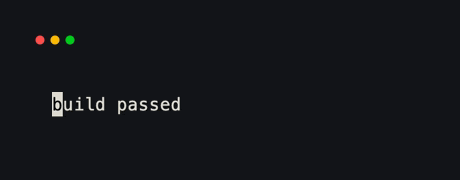
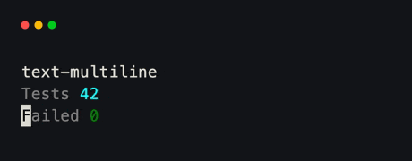
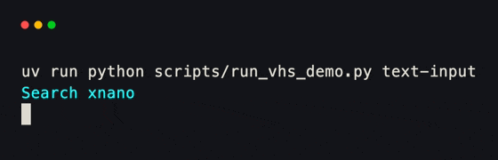

# Text

`Text` handles plain styled text, inline spans, multiple lines, and editable
input. Its shape comes from `content`: a string is a paragraph, a list of leaf
`Text` values is one composed line, and nested lists form multiple lines.

```python title="styled_text.py"
from xnano.components.text import Text
from xnano.terminal import Terminal

message = Text(
    [
        Text("build ", color="gray"),
        Text("passed", color="green", modifiers=("bold",)),  # (1)!
    ]
)

Terminal(height=1).run(message)
```

1. Child values keep their own color, background, and character modifiers.

<div class="xnano-demo" markdown>
{ width="460" }
</div>

<!-- Demo key: components/text-styled; viewport: 24x1 cells. -->

## Multiple lines

Use a child `Text` for each line. `align` and `wrap` belong to the outer
paragraph.

```python title="multiline_text.py"
from xnano.components.text import Text
from xnano.terminal import Terminal

summary = Text(
    [
        Text([Text("Tests ", color="gray"), Text("42", color="cyan")]),
        Text([Text("Failed ", color="gray"), Text("0", color="green")]),
    ],
    align="right",  # (1)!
)

Terminal(width=24, height=2).run(summary)
```

1. Paragraph-level alignment applies to each rendered line.

<div class="xnano-demo" markdown>
{ width="460" }
</div>

<!-- Demo key: components/text-multiline; viewport: 24x2 cells. -->

## Editable text

Set `input=True` on a leaf `Text` used in a grid field. The field joins tab
order and handles insertion, deletion, navigation, and a visible caret while
focused. `placeholder` appears only while the value is empty and unfocused.

```python title="text_input.py" hl_lines="8"
from xnano.components.text import Text
from xnano.fields import Field
from xnano.grid import Grid
from xnano.terminal import Terminal

class Search(Grid):
    query: Text = Field(
        default_factory=lambda: Text("", input=True, placeholder="Search…"),  # (1)!
        height=1,
    )

Terminal(height=1).run(Search())
```

1. Read or replace the current plain string through `query.value`.

<div class="xnano-demo" markdown>
{ width="560" }
</div>

<!-- Demo key: components/text-input; viewport: 36x1 cells. -->

??? note "Beta: web-capable Text"

    The stable `Text` on this page targets the terminal. For browser
    rendering under [Web UI]{data-preview}, use
    `xnano.beta.components.text.Text` — a thin subclass that implements
    `get_web_node` and lowers styled / multiline / input content to HTML
    via web render nodes. Import that class when a grid field must paint
    under both hosts; the API surface (colors, modifiers, `input=True`)
    stays the same.

    See [Web rendering]{data-preview} for node layout and placeholders.

[Web UI]: ../beta/webui/index.md
[Web rendering]: ../beta/webui/rendering.md
