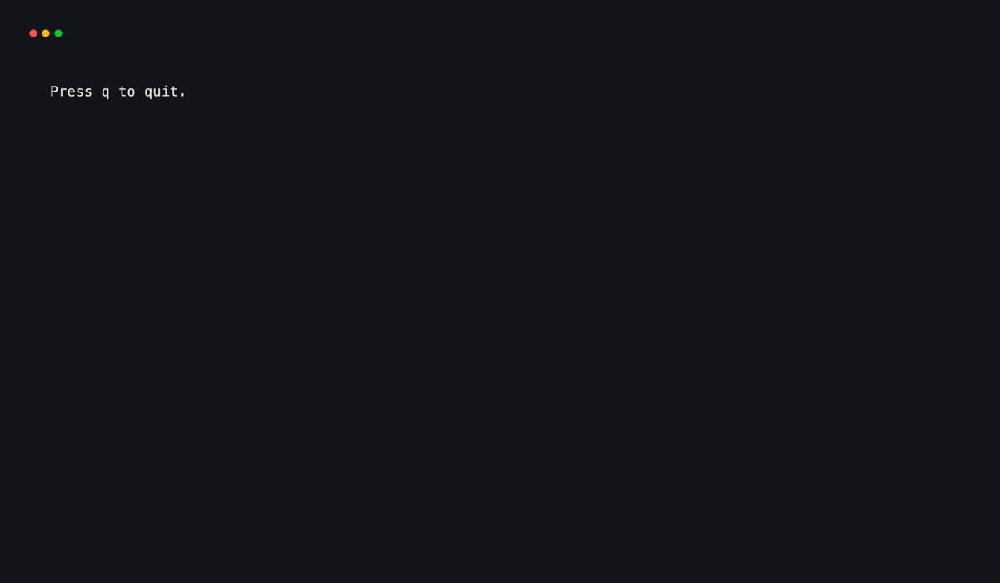
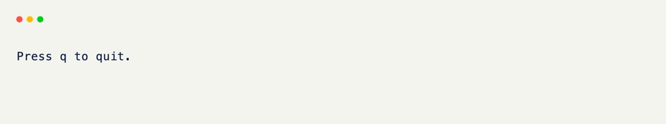

# Getting Started

xnano is a terminal UI framework built on Rust. The Python API is deliberately model-like — you declare what you want and xnano handles the rendering, event loop, and teardown. If you've used Pydantic or dataclasses the shape of it will feel familiar immediately.

This declarative model is the foundation for more than full-screen terminal
apps. The same grids and components also power a [CLI](../cli/index.md) and a
[web UI host](../webui/index.md). The terminal APIs on this page are the primary
path for interactive TUIs.

---

## Install

=== "pip"

    ```bash
    # install the latest version of the library
    pip install "xnano>=1.0.1"
    ```

=== "uv"

    ```bash
    uv add "xnano>=1.0.1"
    ```

=== "poetry"

    ```bash
    poetry add "xnano>=1.0.1"
    ```

Python 3.10+ required. The Rust extension (`xnano-core`) ships inside the wheel, so there are no system-level dependencies to manage.

---

## Printing to the terminal

The simplest entry point is the print-like `render()` helper. It writes styled
content to stdout and returns immediately — no session, no alternate screen,
no event loop. It behaves like a `print()` call that understands layout and
color.

You can pass any number of renderables. They stack vertically in the order given.

```python title="hello.py"
from xnano._renderable import render
from xnano.components.text import Text

render(
    Text("Hello from xnano!", color="violet", modifiers=["bold"]),
    Text("Render returns immediately — no event loop needed.", color="slate-400"),
)
```

<div class="xnano-demo" markdown>
{.demo-dark}
{.demo-light}
</div>

---

## Building an interactive app

For anything that stays on screen and responds to input, use `Terminal().run()` with a `BaseGrid`. A `BaseGrid` is a Python class where each annotated field becomes a slot in your layout. Field declaration order is layout order — top to bottom for `direction="vertical"`, left to right for `direction="horizontal"`. (`Grid` is an alias of `BaseGrid`.)

The `@on_keyboard` decorator wires a method to a key event. The method is called by the Rust event loop, on the Python thread, whenever that key is pressed. You don't need to poll, check, or manage state yourself.

```python title="app.py" hl_lines="4 5 6 7 8 9 10"
from xnano import Field, BaseGrid, Terminal
from xnano.events import on_keyboard

class Hello(BaseGrid, direction="vertical"): # (1)!
    message: str = Field(default="Press q to quit.", height=1) # (2)!

    @on_keyboard("q") # (3)!
    def quit(self, ctx) -> None:
        ctx.terminal.request_exit()

Terminal().run(Hello()) # (4)!
```

1. `BaseGrid` is the base for all layouts. `direction="vertical"` stacks fields top-to-bottom; `"horizontal"` goes left-to-right.
2. `height=1` pins this field to exactly one row. Without a size constraint, a field fills the available space.
3. `@on_keyboard` wires a method to a key. The method name is up to you.
4. `run()` enters the alternate screen and starts the Rust event loop. It returns when the loop exits.

<div class="xnano-demo" markdown>
{.demo-dark}
{.demo-light}
</div>

---

## What happens when you call `run()`

When `Terminal().run(grid)` is called:

1. xnano reads your `BaseGrid` class and resolves the layout from field declarations and sizing constraints.
2. It paints the first frame to the terminal.
3. The Rust event loop takes over — blocking on crossterm input, firing tick timers, and calling your Python hooks as events arrive.
4. When your code calls `ctx.terminal.request_exit()`, the loop stops and the terminal is restored.

The Rust layer handles all the low-level work — raw mode, alternate screen, buffer diffing, escape sequences. Python only sees events and field values.

---

## Next steps

- [Terminal](terminal.md) — run modes, sizing, state, and configuration
- [Grid & Fields](grid.md) — building layouts and controlling field appearance
- [Sizing](sizing.md) — how `width=` and `height=` values are resolved
- [Hooks](hooks.md) — responding to keyboard, tick, click, and state events
