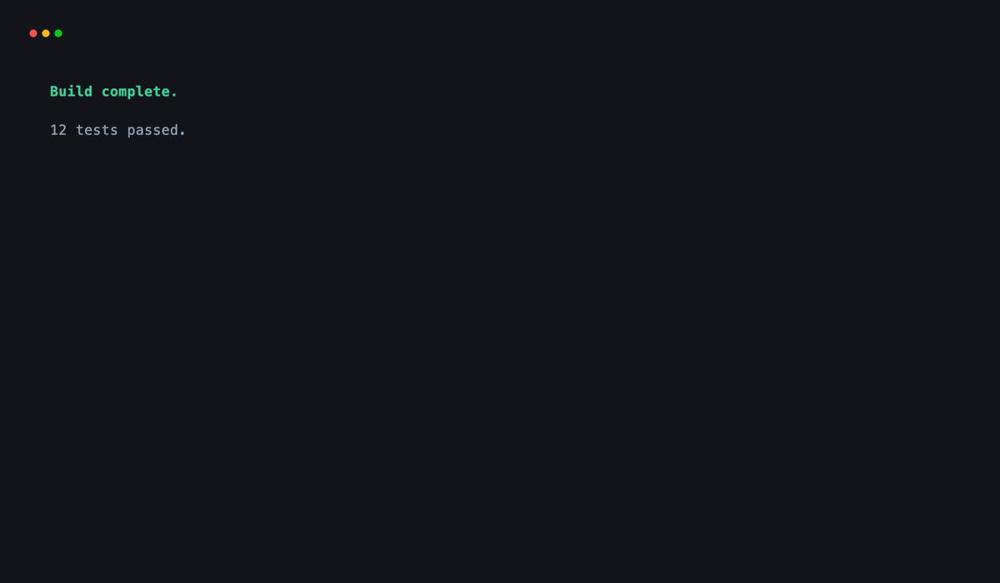
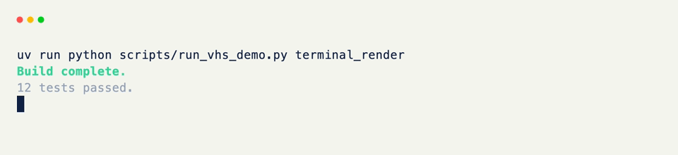
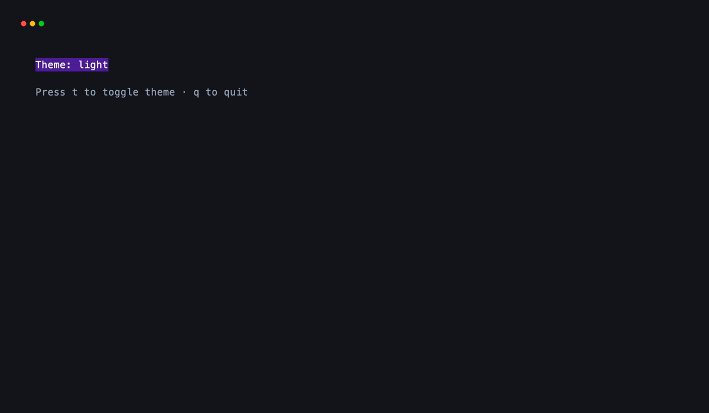
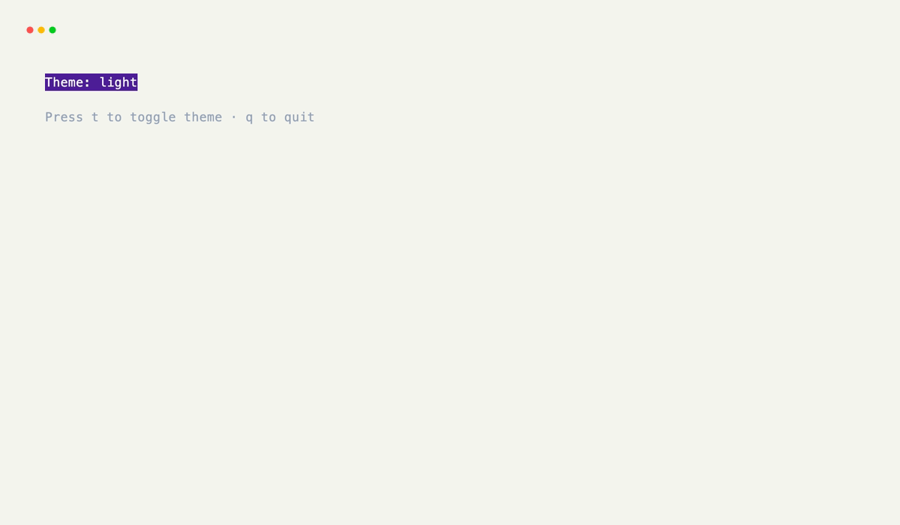

# Terminal sessions

`Terminal` owns the output area and, for interactive applications, the event
loop. Choose `render()` for a result that returns to the shell and `run()` for
a grid that stays active and responds to events.

## Render a result

`render()` paints one frame in the current screen. Multiple values are laid out
vertically unless you pass a different field configuration.

```python title="result.py"
from xnano import Terminal
from xnano.components import Text

Terminal().render(
    Text("Build complete.", color="emerald-400", modifiers=["bold"]),
    Text("12 tests passed.", color="slate-400"),
)
```

<div class="xnano-demo" markdown>
{.demo-dark width="560" loading=lazy}
{.demo-light width="560" loading=lazy}
</div>

Use `width` and `height` to constrain this inline viewport. Both accept the
same fixed, percentage, fractional, and fitted values described in
[Sizing](sizing.md).

## Run an application

`run()` attaches a grid, starts the event loop, and restores the terminal after
exit. A context manager is useful when the application also carries shared
state or changes device settings.

```python title="state.py"
import dataclasses

from xnano import Field, Grid, Terminal
from xnano.hooks import on_keyboard

@dataclasses.dataclass
class AppState:
    theme: str = "dark"

class App(Grid):
    label: str = Field(default="Theme: dark")

    @on_keyboard("t")
    def toggle_theme(self, context) -> None:  # (1)!
        context.state.theme = (
            "light" if context.state.theme == "dark" else "dark"
        )
        self.label = f"Theme: {context.state.theme}"

    @on_keyboard("q")
    def close_app(self, context) -> None:
        context.terminal.request_exit()  # (2)!

with Terminal(state=AppState()) as terminal:
    terminal.run(App())
```

1. State attached to the terminal is available to hooks throughout the grid.
2. `request_exit()` finishes the current loop iteration, then restores the
   terminal.

<div class="xnano-demo" markdown>
{.demo-dark width="700" loading=lazy}
{.demo-light width="700" loading=lazy}
</div>

The [Terminal guide](../terminal/index.md) covers offscreen sessions, device
modes, and cursor control.
