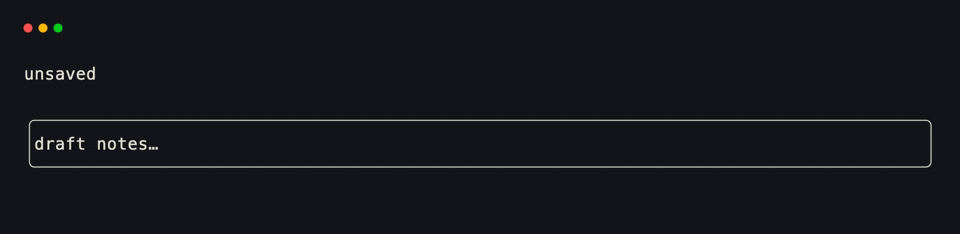
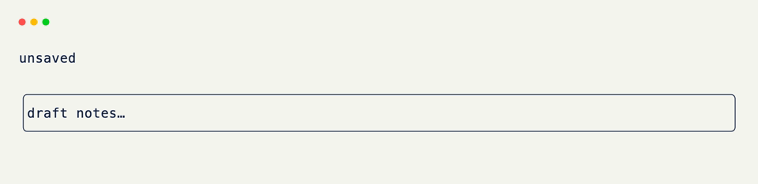

# Actions

An event says what the host observed: a key was pressed, the mouse moved, or the window resized. An [Action]{data-preview} describes the trigger your app cares about — and can produce that same trigger on demand.

That distinction matters once a binding appears in more than one place. Instead of teaching every handler, test, and host that saving means <kbd>Ctrl</kbd>+<kbd>S</kbd>, define the binding once and give it an application-level name.

```python title="Naming a Trigger"
from xnano import Action

SAVE = Action.keyboard("ctrl+s")
```

`SAVE` is an immutable value, not a callback. It can be bound to a hook, compared against a real event, or performed against a host as synthetic input.

<div class="grid-concept-diagram" role="img" aria-label="Diagram: a real event or performed action travels through the same action matching and hook dispatch path">
<svg viewBox="0 0 720 280" xmlns="http://www.w3.org/2000/svg" fill="none">
  <defs>
    <marker id="acd-arrow" markerWidth="8" markerHeight="8" refX="6" refY="4" orient="auto">
      <path d="M0,0 L8,4 L0,8 Z" class="gcd-arrow-fill" />
    </marker>
  </defs>

  <!-- Real input -->
  <rect class="gcd-panel" x="24" y="32" width="176" height="84" rx="12" />
  <text class="gcd-label" x="112" y="62" text-anchor="middle">real input</text>
  <text class="gcd-chrome-label" x="112" y="88" text-anchor="middle">Ctrl+S key event</text>

  <!-- Synthetic input -->
  <rect class="gcd-panel" x="24" y="164" width="176" height="84" rx="12" />
  <text class="gcd-label" x="112" y="194" text-anchor="middle">perform</text>
  <text class="gcd-chrome-label" x="112" y="220" text-anchor="middle">host.perform(SAVE)</text>

  <line class="gcd-arrow" x1="200" y1="74" x2="284" y2="124" marker-end="url(#acd-arrow)" />
  <line class="gcd-arrow" x1="200" y1="206" x2="284" y2="156" marker-end="url(#acd-arrow)" />

  <!-- Shared matcher -->
  <rect class="gcd-panel gcd-panel-accent" x="296" y="86" width="192" height="108" rx="14" />
  <text class="gcd-label gcd-label-accent" x="392" y="120" text-anchor="middle">SAVE</text>
  <text class="gcd-chrome-label" x="392" y="146" text-anchor="middle">Action.keyboard</text>
  <text class="gcd-z-caption" x="392" y="172" text-anchor="middle">matches ctrl+s</text>

  <line class="gcd-arrow" x1="488" y1="140" x2="548" y2="140" marker-end="url(#acd-arrow)" />

  <!-- Hook -->
  <rect class="gcd-panel" x="560" y="88" width="136" height="104" rx="14" />
  <text class="gcd-label" x="628" y="120" text-anchor="middle">hook</text>
  <text class="gcd-chrome-label" x="628" y="148" text-anchor="middle">@on(SAVE)</text>
  <text class="gcd-z-label gcd-z-label-on" x="628" y="172" text-anchor="middle">save()</text>
</svg>
</div>

## Binding an Action

The general `@on` decorator binds a prebuilt action to a method. When an incoming event satisfies the action's filters, xnano calls the method like any other hook.

```python title="Binding an Action" hl_lines="3 5"
from xnano import Action, on

SAVE = Action.keyboard("ctrl+s") # (1)!

@on(SAVE) # (2)!
def save(self) -> None:
    self.dirty = False
    self.status = "saved"
```

1. `Action.keyboard(...)` accepts the same binding grammar as `@on_keyboard`: `"enter"`, `"ctrl+s"`, `"alt+left"`, and so on.
2. `@on(SAVE)` keeps the method attached to the meaning of the constant. Changing the binding in one place updates every hook that uses it.

<br/>

The specialized decorators are still the clearest choice for one-off bindings. These two hooks behave the same way:

```python title="Actions and Specialized Hooks"
@on(Action.keyboard("escape"))
def close_with_action(self) -> None: ...

@on_keyboard("escape")
def close_with_hook(self) -> None: ...
```

Reach for an `Action` when a trigger is reused, needs a meaningful name, or will be performed from code. Keep `@on_keyboard`, `@on_click`, and the other specialized hooks for local, one-use reactions.

## Reusing a Binding

A named action can be shared by several grids without either grid owning the physical key choice.

```python title="Reusing a Binding" hl_lines="3 8 13"
from xnano import Action, BaseGrid, on

SAVE = Action.keyboard("ctrl+s")

class Editor(BaseGrid):
    @on(SAVE)
    def save_document(self) -> None:
        self.status = "saved"

class Settings(BaseGrid):
    @on(SAVE)
    def save_preferences(self) -> None:
        self.status = "preferences saved"
```

The action does not prescribe what saving does. It only carries the trigger and its filters; each bound hook supplies the reaction appropriate to its grid.

<div class="xnano-demo" markdown>
{.demo-dark}
{.demo-light}
</div>

## Performing an Action

Every live host can perform an action. The host turns it into an equivalent event and sends it through the same dispatch path as real input, so the existing hooks fire without a second code path.

```python title="Performing an Action" hl_lines="1 5"
terminal.perform(SAVE) # (1)!

@on_keyboard("f2")
def save_from_shortcut(self, ctx: Context) -> None:
    ctx.actions.perform(SAVE) # (2)!
```

1. `host.perform(...)` is useful in tests, host integrations, and application code that already has the live host.
2. Inside a hook, `ctx.actions` is the host-bound helper. Performing `SAVE` causes every `@on(SAVE)` hook on the active interface to run.

For common synthetic inputs, the helper also has short methods such as `ctx.actions.press("ctrl+s")`, `click("submit")`, `focus("search")`, `paste("text")`, `resize(...)`, and `tick(...)`.

??? warning "Avoid action loops"

    A performed action can trigger a hook that performs another action. xnano queues that work until the current dispatch finishes, but a hook that performs its own trigger forever is still a loop. Treat `perform()` like emitting input: make sure the reaction eventually stops emitting the same input.

## Action Families

Actions mirror the event families used by the hook decorators:

| Builder | Matches | Specialized hook |
|---|---|---|
| `Action.keyboard(*bindings, kind=None)` | key press, release, or repeat | `@on_keyboard` |
| `Action.mouse(*buttons, kind=None)` | mouse button or movement kind | `@on_mouse` |
| `Action.click(field=None, button="left")` | click, optionally scoped to a field | `@on_click` |
| `Action.focus(field=None, kind=None)` | window or field focus change | `@on_focus` |
| `Action.clipboard(text=None)` | clipboard paste | `@on_clipboard` |
| `Action.tick(interval_ms=0)` | host clock tick | `@on_tick` |
| `Action.resize(width=None, height=None)` | host resize | `@on_resize` |
| `Action.request(method, path)` | web request route | request hooks |

All of them share the same core contract: `matches(event)` checks whether an event satisfies the action, while `to_event()` creates the synthetic event used by `perform()`.

The next concept, [Context]{data-preview}, is where the host, current event, shared state, and the `ctx.actions` helper come together inside a hook.

??? abstract "Sandbox & API"

    **Sandbox**

    [Action-Driven Frames](../sandbox/rendering.md#action-driven-frames-without-run){data-preview}

    **API**

    [`Action`](../api/xnano/core/actions.md#xnano.core.actions.Action){data-preview} · [`Context`](../api/xnano/context.md#xnano.context.Context){data-preview}

[Action]: ../api/xnano/core/actions.md
[Context]: ../api/xnano/context.md
