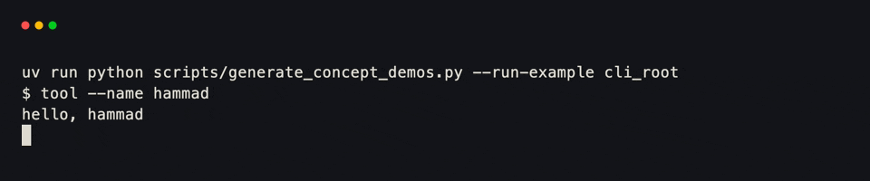
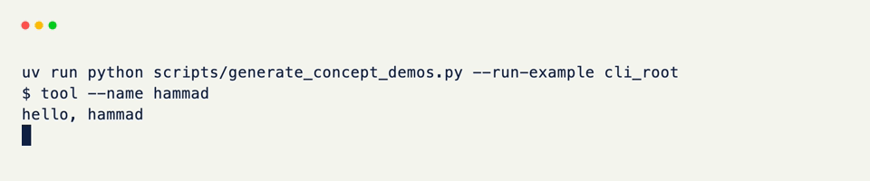
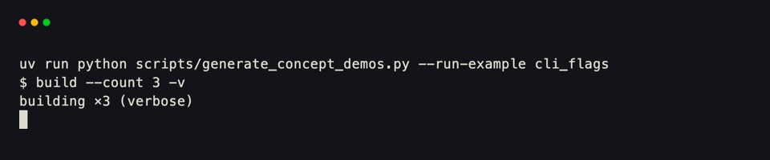
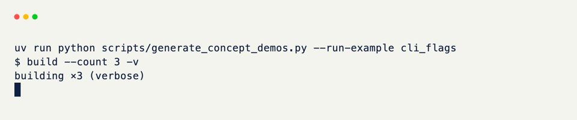
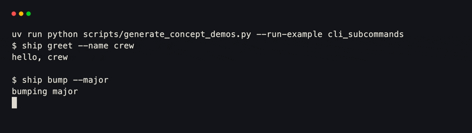
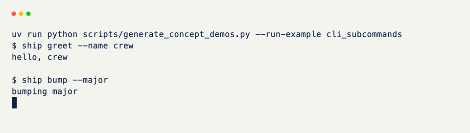
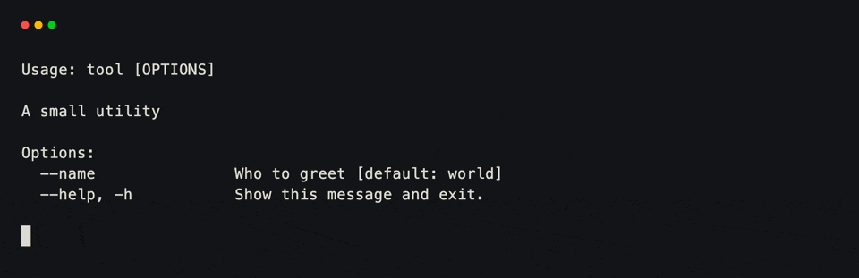
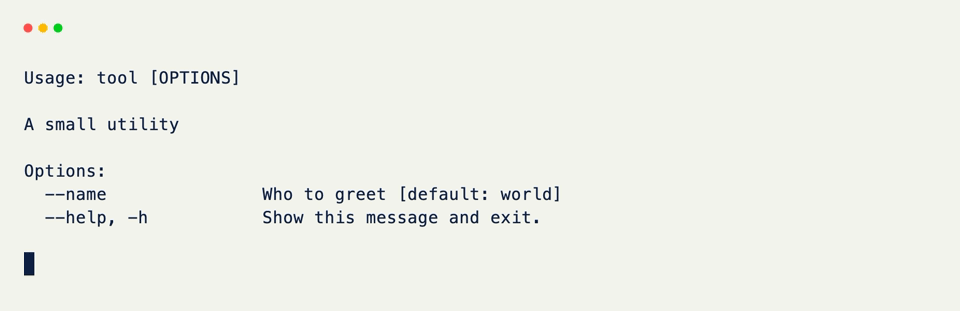

# CLI Commands

!!! warning "Experimental"

    This feature is not only experimental but meant purely as a prototyping surface. This is in **no way**, and will never be a replacement for frameworks such as [typer](https://typer.tiangolo.com/) or [click](https://click.palletsprojects.com/).

[Command]{data-preview} is xnano's CLI surface — declarative options and subcommands for process arguments, with the same spirit as grids and fields, aimed for creating small command-line tools rather than full terminal applications.

It is not a TUI host. Use it when a tool needs a real command-line entrypoint; pair it with [Terminal]{data-preview} only when the same project also runs an interactive session.

A `Command` can:

- Register a root callback <small>(`@cli` or `register_callback`)</small>
- Declare options and flags <small>(`@Command.option`)</small>
- Nest subcommands <small>(`@cli.command()` or `add_subcommand`)</small>
- Coerce values from type annotations <small>(optionally `strict=True`)</small>
- Emit help automatically <small>(`--help` / `-h`)</small>

<div class="grid-concept-diagram" role="img" aria-label="Diagram: argv flows into Command parse, then into a callback or nested subcommand">
<svg viewBox="0 0 720 220" xmlns="http://www.w3.org/2000/svg" fill="none">
  <defs>
    <marker id="cli-arrow" markerWidth="8" markerHeight="8" refX="6" refY="4" orient="auto">
      <path d="M0,0 L8,4 L0,8 Z" class="gcd-arrow-fill" />
    </marker>
  </defs>

  <rect class="gcd-panel" x="28" y="60" width="140" height="80" rx="12" />
  <text class="gcd-label" x="98" y="96" text-anchor="middle">argv</text>
  <text class="gcd-chrome-label" x="98" y="118" text-anchor="middle">flags · words</text>

  <line class="gcd-arrow" x1="168" y1="100" x2="220" y2="100" marker-end="url(#cli-arrow)" />

  <rect class="gcd-panel gcd-panel-accent" x="232" y="48" width="200" height="104" rx="14" />
  <text class="gcd-label gcd-label-accent" x="332" y="84" text-anchor="middle">Command</text>
  <text class="gcd-chrome-label" x="332" y="108" text-anchor="middle">parse · coerce</text>
  <text class="gcd-chrome-label" x="332" y="128" text-anchor="middle">help · route</text>

  <line class="gcd-arrow" x1="432" y1="80" x2="488" y2="60" marker-end="url(#cli-arrow)" />
  <line class="gcd-arrow" x1="432" y1="120" x2="488" y2="140" marker-end="url(#cli-arrow)" />

  <rect class="gcd-window" x="500" y="36" width="192" height="56" rx="10" />
  <text class="gcd-chrome-label" x="596" y="68" text-anchor="middle">root callback</text>

  <rect class="gcd-window" x="500" y="116" width="192" height="56" rx="10" />
  <text class="gcd-chrome-label" x="596" y="148" text-anchor="middle">subcommand</text>
</svg>
</div>

## A Root Command

Construct a `Command`, register a callback with `@cli`, and decorate options with `@Command.option`. Parameter names map from flags (`--name` → `name`).

```python title="A Root Command" hl_lines="3 5 6 7 8"
from xnano.cli import Command

cli = Command(name="tool", description="A small utility")

@cli # (1)!
@Command.option("--name", default="world", help="Who to greet")
def greet(name: str = "world") -> None:
    print(f"hello, {name}")

if __name__ == "__main__":
    cli.run() # (2)!
```

1. `@cli` registers the function as this command's main callback. The same form works as `cli(greet)` after the function is defined, or as `cli.register_callback(greet)`.
2. `run()` parses `sys.argv[1:]` by default. Pass a list explicitly in tests or demos: `cli.run(["--name", "hammad"])`.

<br/>

```bash title="Usage"
uv run python tool.py
# hello, world

uv run python tool.py --name hammad
# hello, hammad

uv run python tool.py --help
```

<div class="xnano-demo" markdown>
{.demo-dark}
{.demo-light}
</div>

Types on the signature drive coercion when values are parseable (`int`, `bool`, and so on). Set `Command(strict=True)` to raise on bad values instead of falling back to the raw string.

## Options and Flags

`@Command.option` attaches flags, defaults, and help text. A list of flags gives short aliases. Boolean parameters become flags when annotated `bool` or when `is_flag=True` is set — present on the command line → `True`; absent → the default.

```python title="Options and Flags" hl_lines="6 7 8 9"
from xnano.cli import Command

cli = Command(name="build", description="Compile the project")

@cli
@Command.option("--count", default=1, help="How many times")
@Command.option(["--verbose", "-v"], is_flag=True, help="Verbose output")
def main(count: int = 1, verbose: bool = False) -> None: # (1)!
    mode = "verbose" if verbose else "quiet"
    print(f"building ×{count} ({mode})")
```

1. `--count` takes a value; `-v` / `--verbose` is a bare flag. Parameter names still match the long flag form (`count`, `verbose`).

<br/>

```bash title="Usage"
uv run python build.py --count 3 -v
# building ×3 (verbose)
```

<div class="xnano-demo" markdown>
{.demo-dark}
{.demo-light}
</div>

Parameters without an explicit `@Command.option` still appear as `--param-name` flags derived from the signature. A required parameter with no default must be provided or `run()` exits with an error and the help text.

??? note "Flags vs. Values"

    - `is_flag=True` (or a `bool` annotation / default) treats presence as `True`.
    - Otherwise the next argument is the value (`--count 3` or `--count=3`).
    - The same validation helpers that power fields also coerce CLI values when types are annotated.

## Subcommands

`@cli.command()` nests another command under a name. Options attach to the subcommand function the same way they do on the root.

```python title="Subcommands" hl_lines="5 6 7 8 10 11 12 13 14"
from xnano.cli import Command

cli = Command(name="ship", description="Release helpers")

@cli.command(name="greet", description="Print a greeting")
@Command.option("--name", default="world", help="Who to greet")
def greet(name: str = "world") -> None:
    print(f"hello, {name}")

@cli.command(name="bump")
@Command.option("--major", is_flag=True, help="Bump the major version")
def bump(major: bool = False) -> None:
    kind = "major" if major else "patch"
    print(f"bumping {kind}")

if __name__ == "__main__":
    cli.run()
```

<br/>

```bash title="Usage"
uv run python ship.py greet --name crew
# hello, crew

uv run python ship.py bump --major
# bumping major

uv run python ship.py --help
uv run python ship.py bump --help
```

<div class="xnano-demo" markdown>
{.demo-dark}
{.demo-light}
</div>

Subcommand names default from the function name with underscores turned into hyphens (`def dry_run` → `dry-run`) when `name=` is omitted. Descriptions fall back to the function docstring.

You can also build a tree programmatically with `add_subcommand(Command(...))` when a subcommand is defined separately.

## Help

With `help=True` (the default), `--help` and `-h` print a generated usage block and exit. The same text is available as a string via `get_help()` without running the process.

```python title="Help Text" hl_lines="8"
from xnano.cli import Command

cli = Command(name="tool", description="A small utility")

@cli
@Command.option("--name", default="world", help="Who to greet")
def greet(name: str = "world") -> None:
    print(f"hello, {name}")

print(cli.get_help()) # (1)!
```

1. Useful in docs, tests, or when embedding help in another UI. Requesting help through `parse_arguments(["--help"])` raises `HelpException`; `run()` catches it and prints help for you.

<br/>

```text title="Example help"
Usage: tool [OPTIONS]

A small utility

Options:
  --name               Who to greet [default: world]
  --help, -h           Show this message and exit.
```

<div class="xnano-demo" markdown>
{.demo-dark}
{.demo-light}
</div>

## Strict Mode

`Command(strict=True)` makes type coercion fail loudly. With `strict=False` (the default), a value that cannot be coerced to the annotation is left as the raw string.

```python title="Strict Mode" hl_lines="3 6"
from xnano.cli import Command

cli = Command(name="count", strict=True)

@cli
def main(n: int) -> None:
    print(n * 2)

cli.run(["--n", "21"])   # prints 42
# cli.run(["--n", "nope"])  # Error: Invalid value for parameter 'n': ...
```

<br/>

Reach for `strict=True` when a tool should refuse bad input rather than silently treat `"nope"` as a string.

## Parsing Without Running

`parse_arguments` returns the target `Command` and a dict of validated values without calling the callback — useful for tests and composition.

```python title="Parse Only" hl_lines="8 9"
from xnano.cli import Command

cli = Command(name="tool")

@cli
@Command.option("--name", default="world")
def greet(name: str = "world") -> None:
    ...

target, values = cli.parse_arguments(["--name", "hammad"])
assert values["name"] == "hammad"
assert target is cli
```

## Next Steps

- Full parameter lists and signatures: the [Command]{data-preview} API reference
- A shorter recipe-oriented walkthrough: [CLI Commands]{data-preview} in Tutorials
- Interactive UI surface when you need a live session: [Terminal]{data-preview}

[Command]: ../api/xnano/cli/command.md
[Terminal]: ../api/xnano/tui/terminal.md
[CLI Commands]: ../tutorials/cli-commands.md
