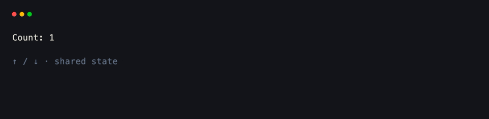
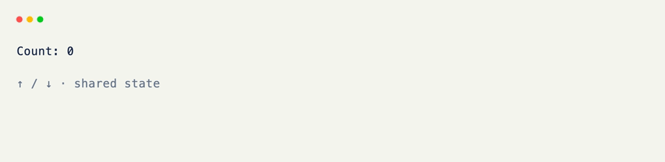

# Context

The second parameter on a hook is always the same object: a [Context]{data-preview} — everything a handler might need to know about the moment it fired, bundled into one argument instead of a dozen.

You've already seen this shape once, on the last page — a hook that takes just `self` gets called with nothing else; add `ctx`, and xnano fills it in.

`Context` is never something you construct yourself. It's built by the host — a [Terminal]{data-preview}, most commonly — and handed to your handler, the same way a request object is handed to a route handler in a web framework.

<div class="grid-concept-diagram" role="img" aria-label="Diagram: the host builds a Context bag of event, terminal, state, and device, then passes it into the hook">
<svg viewBox="0 0 720 280" xmlns="http://www.w3.org/2000/svg" fill="none">
  <defs>
    <marker id="ctx-arrow" markerWidth="8" markerHeight="8" refX="6" refY="4" orient="auto">
      <path d="M0,0 L8,4 L0,8 Z" class="gcd-arrow-fill" />
    </marker>
  </defs>

  <!-- Host -->
  <rect class="gcd-panel" x="28" y="40" width="168" height="200" rx="14" />
  <text class="gcd-label" x="112" y="72" text-anchor="middle">host</text>
  <path class="gcd-line" d="M52 100 h88" stroke-width="3" stroke-linecap="round" />
  <path class="gcd-line-soft" d="M52 120 h120" stroke-width="3" stroke-linecap="round" />
  <path class="gcd-line-soft" d="M52 140 h72" stroke-width="3" stroke-linecap="round" />
  <text class="gcd-chrome-label" x="112" y="190" text-anchor="middle">builds ctx</text>
  <text class="gcd-chrome-label" x="112" y="210" text-anchor="middle">per hook call</text>

  <line class="gcd-arrow" x1="196" y1="140" x2="248" y2="140" marker-end="url(#ctx-arrow)" />

  <!-- Context bag -->
  <rect class="gcd-panel gcd-panel-accent" x="260" y="28" width="220" height="224" rx="14" />
  <text class="gcd-label gcd-label-accent" x="370" y="58" text-anchor="middle">Context</text>

  <rect class="gcd-window" x="284" y="78" width="172" height="32" rx="8" />
  <text class="gcd-chrome-label" x="370" y="98" text-anchor="middle">event</text>

  <rect class="gcd-window" x="284" y="120" width="172" height="32" rx="8" />
  <text class="gcd-chrome-label" x="370" y="140" text-anchor="middle">terminal / host</text>

  <rect class="gcd-window" x="284" y="162" width="172" height="32" rx="8" />
  <text class="gcd-chrome-label" x="370" y="182" text-anchor="middle">state</text>

  <rect class="gcd-window" x="284" y="204" width="172" height="32" rx="8" />
  <text class="gcd-chrome-label" x="370" y="224" text-anchor="middle">device · cursor</text>

  <line class="gcd-arrow" x1="480" y1="140" x2="532" y2="140" marker-end="url(#ctx-arrow)" />

  <!-- Hook -->
  <rect class="gcd-panel" x="544" y="88" width="152" height="104" rx="14" />
  <text class="gcd-label" x="620" y="124" text-anchor="middle">hook</text>
  <text class="gcd-z-label gcd-z-label-on" x="620" y="150" text-anchor="middle">def on_*(</text>
  <text class="gcd-z-label gcd-z-label-on" x="620" y="168" text-anchor="middle">self, ctx)</text>
</svg>
</div>

## Reading the Event

Whatever triggered the hook is on `ctx` too, already narrowed to the kind of hook it fired from.

```python title="Reading the Event"
@on_keyboard("enter")
def submit(self, ctx: Context) -> None:
    key = ctx.keyboard      # the KeyboardEventData that fired this hook
    term = ctx.terminal     # the live Terminal instance
```

<br/>

`ctx.keyboard` and `ctx.mouse` are `None` unless the hook that's running actually fired from that kind of event — a [`@on_tick`](../api/xnano/events.md#xnano.events.on_tick){data-preview} handler's `ctx.keyboard` is always `None`, for instance.

## Typing Context by State

`Context` is generic over whatever state you pass to `Terminal(state=...)` — a dataclass, a Pydantic model, or nothing at all. Parameterize it the same way you would a typed Pydantic model, and `ctx.get_state()` comes back typed instead of `Any`.

```python title="Typing Context by State" hl_lines="4 9"
import dataclasses
from xnano import BaseGrid, Context, Field, Terminal
from xnano.events import on_keyboard

@dataclasses.dataclass
class AppState:
    count: int = 0

class Counter(BaseGrid, direction="vertical"):
    label: str = Field(default="Count: 0", height=1)

    @on_keyboard("up")
    def inc(self, ctx: Context[AppState]) -> None: # (1)!
        state = ctx.get_state() # (2)!
        state.count += 1
        self.label = f"Count: {state.count}"

Terminal(state=AppState()).run(Counter())
```

1. `Context[AppState]` is the same generic pattern as a typed Pydantic model — it doesn't change anything at runtime, but `ctx.get_state()` now returns an `AppState`, not `Any`.
2. `ctx.get_state()` raises if no `state=` was ever attached to the `Terminal` — reach for a `state=True` field instead when a value only needs to live on one grid, not the whole app.

<div class="xnano-demo" markdown>
{.demo-dark}
{.demo-light}
</div>

<br/>

??? note "The State Class"

    Nothing above requires xnano's own `State` class — a plain dataclass or Pydantic model works exactly the same way. `State` exists purely as a convenience for apps that don't want to define a schema up front:

    ```python
    from xnano import State

    state = State(name="John", count=0)
    state.count += 1
    ```

    <br/>

    It's not "the" context state type, just one option among several — reach for a dataclass or Pydantic model instead whenever a fixed schema is worth the extra line.

## Everything Else on Context

A hook rarely needs more than the event, the terminal, and the state — but a few more shortcuts live on `ctx` for when it does:

- [`ctx.cursor`](../api/xnano/context.md#xnano.context.Context.cursor){data-preview} / [`ctx.device`](../api/xnano/context.md#xnano.context.Context.device){data-preview} — the active host's caret and window/tab controls, covered next.
- [`ctx.actions`](../api/xnano/context.md#xnano.context.Context.actions){data-preview} — perform a synthetic input against the live host, as if it had actually happened.
- [`ctx.stage`](../api/xnano/context.md#xnano.context.Context.stage){data-preview} — the active host's layout map and cell-level paint, for advanced/manual drawing.
- `ctx.has_keyboard_event()`, `ctx.has_mouse_event()`, and similar — quick predicates when a hook is bound to more than one kind of event.

??? abstract "Sandbox & API"

    **Sandbox**

    [Action-Driven Frames](../sandbox/rendering.md#action-driven-frames-without-run){data-preview}

    **API**

    [`Context`](../api/xnano/context.md#xnano.context.Context){data-preview} · [`Action`](../api/xnano/core/actions.md#xnano.core.actions.Action){data-preview}

[Terminal]: ../api/xnano/tui/terminal.md
[Context]: ../api/xnano/context.md
