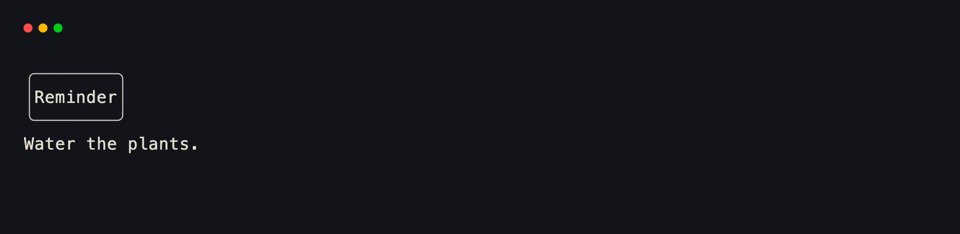
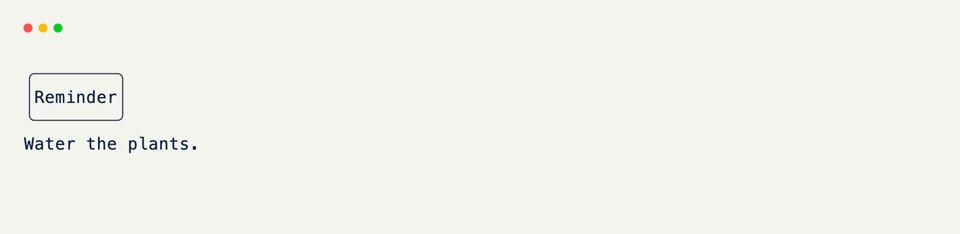

# Fields

Every attribute you declare with `Field()` on a grid is doing two jobs at once.

It's a typed piece of data, the same way a Pydantic `Field()` is. And it's a slot — a rectangular region of the grid this data occupies, sized and styled on its own terms.

If you've used Pydantic, `Field(default=...)` already feels familiar. xnano's `Field` starts there and keeps going — the same call that sets a default also decides where this field's slot sits, how big it is, and how it looks once painted.

Declaring a field gives that attribute:

- A size <small>(`width` / `height` — in cells, a percentage, a fraction, or `"fit"`)</small>
- An appearance <small>(`color`, `border`, `padding`, and more)</small>
- A say in whether it renders at all <small>(`state=True` fields hold data but never paint)</small>

<div class="grid-concept-diagram" role="img" aria-label="Diagram: a Field splits into typed data and a painted slot on the grid; state=True fields have data but no slot">
<svg viewBox="0 0 720 260" xmlns="http://www.w3.org/2000/svg" fill="none">
  <defs>
    <pattern id="fcd-cell" width="14" height="14" patternUnits="userSpaceOnUse">
      <path d="M 14 0 L 0 0 0 14" class="gcd-grid-line" />
    </pattern>
    <marker id="fcd-arrow" markerWidth="8" markerHeight="8" refX="6" refY="4" orient="auto">
      <path d="M0,0 L8,4 L0,8 Z" class="gcd-arrow-fill" />
    </marker>
  </defs>

  <!-- Source: Field() call -->
  <rect class="gcd-panel gcd-panel-accent" x="40" y="90" width="160" height="72" rx="12" />
  <text class="gcd-label gcd-label-accent" x="120" y="122" text-anchor="middle">Field()</text>
  <text class="gcd-chrome-label" x="120" y="146" text-anchor="middle">one declaration</text>

  <line class="gcd-arrow" x1="200" y1="126" x2="248" y2="126" marker-end="url(#fcd-arrow)" />

  <!-- Split node -->
  <circle cx="268" cy="126" r="8" class="gcd-arrow-fill" />
  <line class="gcd-arrow" x1="276" y1="110" x2="330" y2="70" marker-end="url(#fcd-arrow)" />
  <line class="gcd-arrow" x1="276" y1="142" x2="330" y2="182" marker-end="url(#fcd-arrow)" />

  <!-- Data branch -->
  <rect class="gcd-panel" x="340" y="36" width="200" height="72" rx="12" />
  <text class="gcd-label" x="440" y="68" text-anchor="middle">data</text>
  <text class="gcd-chrome-label" x="440" y="90" text-anchor="middle">typed · validated · live</text>

  <!-- Slot branch -->
  <rect class="gcd-panel" x="340" y="148" width="200" height="72" rx="12" />
  <text class="gcd-label" x="440" y="180" text-anchor="middle">slot</text>
  <text class="gcd-chrome-label" x="440" y="202" text-anchor="middle">size · style · paint</text>

  <!-- Grid preview -->
  <g transform="translate(560, 70)">
    <rect class="gcd-window" x="0" y="0" width="140" height="120" rx="10" />
    <rect class="gcd-chrome" x="0" y="0" width="140" height="22" rx="10" />
    <rect class="gcd-chrome" x="0" y="12" width="140" height="10" />
    <circle class="gcd-dot" cx="14" cy="11" r="3" />
    <circle class="gcd-dot" cx="26" cy="11" r="3" />
    <circle class="gcd-dot" cx="38" cy="11" r="3" />
    <rect class="gcd-grid-fill" x="10" y="30" width="120" height="80" rx="4" />
    <rect x="10" y="30" width="120" height="80" rx="4" fill="url(#fcd-cell)" />
    <rect class="gcd-cell-highlight-strong" x="18" y="38" width="104" height="28" rx="3" />
    <text class="gcd-chrome-label" x="70" y="56" text-anchor="middle">painted</text>
    <rect class="gcd-z-base" x="18" y="76" width="104" height="24" rx="3" />
    <text class="gcd-z-label gcd-z-label-muted" x="70" y="92" text-anchor="middle">state only</text>
  </g>
</svg>
</div>

## Declaring a Field

??? example "Interactive Example"

    The following code block is interactive and can be run directly in the browser.

    ```pyodide install="xnano>=1.0.8" hl_lines="4"
    from xnano import BaseGrid, Field, Terminal

    class Card(BaseGrid, direction="vertical"):
        heading: str = Field(default="Reminder", color="violet", border="rounded", width="fit")
        body: str = Field(default="Water the plants.")

    Terminal(height=5).render(Card())
    ```

```python title="Declaring a Field" hl_lines="4"
from xnano import BaseGrid, Field

class Card(BaseGrid, direction="vertical"):
    heading: str = Field(default="Reminder", color="violet", border="rounded", width="fit") # (1)!
    body: str = Field(default="Water the plants.") # (2)!
```

1. `default` and the styling keywords (`color`, `border`, `width`, ...) are all just keyword arguments to the same <code>Field()</code> call — there's no separate styling API to learn.
2. A field with none of the styling arguments set still renders — it just takes on the grid's plain look and whatever space is left over.

<div class="xnano-demo" markdown>
{.demo-dark}
{.demo-light}
</div>

<br/>

The full list of what a field can carry — sizing, layout, color, borders, padding, and more — lives on the [Field]{data-preview} API reference. This page is about the shape of the idea, not every knob on it.

## Fields vs. Plain Attributes

Not every attribute needs a `Field()`. A plain, un-decorated annotation is still a normal typed attribute — it's just never painted, and never occupies a slot.

??? example "Interactive Example"

    The following code block is interactive and can be run directly in the browser.

    ```pyodide install="xnano>=1.0.8" hl_lines="4"
    from xnano import BaseGrid, Field, Terminal

    class Card(BaseGrid, direction="vertical"):
        heading: str = Field(default="Reminder")
        tags: list[str] = ["home", "chores"]

    Terminal(height=1).render(Card())
    ```

```python title="Fields vs. Plain Attributes" hl_lines="5"
from xnano import BaseGrid, Field

class Card(BaseGrid, direction="vertical"):
    heading: str = Field(default="Reminder")
    tags: list[str] = ["home", "chores"] # (1)!
```

1. `tags` is a normal instance attribute — live, readable, writable — but it never shows up on the grid, because it was never given a slot.

<br/>

`tags` behaves a lot like a `state=True` field: live data with no rendering behavior.

The difference is that `state=True` opts a field back into `Field()`'s validation and metadata, while a plain attribute is just Python. Reach for `state=True` when you want that; reach for a plain attribute for everything else.

??? abstract "Sandbox & API"

    **Sandbox**

    [Layout & Fields](../sandbox/layout.md){data-preview} · [Tailwind `class_name`](../sandbox/styling.md#tailwind-class_name){data-preview}

    **API**

    [`Field`](../api/xnano/fields.md#xnano.fields.Field){data-preview} · [`GridFieldInfo`](../api/xnano/fields.md#xnano.fields.GridFieldInfo){data-preview}

[Field]: ../api/xnano/fields.md
