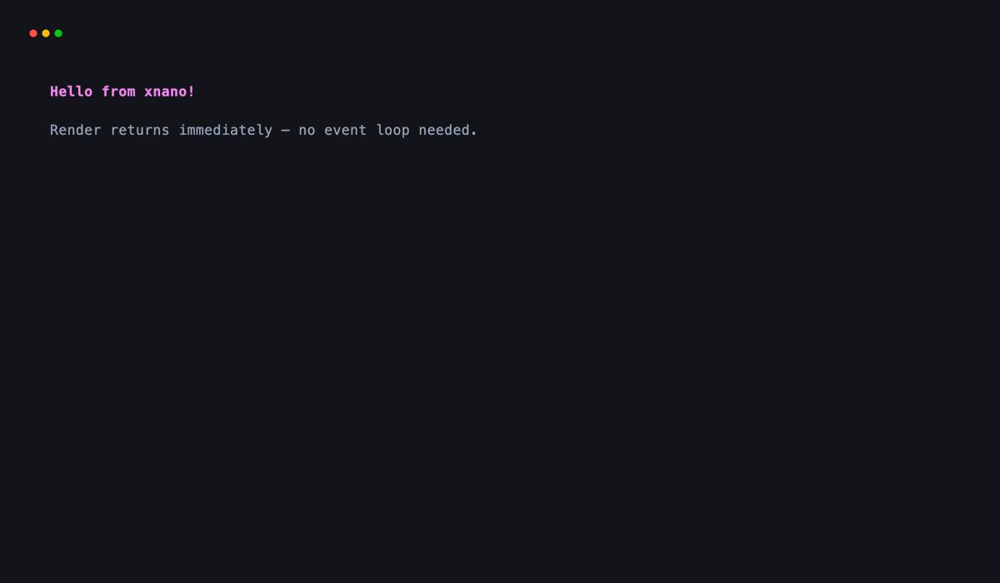
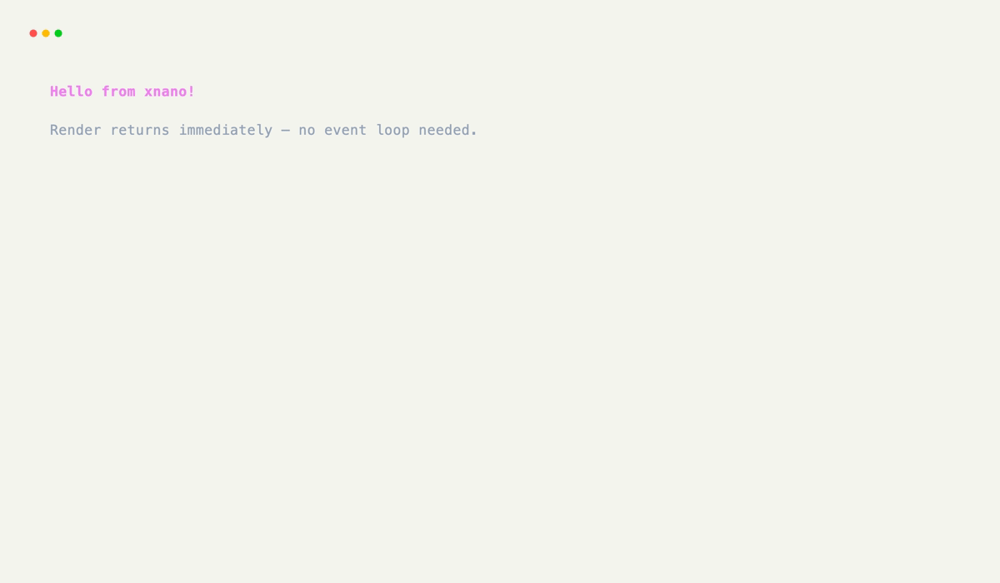

# Getting Started

!!! note "Interactive Examples"

    Thanks to the [Pyodide](https://pyodide.org) and [markdown-exec](https://pawamoy.github.io/markdown-exec/) projects, many of the code examples within the xnano
    documentation are interactive and can be run directly in your browser.

    Try hitting the <kbd>Run</kbd> button on any code block that provides one!

## Installation

You can install xnano on Python 3.10+ using your favorite package manager.

??? abstract "WASM & MicroPython Support"

    [xnano]{data-preview} and [xnano-core]{data-preview} can both be installed on [WASM](https://webassembly.org/) and [MicroPython](https://micropython.org/) platforms, but some features <small>(such as keyboard/mouse event handling)</small> may not be available due to platform limitations.

=== "pip"

    ```bash
    pip install "xnano>=1.0.8"
    ```

=== "uv"

    ```bash
    uv pip install "xnano>=1.0.8"

    # or add to your project's dependencies
    # uv add xnano
    ```

=== "poetry"

    ```bash
    poetry install "xnano>=1.0.8"

    # or add to your project's dependencies
    # poetry add xnano
    ```

=== "conda"

    ```bash
    conda install "xnano>=1.0.8"
    ```

??? tip "Demo"

    Try xnano's built in demo by running the following command(s) in your terminal:

    === "python"

        ```bash title="Run the demo"
        python -m xnano
        ```

    === "uv"

        ```bash title="Run the demo"
        uv run python -m xnano
        ```

## What is xnano?

xnano is a very pythonic framework for building interactive user interfaces on the terminal & web browser. The library itself is
built of two rust-based dependencies:

- [xnano-core]{data-preview} - Low level terminal rendering engine built on top of [ratatui](https://ratatui.rs) and [tachyonfx](https://github.com/ratatui/tachyonfx) specifically for xnano.
- [pydantic-core](https://github.com/pydantic/pydantic-core) - The core of the [Pydantic](https://pydantic.dev/docs/validation/latest/get-started) library used for runtime type validation.

<div class="grid-concept-diagram" role="img" aria-label="Diagram: app grid sits on xnano DSL over xnano-core, targeting terminal or browser">
<svg viewBox="0 0 720 240" xmlns="http://www.w3.org/2000/svg" fill="none">
  <defs>
    <marker id="gsd-arrow" markerWidth="8" markerHeight="8" refX="6" refY="4" orient="auto">
      <path d="M0,0 L8,4 L0,8 Z" class="gcd-arrow-fill" />
    </marker>
  </defs>

  <rect class="gcd-panel gcd-panel-accent" x="200" y="20" width="320" height="48" rx="12" />
  <text class="gcd-label gcd-label-accent" x="360" y="50" text-anchor="middle">your App · grids · fields · hooks</text>

  <line class="gcd-arrow" x1="360" y1="68" x2="360" y2="92" marker-end="url(#gsd-arrow)" />

  <rect class="gcd-panel" x="200" y="96" width="320" height="48" rx="12" />
  <text class="gcd-label" x="360" y="126" text-anchor="middle">xnano · public DSL</text>

  <line class="gcd-arrow" x1="360" y1="144" x2="360" y2="168" marker-end="url(#gsd-arrow)" />

  <rect class="gcd-panel" x="200" y="172" width="320" height="48" rx="12" />
  <text class="gcd-label" x="360" y="202" text-anchor="middle">xnano-core · ratatui · paint</text>

  <!-- Side hosts -->
  <rect class="gcd-window" x="40" y="100" width="120" height="56" rx="10" />
  <text class="gcd-chrome-label" x="100" y="132" text-anchor="middle">terminal</text>
  <line class="gcd-arrow" x1="160" y1="128" x2="196" y2="128" marker-end="url(#gsd-arrow)" />

  <rect class="gcd-window" x="560" y="100" width="120" height="56" rx="10" />
  <text class="gcd-chrome-label" x="620" y="132" text-anchor="middle">browser</text>
  <line class="gcd-arrow" x1="560" y1="128" x2="524" y2="128" marker-end="url(#gsd-arrow)" />
</svg>
</div>

## Supported Interfaces

The core idea of xnano is to provide a unified language that can be re-used across multiple user interfaces with no extra effort. Currently, xnano supports
the following interfaces.

### Terminal

The main featureset of the library revolves around it's rust-based terminal rendering engine, [xnano-core]{data-preview}.

??? example "Interactive Example"

    The following example is interactive and can be run directly in the browser by hitting the <kbd>Run</kbd> button.

    ```pyodide install="xnano>=1.0.10" exec="no"
    import xnano

    xnano.render("hello, terminal!", color="blue")
    ```

```python title="Rendering to the Terminal"
import xnano

xnano.render("Hello from xnano!", color="pink", modifiers=["bold"])
```

<div class="xnano-demo" markdown>
{.demo-dark}
{.demo-light}
</div>

### Web

Rendered content is __orthogonal__ to the host interface it is displayed on, which means everything you build and render onto the terminal within xnano can also be rendered onto a webpage with no extra effort.

??? abstract "Web Dependencies"

    The entire layout and component system for the WebUI engine is built on top of raw [HTMX](https://htmx.org/) and [TailwindCSS](https://tailwindcss.com/), and requires no additional dependencies aside from [starlette](https://www.starlette.io/) and [uvicorn](https://www.uvicorn.org/) to serve the application.

    You can use WebUI based components by installing the following extra:

    ```bash title="Install Web Dependencies"
    pip install "xnano[web]"
    ```

```python title="Launching a Web Application"
from xnano import Field, BaseGrid
from xnano.webui import Web

class App(BaseGrid):
    body: str = Field(default="hello, web!")

Web().run(App(), port=8000)
```

## Next Steps

Currently this site is still a work in progress. Complete walkthroughs and documentation for both <code>xnano</code> and <code>xnano-core</code> are coming soon.

??? abstract "Sandbox & API"

    **Sandbox**

    [Live Sandbox](../sandbox.md){data-preview} · [Render Style and Frame](../sandbox/rendering.md#render-style-and-frame){data-preview}

    **API**

    [`render()`](../api/xnano/_renderable.md#xnano._renderable.render){data-preview} · [`Terminal`](../api/xnano/tui/terminal.md#xnano.tui.terminal.Terminal){data-preview}

[xnano]: getting-started.md
[xnano-core]: ../architecture/xnano-core.md
*[pydantic-core]: Data validation library written in rust.
