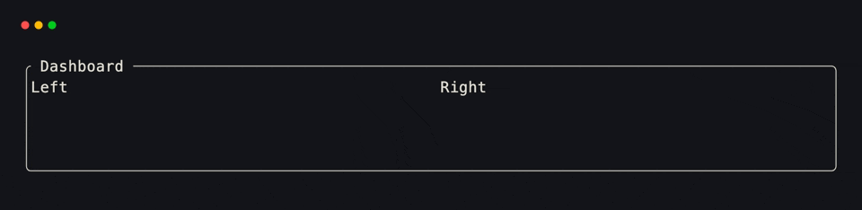
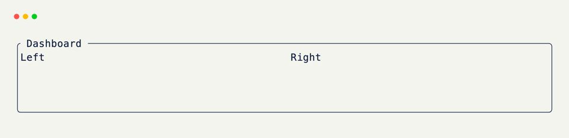

# Grids

Whether it's within the terminal or web browser, everything in xnano revolves around the concept of transforming a "host interface" into a 2D grid of
cells.

<div class="grid-concept-diagram" role="img" aria-label="Diagram: terminal and browser hosts become the same surfaces with a grid overlay">
<svg viewBox="0 0 720 300" xmlns="http://www.w3.org/2000/svg" fill="none">
  <defs>
    <pattern id="gcd-cell-grid" width="14" height="14" patternUnits="userSpaceOnUse">
      <path d="M 14 0 L 0 0 0 14" class="gcd-grid-line" />
    </pattern>
    <marker id="gcd-arrowhead" markerWidth="8" markerHeight="8" refX="6" refY="4" orient="auto">
      <path d="M0,0 L8,4 L0,8 Z" class="gcd-arrow-fill" />
    </marker>
  </defs>

  <!-- Left panel -->
  <rect class="gcd-panel" x="16" y="28" width="280" height="244" rx="16" />
  <text class="gcd-label" x="156" y="54" text-anchor="middle">hosts</text>

  <!-- Terminal (left) -->
  <g transform="translate(40, 70)">
    <rect class="gcd-window" x="0" y="0" width="232" height="88" rx="10" />
    <rect class="gcd-chrome" x="0" y="0" width="232" height="22" rx="10" />
    <rect class="gcd-chrome" x="0" y="12" width="232" height="10" />
    <circle class="gcd-dot" cx="14" cy="11" r="3.5" />
    <circle class="gcd-dot" cx="26" cy="11" r="3.5" />
    <circle class="gcd-dot" cx="38" cy="11" r="3.5" />
    <text class="gcd-chrome-label" x="116" y="15" text-anchor="middle">terminal</text>
    <path class="gcd-line" d="M16 38 h48" stroke-width="3" stroke-linecap="round" />
    <path class="gcd-line-soft" d="M16 52 h96" stroke-width="3" stroke-linecap="round" />
    <path class="gcd-line-soft" d="M16 66 h72" stroke-width="3" stroke-linecap="round" />
  </g>

  <!-- Browser (left) -->
  <g transform="translate(40, 172)">
    <rect class="gcd-window" x="0" y="0" width="232" height="80" rx="10" />
    <rect class="gcd-chrome" x="0" y="0" width="232" height="28" rx="10" />
    <rect class="gcd-chrome" x="0" y="18" width="232" height="10" />
    <circle class="gcd-dot" cx="14" cy="14" r="3.5" />
    <circle class="gcd-dot" cx="26" cy="14" r="3.5" />
    <circle class="gcd-dot" cx="38" cy="14" r="3.5" />
    <rect class="gcd-urlbar" x="54" y="8" width="160" height="12" rx="6" />
    <text class="gcd-chrome-label" x="134" y="17" text-anchor="middle">browser</text>
    <path class="gcd-line" d="M16 46 h80" stroke-width="3" stroke-linecap="round" />
    <path class="gcd-line-soft" d="M16 60 h120" stroke-width="3" stroke-linecap="round" />
  </g>

  <!-- Arrow -->
  <line class="gcd-arrow" x1="320" y1="150" x2="392" y2="150" marker-end="url(#gcd-arrowhead)" />

  <!-- Right panel -->
  <rect class="gcd-panel gcd-panel-accent" x="424" y="28" width="280" height="244" rx="16" />
  <text class="gcd-label gcd-label-accent" x="564" y="54" text-anchor="middle">grid</text>

  <!-- Terminal (right) with grid -->
  <g transform="translate(448, 70)">
    <rect class="gcd-window" x="0" y="0" width="232" height="88" rx="10" />
    <rect class="gcd-chrome" x="0" y="0" width="232" height="22" rx="10" />
    <rect class="gcd-chrome" x="0" y="12" width="232" height="10" />
    <circle class="gcd-dot" cx="14" cy="11" r="3.5" />
    <circle class="gcd-dot" cx="26" cy="11" r="3.5" />
    <circle class="gcd-dot" cx="38" cy="11" r="3.5" />
    <text class="gcd-chrome-label" x="116" y="15" text-anchor="middle">terminal</text>
    <rect class="gcd-grid-fill" x="8" y="28" width="216" height="52" rx="6" />
    <rect x="8" y="28" width="216" height="52" rx="6" fill="url(#gcd-cell-grid)" />
  </g>

  <!-- Browser (right) with grid -->
  <g transform="translate(448, 172)">
    <rect class="gcd-window" x="0" y="0" width="232" height="80" rx="10" />
    <rect class="gcd-chrome" x="0" y="0" width="232" height="28" rx="10" />
    <rect class="gcd-chrome" x="0" y="18" width="232" height="10" />
    <circle class="gcd-dot" cx="14" cy="14" r="3.5" />
    <circle class="gcd-dot" cx="26" cy="14" r="3.5" />
    <circle class="gcd-dot" cx="38" cy="14" r="3.5" />
    <rect class="gcd-urlbar" x="54" y="8" width="160" height="12" rx="6" />
    <text class="gcd-chrome-label" x="134" y="17" text-anchor="middle">browser</text>
    <rect class="gcd-grid-fill" x="8" y="34" width="216" height="38" rx="6" />
    <rect x="8" y="34" width="216" height="38" rx="6" fill="url(#gcd-cell-grid)" />
  </g>
</svg>
</div>

Within these grids, we can select smaller areas to render content or create components from. By doing this, we automatically
give that area the ability to:

- Render it's own content <small>(text, characters, images, etc.)</small>
- Hold it's own state <small>(typed & validated!)</small>
- Handle user input and external events <small>(is this in focus?, was this clicked?, etc.)</small>

<div class="grid-concept-diagram" role="img" aria-label="Diagram: a terminal grid with a smaller focused region of cells highlighted">
<svg viewBox="0 0 720 264" xmlns="http://www.w3.org/2000/svg" fill="none">
  <defs>
    <pattern id="gcd-cell-grid-lg" width="18" height="18" patternUnits="userSpaceOnUse">
      <path d="M 18 0 L 0 0 0 18" class="gcd-grid-line" />
    </pattern>
    <!-- Diagonal hatch for focused / clicked cell region -->
    <pattern id="gcd-focus-stripes" width="8" height="8" patternUnits="userSpaceOnUse" patternTransform="rotate(45)">
      <rect width="8" height="8" class="gcd-stripe-bg" />
      <rect width="3.5" height="8" class="gcd-stripe-fg" />
    </pattern>
    <clipPath id="gcd-term-clip">
      <rect x="40" y="72" width="640" height="152" rx="8" />
    </clipPath>
  </defs>

  <!-- Full-area terminal (two cells shorter than the first diagram) -->
  <rect class="gcd-window" x="24" y="28" width="672" height="208" rx="16" />
  <rect class="gcd-chrome" x="24" y="28" width="672" height="32" rx="16" />
  <rect class="gcd-chrome" x="24" y="44" width="672" height="16" />
  <circle class="gcd-dot" cx="48" cy="44" r="5" />
  <circle class="gcd-dot" cx="66" cy="44" r="5" />
  <circle class="gcd-dot" cx="84" cy="44" r="5" />
  <text class="gcd-chrome-label" x="360" y="49" text-anchor="middle">terminal</text>

  <!-- Grid body -->
  <g clip-path="url(#gcd-term-clip)">
    <rect class="gcd-grid-fill" x="40" y="72" width="640" height="152" />
    <rect x="40" y="72" width="640" height="152" fill="url(#gcd-cell-grid-lg)" />

    <!-- Selected region: a contiguous block of cells -->
    <rect class="gcd-cell-highlight" x="76" y="90" width="126" height="72" rx="3" />
    <!-- Nested focused / clicked cell — striped fill -->
    <rect class="gcd-cell-focus" x="94" y="108" width="54" height="36" rx="2" fill="url(#gcd-focus-stripes)" />
    <rect class="gcd-cell-focus-ring" x="94" y="108" width="54" height="36" rx="2" />
  </g>
</svg>
</div>

??? abstract "The '<code>z</code>' Axis"

    Along with the standard x & y coordinate system, xnano also introduces a third "z" dimension.

    As [xnano-core]{data-preview} controls the complete rendering lifecycle within the terminal at every
    frame, it is able to render the component or content with the highest "z-index" for every cell within
    the grid. This allows you to create things such as overlays & breadcrumbs with ease.

    <div class="grid-concept-diagram grid-concept-diagram--compact" role="img" aria-label="Diagram: lower z selection is not rendered; higher z overlay is rendered">
    <svg viewBox="0 0 460 220" xmlns="http://www.w3.org/2000/svg" fill="none">
      <defs>
        <pattern id="gcd-z-cell-grid" width="14" height="14" patternUnits="userSpaceOnUse">
          <path d="M 14 0 L 0 0 0 14" class="gcd-grid-line" />
        </pattern>
        <filter id="gcd-z-soft-shadow" x="-20%" y="-20%" width="140%" height="140%">
          <feDropShadow dx="0" dy="3" stdDeviation="3.5" flood-opacity="0.28" />
        </filter>
      </defs>
      <!-- Base terminal -->
      <g transform="translate(24, 48)">
        <rect class="gcd-window" x="0" y="0" width="300" height="148" rx="12" />
        <rect class="gcd-chrome" x="0" y="0" width="300" height="24" rx="12" />
        <rect class="gcd-chrome" x="0" y="14" width="300" height="10" />
        <circle class="gcd-dot" cx="14" cy="12" r="3.5" />
        <circle class="gcd-dot" cx="26" cy="12" r="3.5" />
        <circle class="gcd-dot" cx="38" cy="12" r="3.5" />
        <text class="gcd-chrome-label" x="150" y="16" text-anchor="middle">terminal</text>
        <rect class="gcd-grid-fill" x="10" y="32" width="280" height="106" rx="6" />
        <rect x="10" y="32" width="280" height="106" rx="6" fill="url(#gcd-z-cell-grid)" />
        <!-- Base-layer selection (z = 0) — muted: not rendered -->
        <rect class="gcd-z-base" x="28" y="48" width="96" height="54" rx="3" />
        <text class="gcd-z-label gcd-z-label-muted" x="76" y="79" text-anchor="middle">z = 0</text>
        <text class="gcd-z-caption gcd-z-caption-muted" x="134" y="78">this isn't rendered</text>
        <!-- Depth connectors (base → floating overlay) -->
        <path class="gcd-z-connector" d="M28 48 L52 18" />
        <path class="gcd-z-connector" d="M124 48 L148 18" />
        <path class="gcd-z-connector" d="M28 102 L52 72" />
        <path class="gcd-z-connector" d="M124 102 L148 72" />
      </g>
      <!-- Same shape hovering above (higher z) — rendered -->
      <g transform="translate(48, 18)" filter="url(#gcd-z-soft-shadow)">
        <rect class="gcd-z-overlay" x="0" y="0" width="96" height="54" rx="3" />
        <rect class="gcd-z-overlay-inner" x="6" y="6" width="84" height="42" rx="2" />
        <text class="gcd-z-label gcd-z-label-on" x="48" y="32" text-anchor="middle">z = 1</text>
        <text class="gcd-z-caption gcd-z-caption-on" x="106" y="32">this is rendered</text>
      </g>
    </svg>
    </div>


## Creating a Grid

Let's start by creating a simple grid with [BaseGrid]{data-preview}. You'll notice very quickly that the API design for grids is heavily inspired by the [BaseModel]{data-preview} class from the
[Pydantic]{data-preview} library.

??? example "Interactive Example"

    The following code block is interactive and can be run directly in the browser.

    ```pyodide install="xnano>=1.0.8" hl_lines="4 5 6 7 8 9 10" exec="no"
    from xnano import BaseGrid, Field, Terminal

    class App(BaseGrid, direction="vertical"):
        title: str = Field(default="My App", border="rounded")
        body: str = Field()
        name: str = Field(default="Hammad", state=True)

        def __post_init__(self):
            self.body = f"Hello, {self.name}!"

    Terminal(height=4).render(App())
    ```

```python title="Creating a Grid" hl_lines="4 5 6 7 8 9 10"
from xnano import BaseGrid, Field

class App(BaseGrid, direction="vertical"): # (1)!
    title: str = Field(default="My App", border="rounded") # (2)!
    body: str = Field()
    name: str = Field(default="Hammad", state=True) # (3)!

    def __post_init__(self):
        self.body = f"Hello, {self.name}!" # (4)!
```

1. Define a grid component the same way you would a Pydantic model. <br/><br/>You modify set the grid's behavior directly within the class constructor, or by configuring the <code>grid_settings</code> class attribute.
2. The "Field" constructor helps you style, validate, and configure how that field is rendered within the grid.
3. Setting <code>state=True</code> onto a field lets it act purely as state, and is never rendered onto the grid directly.
4. Attributes on a grid are <strong>live</strong>, meaning any changes to attributes are immediately reflected onto your host display or browser.
5. The easiest way to print to the terminal with xnano is to use the <code>render()</code> function.

<div class="xnano-demo" markdown>
{.demo-dark}
{.demo-light}
</div>

## Grid Settings

Some settings describe the grid as a whole rather than any single field — its layout direction, the gap between fields, and the frame drawn around the whole thing. These live apart from field declarations, the same way Pydantic keeps `model_config` separate from the fields it configures.

??? example "Interactive Example"

    The following code block is interactive and can be run directly in the browser.

    ```pyodide install="xnano>=1.0.8" hl_lines="3"
    from xnano import BaseGrid, Field, Terminal

    class Dashboard(BaseGrid, direction="horizontal", gap=1, border="rounded", title=" Dashboard "):
        left: str = Field(default="Left", width="1fr")
        right: str = Field(default="Right", width="1fr")

    Terminal(height=5).render(Dashboard())
    ```

```python title="Grid Settings" hl_lines="3"
from xnano import BaseGrid, Field

class Dashboard(BaseGrid, direction="horizontal", gap=1, border="rounded", title=" Dashboard "): # (1)!
    left: str = Field(default="Left", width="1fr")
    right: str = Field(default="Right", width="1fr")
```

1. Everything after <code>BaseGrid</code> in the class header is a grid setting — here, laying <code>left</code> and <code>right</code> out side by side, spacing them a cell apart, and framing the whole grid in a rounded, titled border.

<div class="xnano-demo" markdown>
{.demo-dark}
{.demo-light}
</div>

<br/>

The same settings can also be declared on a <code>grid_settings</code> class attribute — useful once a grid has enough settings that the class header starts to run long, or when a base grid needs to hand settings down to a subclass.

=== "Class header"

    ```python
    class Dashboard(BaseGrid, direction="horizontal", gap=1, border="rounded"):
        ...
    ```

=== "<code>grid_settings</code> attribute"

    ```python
    from xnano import GridSettings

    class Dashboard(BaseGrid):
        grid_settings = GridSettings(
            direction="horizontal",
            gap=1,
            border="rounded",
        )
        ...
    ```

<br/>

Both forms merge together if used at the same time — a subclass's <code>grid_settings</code> wins over anything set in its own or an inherited class header.

`direction` and `gap` are the two you'll reach for the most. Everything else — color, borders, padding, title, character modifiers — is the same styling vocabulary a [Field]{data-preview} accepts, just applied to the grid's outer frame instead of one slot. The full list lives on the [GridSettings]{data-preview} API reference.

## Displaying Content

Now that we've defined a simple grid component, let's display it on an interface.

Grids are **orthogonal** to the host they're rendered on. This means you can render the same grid on both the terminal and web browser
without any additional effort.

### Rendering in the Terminal

The primary way to render or display content using xnano is through the terminal. To do this, we can either create a new session of a [Terminal]{data-preview} class, or use the
[render]{data-preview} function directly.

=== "Using the <code>render()</code> function"

    ```python title="render()" hl_lines="3"
    from xnano import render

    render(App()) # (1)!
    ```

    1. The <code>render()</code> function acts as a drop in replacement for the stdlib <code>print()</code> function with all of xnano's layout and styling capabilities.

=== "Running a <code>Terminal</code> session"

    ```python title="Terminal" hl_lines="3 4"
    from xnano.tui import Terminal

    terminal = Terminal()
    terminal.run(App()) # (1)!
    ```

    1. Unlike <code>render()</code>, <code>Terminal</code> sessions are persistent and will remain active unless explicitly exited by the framework or user.

### Running a Web Application

??? abstract "Web Dependencies"

    Although the rendering engine for web applications requires no additional dependencies, xnano requires
    the [starlette](https://www.starlette.io/) and [uvicorn](https://www.uvicorn.org/) python packages
    to bootstrap and launch the web app itself.

    You can install these dependencies by installing the <code>xnano[web]</code> extra.

    ```bash
    pip install 'xnano[web]'
    ```

<br/>

We can run our web application the exact same way we did with the terminal! Simple create a new "live session" using
the [Web]{data-preview} class, and pass the grid component to it.

```python title="Web" hl_lines="3"
from xnano.webui import Web

Web().run(App())
```

```bash title="Output"
INFO:     Started server process [79107]
INFO:     Waiting for application startup.
INFO:     Application startup complete.
INFO:     Uvicorn running on http://127.0.0.1:8000 (Press CTRL+C to quit)
```

??? abstract "Sandbox & API"

    **Sandbox**

    [Grid Direction and Gap](../sandbox/layout.md#grid-direction-and-gap){data-preview} · [Sizing](../sandbox/layout.md#sizing){data-preview} · [Nested Grids](../sandbox/layout.md#nested-grids-and-field-direction){data-preview}

    **API**

    [`BaseGrid`](../api/xnano/grid.md#xnano.grid.BaseGrid){data-preview} · [`GridSettings`](../api/xnano/grid.md#xnano.grid.GridSettings){data-preview} · [`Field`](../api/xnano/fields.md#xnano.fields.Field){data-preview}

[xnano-core]: ../architecture/xnano-core.md
[Pydantic]: https://pydantic.dev/docs/validation/dev/api/pydantic/
[BaseModel]: https://pydantic.dev/docs/validation/dev/api/pydantic/base_model/
[Terminal]: ../api/xnano/tui/terminal.md
[render]: ../api/xnano/_renderable.md
[Field]: fields.md
[GridSettings]: ../api/xnano/grid.md
[Web]: ../api/xnano/webui/web.md
[BaseGrid]: ../api/xnano/grid.md#xnano.grid.BaseGrid
