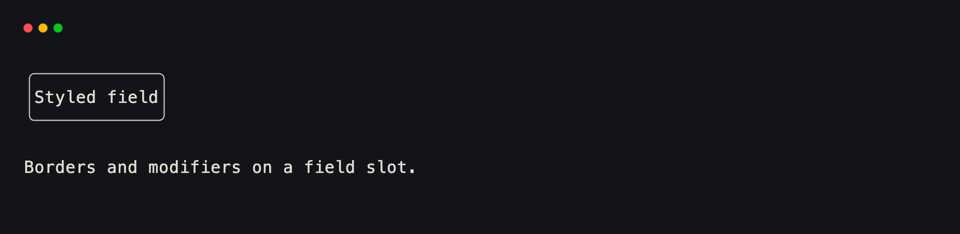
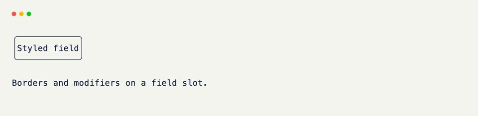
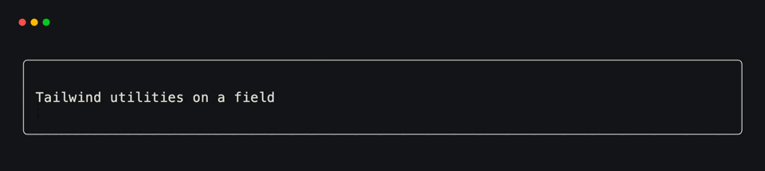
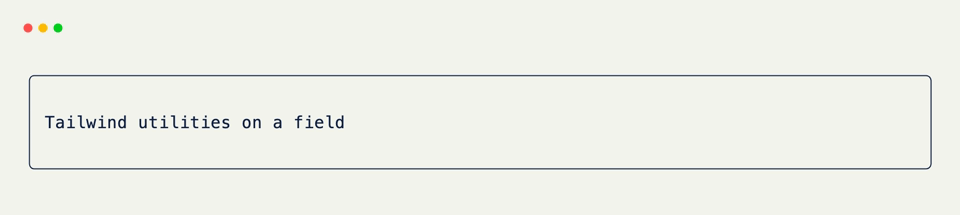

# Styling

Every color, border, and modifier you've seen so far — `color="violet"`, `border="rounded"` — comes from one shared vocabulary. It doesn't matter whether you're styling a [Field]{data-preview}, a `GridSettings` frame, or one of the built-in components covered next: the same keywords mean the same thing everywhere.

<div class="grid-concept-diagram" role="img" aria-label="Diagram: Field, GridSettings, and components share one Style vocabulary">
<svg viewBox="0 0 720 200" xmlns="http://www.w3.org/2000/svg" fill="none">
  <defs>
    <marker id="scd-arrow" markerWidth="8" markerHeight="8" refX="6" refY="4" orient="auto">
      <path d="M0,0 L8,4 L0,8 Z" class="gcd-arrow-fill" />
    </marker>
  </defs>

  <rect class="gcd-panel" x="40" y="48" width="140" height="64" rx="12" />
  <text class="gcd-label" x="110" y="86" text-anchor="middle">Field</text>

  <rect class="gcd-panel" x="210" y="48" width="160" height="64" rx="12" />
  <text class="gcd-label" x="290" y="86" text-anchor="middle">GridSettings</text>

  <rect class="gcd-panel" x="400" y="48" width="160" height="64" rx="12" />
  <text class="gcd-label" x="480" y="86" text-anchor="middle">components</text>

  <line class="gcd-arrow" x1="110" y1="112" x2="110" y2="140" marker-end="url(#scd-arrow)" />
  <line class="gcd-arrow" x1="290" y1="112" x2="290" y2="140" marker-end="url(#scd-arrow)" />
  <line class="gcd-arrow" x1="480" y1="112" x2="480" y2="140" marker-end="url(#scd-arrow)" />

  <path class="gcd-arrow" d="M110 148 H 580" fill="none" />
  <rect class="gcd-panel gcd-panel-accent" x="200" y="148" width="320" height="40" rx="10" />
  <text class="gcd-label gcd-label-accent" x="360" y="174" text-anchor="middle">Style · color · border · modifiers</text>
</svg>
</div>

## Color

A color can be a plain name, a hex string, an RGB(A) tuple, or a Tailwind shade.

```python title="Color Inputs"
Field(color="violet")          # a named color
Field(color="#a78bfa")         # hex
Field(color=(167, 139, 250))   # RGB tuple
Field(color="violet-400")      # a Tailwind shade
```

<br/>

Tailwind shades are the one worth knowing well — every color in the default Tailwind palette (`slate`, `violet`, `emerald`, `amber`, ...) is available at every weight from `50` to `950`, so `"violet-400"` and `"violet-600"` are both valid without reaching for a hex code.

## Borders and Modifiers

A `border` draws a frame around a field's slot; `modifiers` change how its text renders.

```python title="Borders and Modifiers" hl_lines="2 3"
Field(
    border="rounded",
    modifiers=["bold", "italic"],
)
```

<div class="xnano-demo" markdown>
{.demo-dark}
{.demo-light}
</div>

<br/>

Six border styles are available — `"plain"`, `"rounded"`, `"double"`, `"thick"`, `"quadrant_inside"`, `"quadrant_outside"` — and seven modifiers: `"bold"`, `"dim"`, `"italic"`, `"underline"`, `"slow_blink"`, `"rapid_blink"`, `"reversed"`. All seven are real terminal attributes, not an approximation — `"slow_blink"` really blinks.

## Tailwind Classes

Anywhere a field accepts `class_name`, you can reach for a Tailwind utility string instead of the individual keyword arguments.

```python title="Tailwind Classes"
Field(class_name="text-violet-400 bg-slate-900 p-2 rounded-lg")
```

<div class="xnano-demo" markdown>
{.demo-dark}
{.demo-light}
</div>

<br/>

The terminal and the browser don't treat this the same way. Classes with a cell-level meaning — color, padding, margin, border — get lowered into the exact same styling a `Field(color=..., padding=...)` call would produce, so they render identically on both hosts. Everything else (`flex-*`, `shadow-*`, `transition-*`, ...) only makes sense in a browser, and passes straight through to the rendered HTML untouched — the terminal host just ignores it.

??? note "Why Both APIs Exist"

    Keyword arguments and `class_name` aren't two competing systems — they're the same `Style` underneath, built two different ways. Reach for keywords when a value is dynamic or computed; reach for `class_name` when you're pasting in something that already looks like Tailwind, or want the browser-only utilities keywords don't cover.

[Field]: fields.md
