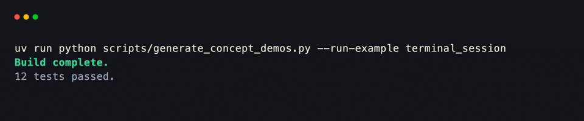
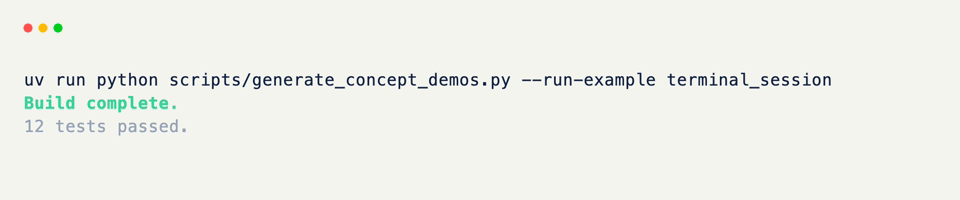

# Terminal

A [Terminal]{data-preview} is a live session on top of a real terminal window — the thing that owns the screen, reads keys and mouse movement off it, and keeps both alive for as long as your app runs.

Nothing in xnano renders on its own. Whatever you build needs somewhere to actually run, and a `Terminal` is that somewhere: the stage the rest of the framework performs on.

Think of it the way a web framework thinks of a server process. The routes, models, and handlers you write don't listen on a socket by themselves — something has to bind the port, accept connections, and keep looping. `Terminal` is that piece, except the "socket" is your actual terminal emulator, and the "requests" are key presses, mouse events, and clock ticks.

<div class="grid-concept-diagram" role="img" aria-label="Diagram: Terminal owns the session loop around a root grid — open, run events and frames, exit">
<svg viewBox="0 0 720 240" xmlns="http://www.w3.org/2000/svg" fill="none">
  <defs>
    <pattern id="tcd-cell" width="12" height="12" patternUnits="userSpaceOnUse">
      <path d="M 12 0 L 0 0 0 12" class="gcd-grid-line" />
    </pattern>
    <marker id="tcd-arrow" markerWidth="8" markerHeight="8" refX="6" refY="4" orient="auto">
      <path d="M0,0 L8,4 L0,8 Z" class="gcd-arrow-fill" />
    </marker>
  </defs>

  <rect class="gcd-panel" x="40" y="28" width="640" height="184" rx="16" />
  <text class="gcd-label" x="360" y="56" text-anchor="middle">Terminal session</text>

  <!-- Loop stages -->
  <rect class="gcd-window" x="72" y="80" width="100" height="48" rx="10" />
  <text class="gcd-chrome-label" x="122" y="108" text-anchor="middle">open</text>

  <line class="gcd-arrow" x1="172" y1="104" x2="208" y2="104" marker-end="url(#tcd-arrow)" />

  <!-- Root grid -->
  <g transform="translate(220, 72)">
    <rect class="gcd-window" x="0" y="0" width="200" height="100" rx="10" />
    <rect class="gcd-chrome" x="0" y="0" width="200" height="22" rx="10" />
    <rect class="gcd-chrome" x="0" y="12" width="200" height="10" />
    <circle class="gcd-dot" cx="12" cy="11" r="3" />
    <circle class="gcd-dot" cx="24" cy="11" r="3" />
    <circle class="gcd-dot" cx="36" cy="11" r="3" />
    <text class="gcd-chrome-label" x="100" y="15" text-anchor="middle">root grid</text>
    <rect class="gcd-grid-fill" x="12" y="32" width="176" height="56" rx="4" />
    <rect x="12" y="32" width="176" height="56" rx="4" fill="url(#tcd-cell)" />
  </g>

  <path class="gcd-z-connector" d="M320 172 C 320 200, 122 200, 122 128" marker-end="url(#tcd-arrow)" fill="none" />
  <text class="gcd-z-caption" x="230" y="196" text-anchor="middle">events · frames</text>

  <line class="gcd-arrow" x1="420" y1="122" x2="470" y2="122" marker-end="url(#tcd-arrow)" />

  <rect class="gcd-panel gcd-panel-accent" x="484" y="80" width="160" height="80" rx="12" />
  <text class="gcd-label gcd-label-accent" x="564" y="116" text-anchor="middle">exit</text>
  <text class="gcd-chrome-label" x="564" y="138" text-anchor="middle">request_exit()</text>
</svg>
</div>

## A Minimal Session

The smallest possible use of a `Terminal` is a single function call — nothing to define, nothing to lay out first.

??? example "Interactive Example"

    The following code block is interactive and can be run directly in the browser.

    ```pyodide install="xnano>=1.0.8" exec="no"
    import xnano

    xnano.render("hello, terminal!", color="blue")
    ```

```python title="A Minimal Session" hl_lines="3"
import xnano

xnano.render("hello, terminal!", color="blue") # (1)!
```

1. [render]{data-preview} is a one-shot: it opens a `Terminal` session just long enough to paint this one call, then hands the screen back.

<div class="xnano-demo" markdown>
{.demo-dark}
{.demo-light}
</div>

<br/>

`render()` is convenient for a single frame, but most apps want to stay open — reading input, updating state, redrawing — until the user quits. That's what a `Terminal` session gives you directly:

```python title="A Persistent Session" hl_lines="3 4"
from xnano.tui import Terminal

terminal = Terminal()
terminal.run("hello, terminal!") # (1)!
```

1. Unlike `render()`, a session started with `.run()` stays open — it keeps drawing frames and dispatching events until the app exits, the same way a web server keeps accepting connections until it's stopped.

## Terminal Grids

A `Terminal` doesn't know anything about layout or state on its own — pass it a plain string, as above, and it just paints that string.

Give it a `BaseGrid` instead, and the terminal treats it as the root of the whole screen: the grid's fields become the regions of the display, and the terminal starts dispatching keyboard, mouse, and tick events into whatever hooks that grid defines.

```python title="Running a Grid" hl_lines="8"
from xnano import BaseGrid, Field, Terminal

class App(BaseGrid, direction="vertical"):
    title: str = Field(default="My App", border="rounded")
    name: str = Field(default="Hammad", state=True)

terminal = Terminal()
terminal.run(App()) # (1)!
```

1. Don't worry about the `Field()` and `BaseGrid` syntax yet — that's exactly what the next couple of pages are for. For now, the only thing to take away is that a `Terminal` is what actually puts this grid on screen and keeps it alive.

??? note "State Threaded Through the Session"

    A `Terminal` can also carry application-wide state, passed once at construction and handed to every hook as part of its [Context]{data-preview} — `Terminal(state=AppState())`. That's covered properly once hooks are introduced; for now, just know the session is also where that state lives.

## Next Steps

Everything from here — [grids]{data-preview}, [fields]{data-preview}, [events and hooks]{data-preview}, and the [device and cursor]{data-preview} a session exposes — describes what happens *inside* a `Terminal`. Start with grids to see what actually gets drawn onto it.

[Terminal]: ../api/xnano/tui/terminal.md
[render]: ../api/xnano/_renderable.md
[Context]: ../api/xnano/context.md
[grids]: grids.md
[fields]: fields.md
[events and hooks]: events.md
[device and cursor]: device.md
