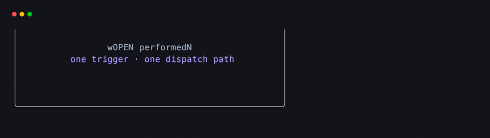
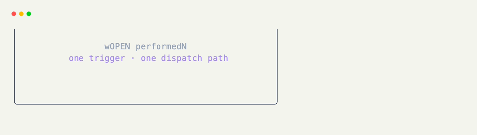

# Hooks & Actions

Hooks are where a grid starts listening. Put an `@on_*` decorator on a method and xnano calls it when the matching event reaches that grid. Actions describe the other half of the exchange: a trigger you can name, reuse, and perform from code.

The specialized hooks are usually the nicest place to begin. [`@on_keyboard("escape")`](on-keyboard.md){data-preview} says exactly what it listens for; [`@on_action(CLOSE)`](on.md){data-preview} becomes useful when that same trigger belongs in several places or needs to be emitted without a physical key press.

| Hook | What wakes it up | Associated action |
|---|---|---|
| [`@on_action`](on.md){data-preview} | A reusable action | The action passed to it |
| [`@on_event`](on-event.md){data-preview} | Any terminal event | — |
| [`@on_keyboard`](on-keyboard.md){data-preview} | Key press, release, or repeat | [`Action.keyboard(...)`](../api/xnano/core/actions.md#xnano.core.actions.KeyboardAction){data-preview} |
| [`@on_mouse`](on-mouse.md){data-preview} | Mouse input and movement | [`Action.mouse(...)`](../api/xnano/core/actions.md#xnano.core.actions.MouseAction){data-preview} |
| [`@on_click`](on-click.md){data-preview} | A click in a field | [`Action.click(...)`](../api/xnano/core/actions.md#xnano.core.actions.ClickAction){data-preview} |
| [`@on_tick`](on-tick.md){data-preview} | The host clock | [`Action.tick(...)`](../api/xnano/core/actions.md#xnano.core.actions.TickAction){data-preview} |
| [`@on_resize`](on-resize.md){data-preview} | Terminal resize | [`Action.resize(...)`](../api/xnano/core/actions.md#xnano.core.actions.ResizeAction){data-preview} |
| [`@on_focus`](on-focus.md){data-preview} | Window or field focus | [`Action.focus(...)`](../api/xnano/core/actions.md#xnano.core.actions.FocusAction){data-preview} |
| [`@on_clipboard`](on-clipboard.md){data-preview} | Clipboard paste | [`Action.clipboard(...)`](../api/xnano/core/actions.md#xnano.core.actions.ClipboardAction){data-preview} |
| [`@on_state`](on-state.md){data-preview} | A true shared-state expression | — |
| [`@on_field`](on-field.md){data-preview} | A true grid-field expression | — |
| [`@on_poll`](on-poll.md){data-preview} | An idle wait or every frame | — |

Web grids add request hooks of their own: [`@on_get_request`](web-requests/get.md){data-preview} and [`@on_post_request`](web-requests/post.md){data-preview}.

## One Dispatch Path

A real event and a performed action meet the same hook. That makes actions particularly handy in tests, integrations, and browser examples where starting a live terminal loop would be the wrong shape of program.

```python title="Perform an Action Without a Live Loop" hl_lines="3 9 16"
from xnano import Action, BaseGrid, Field, Terminal, on_action

OPEN = Action.keyboard("enter")

class Notice(BaseGrid, border="rounded", title=" action ", padding=1):
    message: str = Field(default="closed", align="center")

    @on_action(OPEN)
    def open_notice(self) -> None:
        self.message = "open"

notice = Notice()
terminal = Terminal.offscreen(cols=36, rows=7)
terminal.render(notice)
terminal.perform(OPEN)
terminal.render(notice)
```

The recorded examples on these pages use the same action-driven path when a browser cannot provide a live terminal event loop.

<div class="xnano-demo" markdown>
{.demo-dark}
{.demo-light}
</div>

??? abstract "API"

    [`events`](../api/xnano/events.md){data-preview} · [`Action`](../api/xnano/core/actions.md#xnano.core.actions.Action){data-preview} · [`Context`](../api/xnano/context.md#xnano.context.Context){data-preview}
