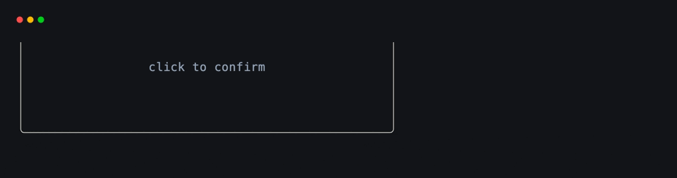
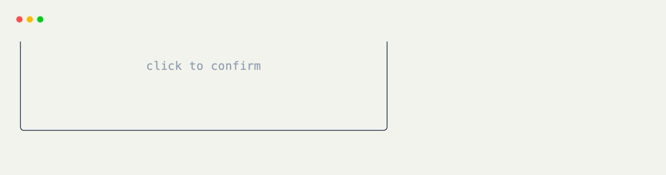

# Click Hooks

Use [`@on_click`](../api/xnano/events.md#xnano.events.on_click){data-preview} to make a rendered field clickable. xnano checks the field's current layout area for you, so the handler does not need to compare mouse coordinates.

## Click a Field

The field name is the usual decorator form:

```python title="Clickable Field" hl_lines="7"
from xnano import BaseGrid, Field
from xnano.events import on_click

class Dialog(BaseGrid):
    confirm: str = Field(default="Confirm", border="rounded")

    @on_click("confirm")
    def confirm_choice(self) -> None:
        self.confirm = "Confirmed"
```

You can also apply the decorator directly to an existing function and pass the field by keyword:

```python title="Keyword Field"
def confirm_choice(self) -> None:
    self.confirm = "Confirmed"

confirm_choice = on_click(confirm_choice, field="confirm")
```

## Choose a Button or Event Kind

Clicks default to a left-button press. Use `button=` for another mouse button, or `kind=` when release is the meaningful moment.

```python title="Right Click"
@on_click("item", button="right")
def open_context_menu(self) -> None:
    self.menu = "open"
```

```python title="Release Inside a Field"
@on_click("submit", kind="release")
def finish_submit(self) -> None:
    self.status = "submitted"
```

<div class="xnano-demo" markdown>
{.demo-dark}
{.demo-light}
</div>

## Click Actions

[`Action.click(field=None, button="left")`](../api/xnano/core/actions.md#xnano.core.actions.ClickAction){data-preview} is the reusable form. It is particularly useful when one grid behaves like a toolbar and another owns the field or state being changed.

```python title="Perform a Click from Another Hook" hl_lines="1 3 8"
CONFIRM = Action.click("confirm")

@on_action(CONFIRM)
def confirm_choice(self) -> None:
    self.status = "confirmed"

@on_keyboard("enter")
def confirm_from_keyboard(self, ctx: Context) -> None:
    ctx.actions.perform(CONFIRM)
```

??? abstract "API"

    [`on_click`](../api/xnano/events.md#xnano.events.on_click){data-preview} · [`ClickAction`](../api/xnano/core/actions.md#xnano.core.actions.ClickAction){data-preview}
