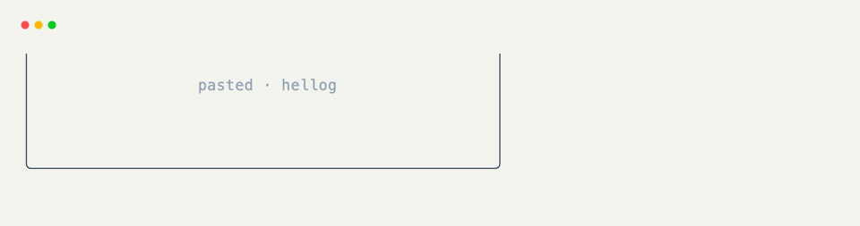

# Clipboard Hooks

[`@on_clipboard`](../api/xnano/events.md#xnano.events.on_clipboard){data-preview} runs when the host receives pasted text. The clipboard payload is available as `ctx.event.clipboard_event.text`.

```python title="Show Pasted Text" hl_lines="7"
from xnano import BaseGrid, Context, Field
from xnano.events import on_clipboard

class PastePreview(BaseGrid):
    preview: str = Field(default="Paste something")

    @on_clipboard
    def preview_paste(self, ctx: Context) -> None:
        self.preview = ctx.event.clipboard_event.text
```

The hook receives the complete paste as one event. Validate or normalize it in the handler before assigning it to a field.

```python title="Validate a Paste"
@on_clipboard
def accept_identifier(self, ctx: Context) -> None:
    text = ctx.event.clipboard_event.text.strip()
    self.status = text if text.isidentifier() else "invalid identifier"
```

<div class="xnano-demo" markdown>
{.demo-dark}
{.demo-light}
</div>

## Clipboard Actions

[`Action.clipboard(text=None)`](../api/xnano/core/actions.md#xnano.core.actions.ClipboardAction){data-preview} can represent any paste or one exact payload. The [`Actions.paste()`](../api/xnano/core/actions.md#xnano.core.actions.Actions.paste){data-preview} convenience method performs a synthetic paste.

```python title="Synthetic Paste" hl_lines="1 3 7"
PASTE_SAMPLE = Action.clipboard("hello")

@on_action(PASTE_SAMPLE)
def receive_sample(self) -> None:
    self.preview = "hello"

ctx.actions.paste("hello")
```

??? abstract "API"

    [`on_clipboard`](../api/xnano/events.md#xnano.events.on_clipboard){data-preview} · [`ClipboardAction`](../api/xnano/core/actions.md#xnano.core.actions.ClipboardAction){data-preview}
