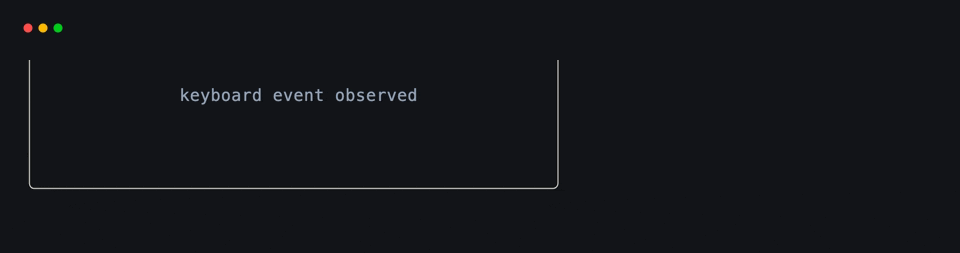
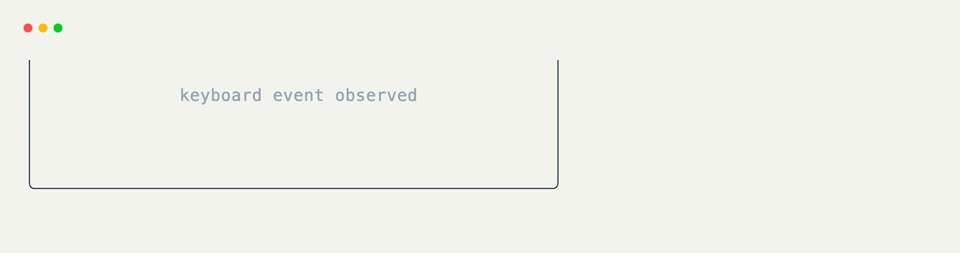

# Catch-All Event Hooks

[`@on_event`](../api/xnano/events.md#xnano.events.on_event){data-preview} runs for every terminal event received by the grid. It is a good fit for diagnostics, activity tracking, and behavior that genuinely spans several event families.

```python title="Record the Last Event" hl_lines="7"
from xnano import BaseGrid, Context, Field
from xnano.events import on_event

class Activity(BaseGrid):
    status: str = Field(default="waiting")

    @on_event
    def show_activity(self, ctx: Context) -> None:
        self.status = f"last event: {ctx.event.type}"
```

## Narrow Inside the Handler

The unified [`Event`](../api/xnano/events.md#xnano.events.Event){data-preview} exposes family checks when one catch-all handler really does need branches.

```python title="Branch by Event Family"
@on_event
def record_input(self, ctx: Context) -> None:
    if ctx.event.is_keyboard_event():
        self.status = f"key: {ctx.keyboard.binding}"
    elif ctx.event.is_mouse_event():
        self.status = "mouse input"
    elif ctx.event.is_resize_event():
        self.status = "window resized"
```

If a method only needs one family, use its specialized hook instead. [`@on_keyboard`](on-keyboard.md){data-preview}, [`@on_mouse`](on-mouse.md){data-preview}, and the others make the filter visible and avoid branching in application code.

<div class="xnano-demo" markdown>
{.demo-dark}
{.demo-light}
</div>

## Actions and Catch-All Hooks

There is no catch-all [`Action`](../api/xnano/core/actions.md#xnano.core.actions.Action){data-preview} builder: actions describe concrete triggers. Performing any supported action still produces an event that [`@on_event`](../api/xnano/events.md#xnano.events.on_event){data-preview} can observe.

```python title="Observe a Performed Action"
REFRESH = Action.keyboard("r")

@on_event
def record_activity(self, ctx: Context) -> None:
    self.status = ctx.event.type

ctx.actions.perform(REFRESH)
```

??? abstract "API"

    [`on_event`](../api/xnano/events.md#xnano.events.on_event){data-preview} · [`Event`](../api/xnano/events.md#xnano.events.Event){data-preview}
