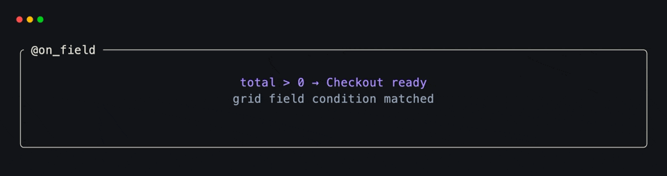
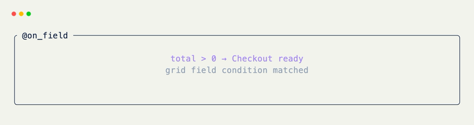

# Field-Condition Hooks

[`@on_field`](../api/xnano/events.md#xnano.events.on_field){data-preview} evaluates an expression against the current grid. Both rendered fields and `state=True` fields are available by name.

## Watch a State Field

```python title="Enable an Action" hl_lines="7"
from xnano import BaseGrid, Field
from xnano.events import on_field

class Checkout(BaseGrid):
    total: int = Field(default=0, state=True)

    @on_field("total > 0")
    def enable_checkout(self) -> None:
        self.button = "Checkout ready"
```

## Inspect Structured Values

Expressions can index grid-owned mappings and sequences.

```python title="Read Structured Field State"
@on_field("config['name'] == 'Ada'")
def greet_user(self) -> None:
    self.message = "Hello, Ada!"
```

You can combine several fields in one condition:

```python title="Combine Fields"
@on_field("email and accepted_terms")
def enable_submit(self) -> None:
    self.submit = "Ready"
```

## Conditions Are Level-Triggered

The method runs while the expression is truthy, not only when it changes from false to true. Assign a guard field when a reaction should happen once.

```python title="Run Once"
@on_field("complete and not announced")
def announce_completion(self) -> None:
    self.status = "Complete"
    self.announced = True
```

<div class="xnano-demo" markdown>
{.demo-dark}
{.demo-light}
</div>

Field conditions do not have an action counterpart. When the trigger is an explicit command rather than a continuing condition, bind a named [`Action`](../api/xnano/core/actions.md#xnano.core.actions.Action){data-preview} instead.

??? abstract "API"

    [`on_field`](../api/xnano/events.md#xnano.events.on_field){data-preview} · [`Field`](../api/xnano/fields.md#xnano.fields.Field){data-preview}
