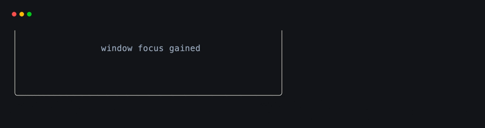
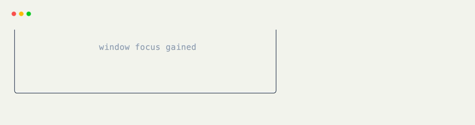

# Focus Hooks

Focus exists at two levels: the terminal window can gain or lose operating-system focus, and an editable field can gain or lose application focus. [`@on_focus`](../api/xnano/events.md#xnano.events.on_focus){data-preview} handles both.

## Window Focus

Bare [`@on_focus`](../api/xnano/events.md#xnano.events.on_focus){data-preview} listens to window focus events. Inspect `ctx.event.focus_event.kind` when gained and lost need different behavior.

```python title="Window Focus" hl_lines="1 3"
@on_focus
def update_window_status(self, ctx: Context) -> None:
    self.status = f"window {ctx.event.focus_event.kind}"
```

Use `kind=` to register separate handlers:

```python title="Gained and Lost"
@on_focus(kind="gained")
def resume_updates(self) -> None:
    self.status = "live"

@on_focus(kind="lost")
def pause_updates(self) -> None:
    self.status = "paused"
```

## Field Focus

Pass a field name to follow the caret as it enters or leaves an editable `Text(input=True)` field.

```python title="Editable Field Focus" hl_lines="1 5"
@on_focus("email", kind="gained")
def begin_email(self) -> None:
    self.hint = "Enter your email address"

@on_focus("email", kind="lost")
def finish_email(self) -> None:
    self.hint = ""
```

The keyword form is identical: [`@on_focus(field="email", kind="gained")`](../api/xnano/events.md#xnano.events.on_focus){data-preview}.

<div class="xnano-demo" markdown>
{.demo-dark}
{.demo-light}
</div>

## Focus Actions

[`Action.focus(field=None, kind=None)`](../api/xnano/core/actions.md#xnano.core.actions.FocusAction){data-preview} preserves the same distinction. It is useful for moving focus from one grid while another grid owns the focused field.

```python title="Reusable Field Focus"
FOCUS_SEARCH = Action.focus("search", kind="gained")

@on_action(FOCUS_SEARCH)
def reveal_help(self) -> None:
    self.help = "Type to filter"

ctx.actions.focus("search", kind="gained")
```

??? abstract "API"

    [`on_focus`](../api/xnano/events.md#xnano.events.on_focus){data-preview} · [`FocusAction`](../api/xnano/core/actions.md#xnano.core.actions.FocusAction){data-preview}
