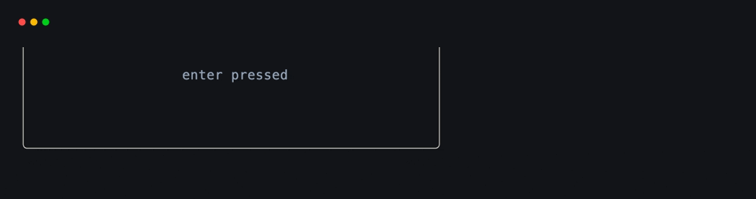
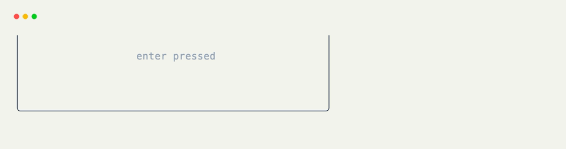

# Keyboard Hooks

Use [`@on_keyboard`](../api/xnano/events.md#xnano.events.on_keyboard){data-preview} when a grid should react to a key. Bindings use the same readable grammar throughout xnano: `"enter"`, `"ctrl+s"`, `"shift+tab"`, and so on.

## Listen for One Key

Pass a binding to run the method only when that key is received.

```python title="One Binding" hl_lines="7"
from xnano import BaseGrid, Field
from xnano.events import on_keyboard

class Search(BaseGrid):
    status: str = Field(default="ready")

    @on_keyboard("escape")
    def clear_search(self) -> None:
        self.status = "cleared"
```

## Accept Alternative Bindings

Positional bindings are alternatives. This is useful when an interface supports both arrow keys and familiar editor shortcuts.

```python title="Several Bindings" hl_lines="2"
class ListView(BaseGrid):
    @on_keyboard("down", "j")
    def select_next(self) -> None:
        self.index += 1
```

The keyword form is available when it reads better in generated or shared code:

```python title="Keyword Binding"
@on_keyboard(key="ctrl+s")
def save_document(self) -> None:
    self.status = "saved"
```

## Listen for Every Key

Bare [`@on_keyboard`](../api/xnano/events.md#xnano.events.on_keyboard){data-preview} applies no binding filter. Add [`Context`](../api/xnano/context.md#xnano.context.Context){data-preview} when the handler needs to inspect the key that arrived.

```python title="Any Keyboard Event" hl_lines="1 3"
@on_keyboard
def show_last_key(self, ctx: Context) -> None:
    self.status = str(ctx.keyboard.binding)
```

Use `kind="press"`, `"release"`, or `"repeat"` to select a transition:

```python title="Key Release"
@on_keyboard("space", kind="release")
def finish_hold(self) -> None:
    self.status = "released"
```

<div class="xnano-demo" markdown>
{.demo-dark}
{.demo-light}
</div>

## Keyboard Actions

[`Action.keyboard(*bindings, kind=None)`](../api/xnano/core/actions.md#xnano.core.actions.KeyboardAction){data-preview} stores the same filters as a reusable value. Bind it with [`@on_action`](on.md){data-preview}, or perform it when another grid should produce the same trigger.

```python title="Reusable Keyboard Action" hl_lines="1 3 7"
NEXT = Action.keyboard("down", "j")

@on_action(NEXT)
def select_next(self) -> None:
    self.index += 1

ctx.actions.perform(NEXT)
```

??? abstract "API"

    [`on_keyboard`](../api/xnano/events.md#xnano.events.on_keyboard){data-preview} · [`KeyboardAction`](../api/xnano/core/actions.md#xnano.core.actions.KeyboardAction){data-preview}
