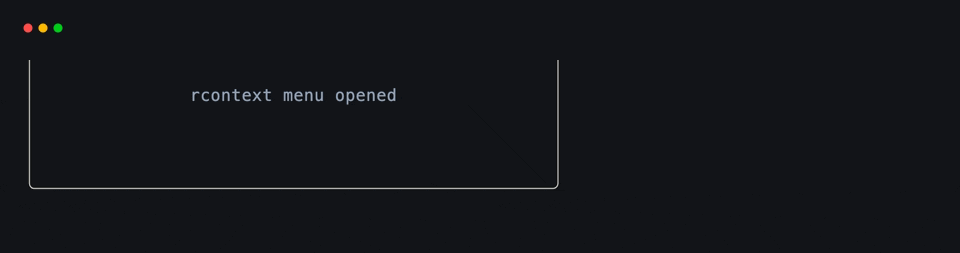
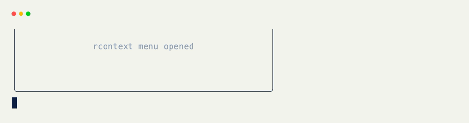

# Mouse Hooks

[`@on_mouse`](../api/xnano/events.md#xnano.events.on_mouse){data-preview} is the low-level mouse hook. It can react to button presses, releases, dragging, pointer movement, and scrolling, with an optional field boundary.

For an ordinary clickable field, [`@on_click`](on-click.md){data-preview} is the shorter API. Reach for [`@on_mouse`](../api/xnano/events.md#xnano.events.on_mouse){data-preview} when the event kind or coordinates matter.

## Button Events

With no arguments, [`@on_mouse`](../api/xnano/events.md#xnano.events.on_mouse){data-preview} listens for a left-button press. Pass one or more buttons to narrow or widen the match.

```python title="Default Left Press"
@on_mouse
def select_item(self) -> None:
    self.status = "selected"
```

```python title="Right Button Release"
@on_mouse("right", kind="release")
def close_menu(self) -> None:
    self.menu = "closed"
```

The keyword form is equivalent:

```python title="Keyword Button"
@on_mouse(button="middle", kind="press")
def open_link(self) -> None:
    self.status = "opened in a new view"
```

## Movement and Scrolling

Movement and scroll events do not carry a button. Filter them by `kind` and read their position from [`Context`](../api/xnano/context.md#xnano.context.Context){data-preview}.

```python title="Pointer Movement" hl_lines="1 3"
@on_mouse(kind="move")
def track_pointer(self, ctx: Context) -> None:
    self.position = f"{ctx.mouse.column}, {ctx.mouse.row}"
```

```python title="Scrolling"
@on_mouse(kind="scroll_up")
def scroll_previous(self) -> None:
    self.offset = max(0, self.offset - 1)

@on_mouse(kind="scroll_down")
def scroll_next(self) -> None:
    self.offset += 1
```

## Scope Mouse Input to a Field

Pass `field=` when the same mouse gesture should only count inside one rendered field.

```python title="Movement Inside a Canvas" hl_lines="1"
@on_mouse(field="preview", kind="move")
def inspect_preview(self, ctx: Context) -> None:
    self.coordinates = f"{ctx.mouse.column}, {ctx.mouse.row}"
```

<div class="xnano-demo" markdown>
{.demo-dark}
{.demo-light}
</div>

## Mouse Actions

[`Action.mouse(*buttons, kind=None)`](../api/xnano/core/actions.md#xnano.core.actions.MouseAction){data-preview} mirrors button and kind filters. Field-scoped reusable clicks are better expressed with [`Action.click(...)`](../api/xnano/core/actions.md#xnano.core.actions.ClickAction){data-preview}.

```python title="Reusable Mouse Action"
CONTEXT_MENU = Action.mouse("right", kind="press")

@on_action(CONTEXT_MENU)
def open_menu(self) -> None:
    self.menu = "open"
```

??? abstract "API"

    [`on_mouse`](../api/xnano/events.md#xnano.events.on_mouse){data-preview} · [`MouseAction`](../api/xnano/core/actions.md#xnano.core.actions.MouseAction){data-preview}
