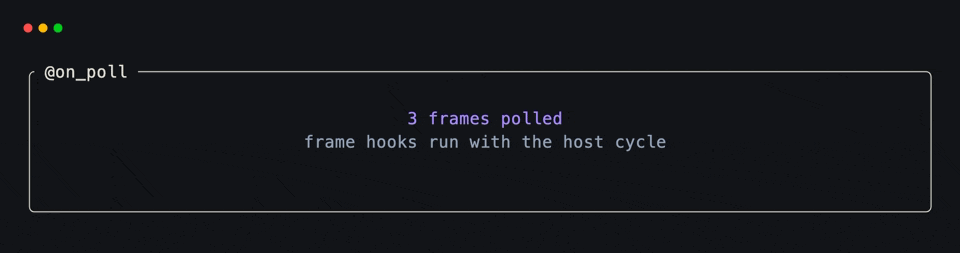
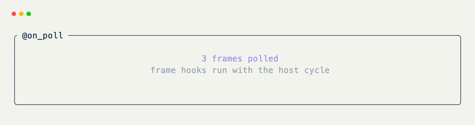

# Poll Hooks

[`@on_poll`](../api/xnano/events.md#xnano.events.on_poll){data-preview} gives small pieces of background work a place in the host cycle. It supports two modes: `"idle"` and `"frame"`.

## Poll While Idle

Bare [`@on_poll`](../api/xnano/events.md#xnano.events.on_poll){data-preview} defaults to `"idle"`. It runs when the host completes an event wait without receiving input.

```python title="Idle Polling"
@on_poll
def check_queue(self) -> None:
    if self.queue:
        self.status = self.queue.pop(0)
```

The positional and keyword forms are equivalent:

```python title="Explicit Idle Mode"
@on_poll("idle")
def check_connection(self) -> None:
    self.status = "waiting"

@on_poll(when="idle")
def check_messages(self) -> None:
    self.unread = len(self.messages)
```

## Poll Every Frame

Use `"frame"` for work that belongs to rendering rather than idle waits.

```python title="Frame Polling"
@on_poll("frame")
def count_frame(self) -> None:
    self.frames += 1
```

Keep frame handlers short—they run on the rendering path. For work with a fixed cadence, [`@on_tick(interval)`](on-tick.md){data-preview} communicates the timing more precisely.

<div class="xnano-demo" markdown>
{.demo-dark}
{.demo-light}
</div>

Polling is host lifecycle behavior, so it has no associated action. It also requires a live host cycle; do not use [`Terminal.run()`](../api/xnano/terminal/terminal.md#xnano.terminal.terminal.Terminal.run){data-preview} in Pyodide examples to demonstrate it.

??? abstract "API"

    [`on_poll`](../api/xnano/events.md#xnano.events.on_poll){data-preview}
