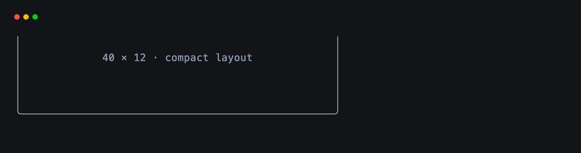
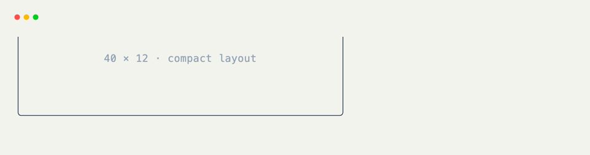

# Resize Hooks

[`@on_resize`](../api/xnano/events.md#xnano.events.on_resize){data-preview} runs after the terminal reports a new size in cells. Layout is recalculated by the host; your handler only needs to update application policy that depends on the available width or height.

```python title="Display the New Size" hl_lines="7"
from xnano import BaseGrid, Context, Field
from xnano.events import on_resize

class Status(BaseGrid):
    label: str = Field(default="waiting for resize")

    @on_resize
    def show_size(self, ctx: Context) -> None:
        resize = ctx.event.resize_event
        self.label = f"{resize.width} × {resize.height}"
```

## Choose an Application Layout

A resize hook is also a convenient place to switch between compact and wide content.

```python title="Responsive Policy"
@on_resize
def choose_layout(self, ctx: Context) -> None:
    width = ctx.event.resize_event.width
    self.navigation = "icons" if width < 60 else "icons and labels"
```

<div class="xnano-demo" markdown>
{.demo-dark}
{.demo-light}
</div>

## Resize Actions

[`Action.resize(width=None, height=None)`](../api/xnano/core/actions.md#xnano.core.actions.ResizeAction){data-preview} lets tests and other grids exercise the same behavior without resizing a real window.

```python title="Synthetic Resize"
NARROW = Action.resize(width=40, height=12)

@on_action(NARROW)
def use_compact_layout(self) -> None:
    self.mode = "compact"

ctx.actions.resize(width=40, height=12)
```

Omitted dimensions are not filtered, so [`Action.resize(width=40)`](../api/xnano/core/actions.md#xnano.core.actions.ResizeAction){data-preview} matches any height at that width.

??? abstract "API"

    [`on_resize`](../api/xnano/events.md#xnano.events.on_resize){data-preview} · [`ResizeAction`](../api/xnano/core/actions.md#xnano.core.actions.ResizeAction){data-preview}
