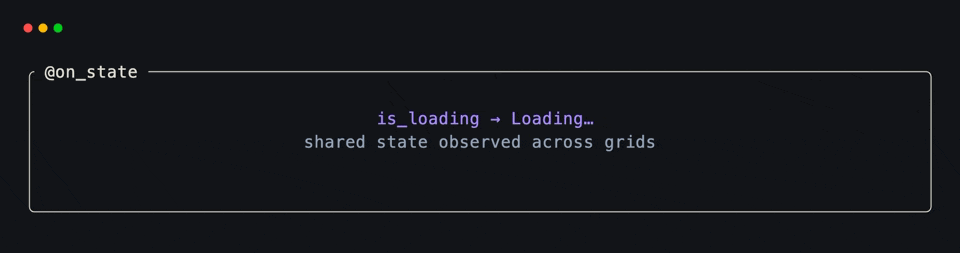
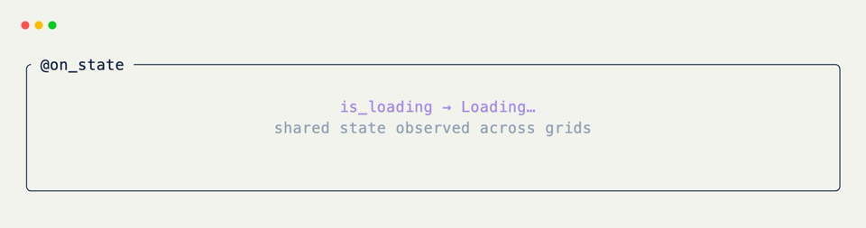

# Shared-State Hooks

[`@on_state`](../api/xnano/events.md#xnano.events.on_state){data-preview} evaluates an expression against the host's shared state on each tick. When the expression is truthy, xnano calls the decorated method.

Use it when several grids share one state object and a grid should react to a condition without knowing which other grid changed it.

Every example on this page reacts to one shared `AppState`, attached once via [`Terminal`](../api/xnano/terminal/terminal.md#xnano.terminal.terminal.Terminal){data-preview}:

```python title="AppState"
import dataclasses

@dataclasses.dataclass
class User:
    name: str

@dataclasses.dataclass
class AppState:
    is_loading: bool = False
    is_connected: bool = False
    messages: list[str] = dataclasses.field(default_factory=list)
    user: User | None = None
    notification: str | None = None
```

`AppState` is not an xnano type — it's just this page's name for whatever
object you pass to `Terminal(state=...)`. A plain dataclass, a Pydantic
model, or xnano's own [`State`](../api/xnano/state.md#xnano.state.State){data-preview}
all work identically; the fields above (`is_loading`, `messages`, `user`,
`notification`) exist only to give the expressions below something to
match against, not because `@on_state` expects a particular shape.

## Refer to State Attributes Directly

State attributes are available by name inside the expression.

```python title="Watch a Boolean" hl_lines="7"
from xnano import BaseGrid, Field, Terminal
from xnano.events import on_state

class LoadingStatus(BaseGrid):
    status: str = Field(default="ready")

    @on_state("is_loading")
    def show_loading(self) -> None:
        self.status = "Loading…"

Terminal(state=AppState(is_loading=True)).run(LoadingStatus())
```

`is_loading` resolves against the `AppState` above — no lookup or import needed inside the expression string.

Expressions can combine comparisons and safe built-ins:

```python title="Combine State Conditions"
@on_state("is_connected and len(messages) > 0")
def show_inbox(self) -> None:
    self.status = "New messages"
```

This reads `is_connected` and `messages` off the same `AppState` — true once the app is connected and at least one message has arrived.

The complete object is also bound as `state` when an explicit reference reads better.

```python title="Use the State Object"
@on_state("state.user is not None")
def show_account(self, ctx: Context[AppState]) -> None:
    self.account = ctx.get_state().user.name
```

[`Context[AppState]`](../core-concepts/context.md#typing-context-by-state){data-preview} types `ctx.get_state()` as the same `AppState` the expression runs against, so `.user` is a real attribute instead of `Any`.

## Conditions Are Level-Triggered

[`@on_state`](../api/xnano/events.md#xnano.events.on_state){data-preview} is not a change detector. A handler remains eligible on every tick while its expression is true. Keep the handler idempotent, or change the state when the work should happen only once.

```python title="Consume a One-Time Condition"
@on_state("notification is not None")
def consume_notification(self, ctx: Context[AppState]) -> None:
    state = ctx.get_state()
    self.message = state.notification
    state.notification = None
```

<div class="xnano-demo" markdown>
{.demo-dark}
{.demo-light}
</div>

State predicates do not have an associated action—the changing state is the trigger. Use [`@on_field`](on-field.md){data-preview} for values owned by one grid.

??? abstract "API"

    [`on_state`](../api/xnano/events.md#xnano.events.on_state){data-preview} · [`State`](../api/xnano/state.md#xnano.state.State){data-preview}
