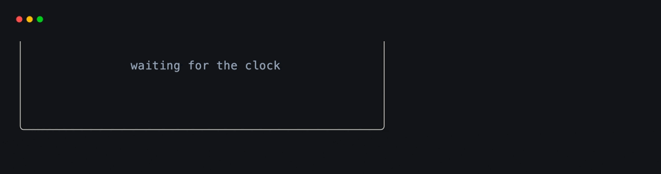
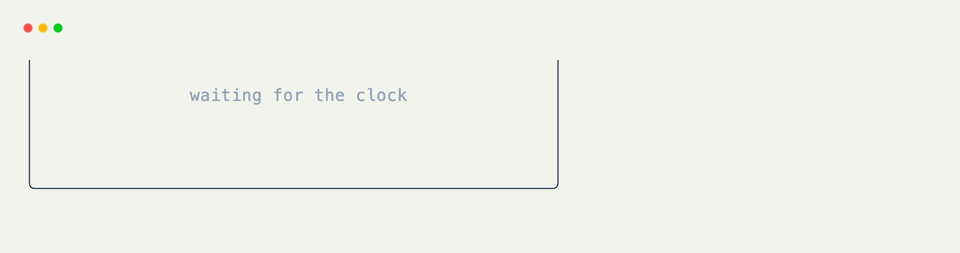

# Tick Hooks

Use [`@on_tick`](../api/xnano/events.md#xnano.events.on_tick){data-preview} for work driven by the host clock: clocks, animation steps, periodic refreshes, and small checks that should continue when no input arrives.

## Run on Every Tick

Bare [`@on_tick`](../api/xnano/events.md#xnano.events.on_tick){data-preview} has an interval of `0`, so it is eligible on every host tick.

```python title="Every Tick"
@on_tick
def count_tick(self) -> None:
    self.ticks += 1
```

For animation, set the host's tick interval deliberately rather than assuming a particular frame rate.

## Use a Fixed Interval

Pass milliseconds positionally:

```python title="Once a Second" hl_lines="7"
import time

from xnano import BaseGrid, Field
from xnano.events import on_tick

class Clock(BaseGrid):
    @on_tick(1000)
    def update_clock(self) -> None:
        self.display = time.strftime("%H:%M:%S")
```

The explicit keyword form is equivalent:

```python title="Keyword Interval"
@on_tick(interval_milliseconds=250)
def update_progress(self) -> None:
    self.progress += 1
```

Intervals are matched against elapsed host time. If the code means “once a second,” use `1000` instead of counting frames.

<div class="xnano-demo" markdown>
{.demo-dark}
{.demo-light}
</div>

## Tick Actions

[`Action`](../api/xnano/core/actions.md#xnano.core.actions.Action){data-preview}`.tick(interval_ms=0)` drives the same dispatch path without waiting for a live clock.

```python title="Synthetic Tick"
SECOND = Action.tick(1000)

@on_action(SECOND)
def update_clock(self) -> None:
    self.display = "tick received"

terminal.perform(SECOND)
```

??? abstract "API"

    [`on_tick`](../api/xnano/events.md#xnano.events.on_tick){data-preview} · [`TickAction`](../api/xnano/core/actions.md#xnano.core.actions.TickAction){data-preview}
