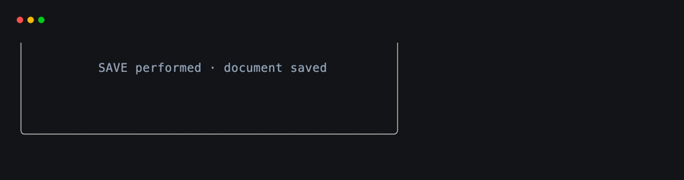
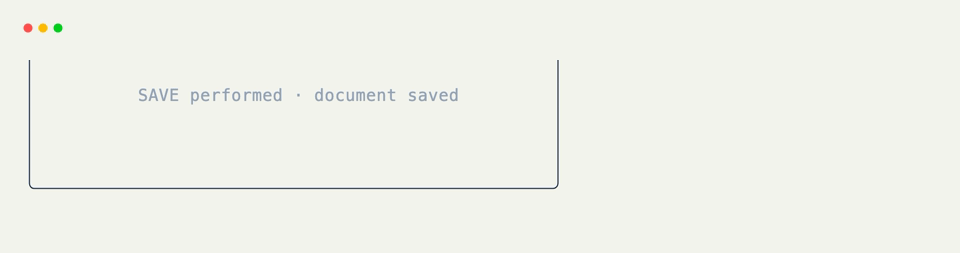

# Action Hooks

[`@on_action`](../api/xnano/events.md#xnano.events.on_action){data-preview} binds a method to an [`Action`](../api/xnano/core/actions.md#xnano.core.actions.Action){data-preview} value. It is useful when a trigger needs a name, belongs to more than one grid, or can be performed from code as well as produced by physical input.

```python title="Bind a Named Action" hl_lines="3 8"
from xnano import Action, BaseGrid, Field, on_action

SAVE = Action.keyboard("ctrl+s")

class Editor(BaseGrid):
    status: str = Field(default="unsaved")

    @on_action(SAVE)
    def save_document(self) -> None:
        self.status = "saved"
```

The action describes the trigger; the method still owns the reaction. Calling `save_document()` directly does not perform `SAVE`.

## Share an Action Between Grids

The sending grid and receiving grid only need to share the action value. They do not need references to each other.

```python title="Perform from One Grid" hl_lines="5"
class Toolbar(BaseGrid):
    @on_click("save_button")
    def request_save(self, ctx: Context) -> None:
        ctx.actions.perform(SAVE)
```

```python title="Handle in Another Grid" hl_lines="2"
class Editor(BaseGrid):
    @on_action(SAVE)
    def save_document(self) -> None:
        self.status = "saved"
```

## Perform an Action

A host can perform an action directly:

```python title="Perform from a Host"
terminal.perform(SAVE)
```

Inside a hook, use the host-bound helper:

```python title="Perform from Context"
@on_keyboard("f2")
def save_from_shortcut(self, ctx: Context) -> None:
    ctx.actions.perform(SAVE)
```

Both forms synthesize the corresponding event and send it through normal dispatch. Every matching hook on the active interface can react.

<div class="xnano-demo" markdown>
{.demo-dark}
{.demo-light}
</div>

## Supported Action Families

[`@on_action`](../api/xnano/events.md#xnano.events.on_action){data-preview} accepts keyboard, mouse, click, focus, clipboard, tick, and resize actions. Request actions belong to the web request decorators because a request also needs a registered route.

!!! note "Renamed from `@on`"

    [`@on`](../api/xnano/events.md#xnano.events.on){data-preview} remains available for existing applications, but it is deprecated. New code should import and use [`@on_action`](../api/xnano/events.md#xnano.events.on_action){data-preview}; the dispatch behavior is otherwise identical.

??? abstract "API"

    [`on_action`](../api/xnano/events.md#xnano.events.on_action){data-preview} · [`Action`](../api/xnano/core/actions.md#xnano.core.actions.Action){data-preview}
