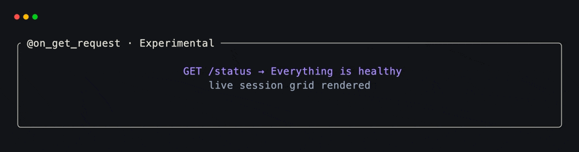
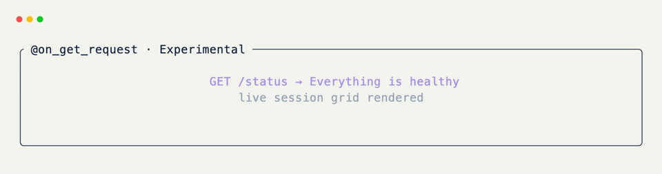

# GET Request Hooks

!!! warning "Experimental"

    Web request hooks are experimental and are subject to frequent
    changes.

Use
[`@on_get_request`](../../api/xnano/requests.md#xnano.requests){data-preview}
when visiting a path should read, select, or refresh something without
describing a mutation. The handler mutates grid state; the host repaints
on its own schedule (cell stream under `Web`, terminal frame loop under
`Terminal.run(..., host=..., port=...)`).

`GET` is one of ten method decorators — the same path rules apply to
`@on_head_request`, `@on_post_request`, `@on_put_request`,
`@on_delete_request`, and the rest. See the
[method table](index.md#every-http-method){data-preview}.

## Register a Path

```python title="Status Route" hl_lines="6"
from xnano import BaseGrid, Field
from xnano.web.requests import on_get_request

class Dashboard(BaseGrid):
    message: str = Field(default="checking")

    @on_get_request("/status")
    def show_status(self) -> None:
        self.message = "Everything is healthy"
```

A leading slash is optional; xnano normalizes `"status"` to `"/status"`.

## Register the Root Path

Bare
[`@on_get_request`](../../api/xnano/requests.md#xnano.requests){data-preview}
defaults to `/`:

```python title="Root Route"
@on_get_request
def show_home(self) -> None:
    self.page = "home"
```

The explicit keyword form is equivalent:

```python title="Explicit Root Route"
@on_get_request(path="/")
def show_home(self) -> None:
    self.page = "home"
```

## Host the Routes

Under
[`Web`](../../api/xnano/web/web.md#xnano.web.web.Web){data-preview}, the
path becomes a `GET` route on the native server:

```python title="Web" hl_lines="2"
from xnano.web import Web

Web().run(Dashboard)
# curl http://127.0.0.1:8000/status  → 204, grid mutates, canvas updates
```

Under
[`Terminal`](../../api/xnano/terminal/terminal.md#xnano.terminal.terminal.Terminal){data-preview},
pass `host` / `port` so a background request server exposes the same
route while the TUI runs:

```python title="Terminal" hl_lines="2 3 4 5"
from xnano.terminal import Terminal

Terminal().run(
    Dashboard(),
    host="127.0.0.1",
    port=8000,
)
# curl http://127.0.0.1:8000/status  → empty 200, TUI repaints
```

Responses carry no body — hooks mutate state; they do not render HTML.

<div class="xnano-demo" markdown>
{.demo-dark}
{.demo-light}
</div>

## GET Actions

[`Action.request("GET", "/status")`](../../api/xnano/core/actions.md#xnano.core.actions.RequestAction){data-preview}
describes the associated trigger. Bind the actual route with
[`@on_get_request`](../../api/xnano/requests.md#xnano.requests){data-preview},
not [`@on_action`](../on.md){data-preview}, so the host can discover it.

??? abstract "API"

    [`on_get_request`](../../api/xnano/requests.md#xnano.requests){data-preview}
    ·
    [`RequestAction`](../../api/xnano/core/actions.md#xnano.core.actions.RequestAction){data-preview}
