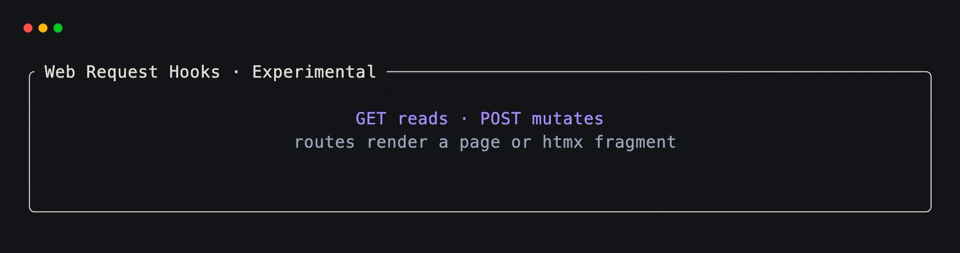
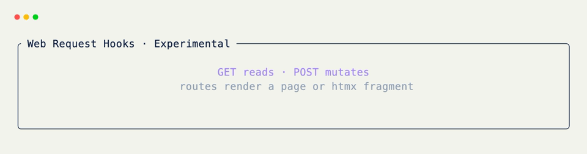

# Web Request Hooks

!!! warning "Experimental"

    Web request hooks are experimental and are subject to frequent
    changes.

Request hooks turn grid methods into HTTP routes. Handlers **mutate grid
state only** — they never return a body. The host repaints on its own
schedule:

- Under [`Web`](../../api/xnano/web/web.md#xnano.web.web.Web){data-preview},
  routes register on the native stdlib server. The continuous cell-stream
  loop reflects the mutation on the next frame.
- Under
  [`Terminal`](../../api/xnano/terminal/terminal.md#xnano.terminal.terminal.Terminal){data-preview},
  pass `host` / `port` to `Terminal.run` (defaults apply). A background
  request server exposes the same routes; the terminal frame loop
  repaints. If the grid declares no request hooks, `host` / `port` are
  ignored.

## Every HTTP Method

Each method has its own decorator — the name is
`@on_<method>_request`, and the matching
[`Action.request(method, path)`](../../api/xnano/core/actions.md#xnano.core.actions.RequestAction){data-preview}
uses the uppercase method string:

| Decorator | Method | Typical use |
|---|---|---|
| [`@on_get_request`](get.md){data-preview} | `GET` | Reads, navigation, refresh |
| `@on_head_request` | `HEAD` | Metadata-only probes |
| [`@on_post_request`](post.md){data-preview} | `POST` | Creates, form submits, increments |
| `@on_put_request` | `PUT` | Full resource replace |
| `@on_patch_request` | `PATCH` | Partial resource update |
| `@on_delete_request` | `DELETE` | Removal |
| `@on_options_request` | `OPTIONS` | Capability / CORS-style discovery |
| `@on_connect_request` | `CONNECT` | Tunnel / proxy style hooks |
| `@on_trace_request` | `TRACE` | Diagnostic echo hooks |
| `@on_query_request` | `QUERY` | Safe, body-bearing queries |

All ten share the same decorator shape, path normalization, and
cross-host registration. Dedicated walkthroughs exist for the two most
common cases — [GET](get.md){data-preview} and
[POST](post.md){data-preview} — but every method above works the same
way.

Import from
[`xnano.web.requests`](../../api/xnano/web/requests.md){data-preview},
the barrel [`xnano.hooks`](../../api/xnano/hooks.md){data-preview}, or
[`xnano.requests`](../../api/xnano/requests.md){data-preview}:

```python title="Multiple Methods" hl_lines="9 13 17 21"
from xnano import BaseGrid, Field
from xnano.hooks import (
    on_delete_request,
    on_get_request,
    on_patch_request,
    on_post_request,
    on_put_request,
)

class Items(BaseGrid):
    message: str = Field(default="idle")
    count: int = Field(default=0, state=True)

    @on_get_request("/items")
    def list_items(self) -> None:
        self.message = f"{self.count} items"

    @on_post_request("/items")
    def create_item(self) -> None:
        self.count += 1
        self.message = f"created · {self.count}"

    @on_put_request("/items")
    def replace_items(self) -> None:
        self.count = 1
        self.message = "replaced"

    @on_patch_request("/items")
    def touch_items(self) -> None:
        self.message = "patched"

    @on_delete_request("/items")
    def clear_items(self) -> None:
        self.count = 0
        self.message = "cleared"
```

Bare `@on_get_request` (no path) and `@on_get_request(path="/")` both
register `/`; the same default applies to every other method decorator.

## Serve With Web

```python title="Web Host" hl_lines="3"
from xnano.web import Web

Web(title="items").run(Items)  # (1)!
```

1. Pass the **class** for a fresh grid per browser session, or an
   **instance** to share one live grid across visitors. Open
   `http://127.0.0.1:8000`, then hit routes with any HTTP client —
   `curl -X PUT http://127.0.0.1:8000/items` — and watch the canvas
   update on the next frame.

## Serve Alongside Terminal

```python title="Terminal + Request Server" hl_lines="3 4"
from xnano.terminal import Terminal

Terminal().run(
    Items(),
    host="127.0.0.1",
    port=8000,
)  # (1)!
```

1. When the grid declares request hooks,
   [`start_request_server`](../../api/xnano/web/request_server.md){data-preview}
   starts in a background thread and accepts every method the
   decorators registered. Responses are empty `200` / `404` — handlers
   only mutate state; the TUI repaints on its next frame.

<div class="xnano-demo" markdown>
{.demo-dark}
{.demo-light}
</div>

## Request Actions

[`Action.request(method, path)`](../../api/xnano/core/actions.md#xnano.core.actions.RequestAction){data-preview}
represents the same trigger for host-driven dispatch. Generic
[`@on_action`](../on.md){data-preview} does not register HTTP routes; keep
the corresponding `@on_<method>_request` decorator on the route method.

```python title="Request Actions"
from xnano import Action

REFRESH = Action.request("GET", "/items")
CREATE = Action.request("POST", "/items")
REPLACE = Action.request("PUT", "/items")
REMOVE = Action.request("DELETE", "/items")
```

Paths are normalized to begin with `/`, and methods are uppercased before
matching.

??? abstract "API"

    [`xnano.web.requests`](../../api/xnano/web/requests.md){data-preview}
    ·
    [`xnano.requests`](../../api/xnano/requests.md){data-preview}
    ·
    [`xnano.hooks`](../../api/xnano/hooks.md){data-preview}
    ·
    [`RequestAction`](../../api/xnano/core/actions.md#xnano.core.actions.RequestAction){data-preview}
    ·
    [`start_request_server`](../../api/xnano/web/request_server.md){data-preview}
