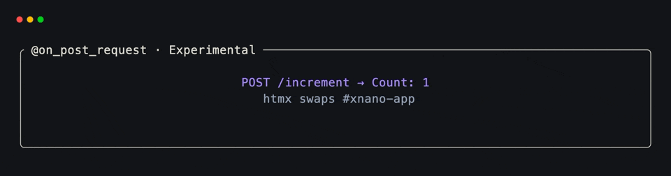
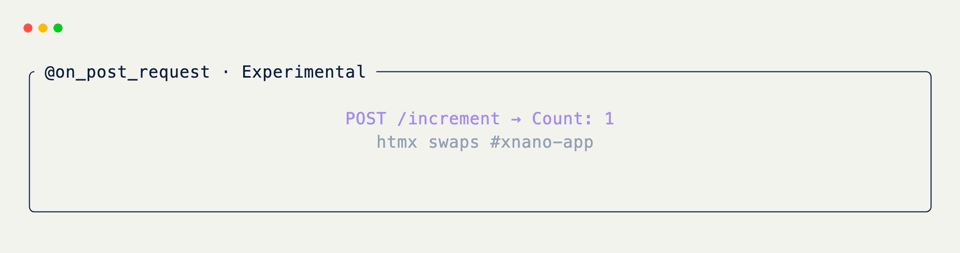

# POST Request Hooks

!!! warning "Experimental"

    Web request hooks are experimental and are subject to frequent changes.

Use [`@on_post_request`](../../api/xnano/web/requests.md#xnano.web.requests.on_post_request){data-preview} for state-changing interactions such as submitting a form, incrementing a counter, or applying a choice.

## Register a Mutation

```python title="Increment Route" hl_lines="7"
from xnano import BaseGrid, Field
from xnano.web.requests import on_post_request

class Counter(BaseGrid):
    count: int = Field(default=0, state=True)
    label: str = Field(default="Count: 0")

    @on_post_request("/increment")
    def increment(self) -> None:
        self.count += 1
        self.label = f"Count: {self.count}"
```

## Connect htmx

Point an htmx interaction at the same path and replace the app fragment with the response.

```html title="htmx Button"
<button
  hx-post="/increment"
  hx-target="#xnano-app"
  hx-swap="innerHTML"
>
  Increment
</button>
```

For an `HX-Request`, xnano returns the `#xnano-app` fragment. Ordinary browser navigation receives the complete page.

Bare [`@on_post_request`](../../api/xnano/web/requests.md#xnano.web.requests.on_post_request){data-preview} and [`@on_post_request(path="/")`](../../api/xnano/web/requests.md#xnano.web.requests.on_post_request){data-preview} register the root path, just like their GET counterparts.

<div class="xnano-demo" markdown>
{.demo-dark}
{.demo-light}
</div>

## POST Actions

[`Action.request("POST", "/increment")`](../../api/xnano/core/actions.md#xnano.core.actions.RequestAction){data-preview} describes the associated trigger. Keep [`@on_post_request`](../../api/xnano/web/requests.md#xnano.web.requests.on_post_request){data-preview} on the method so [`Web`](../../api/xnano/web/web.md#xnano.web.web.Web){data-preview} registers the route.

??? abstract "API"

    [`on_post_request`](../../api/xnano/web/requests.md#xnano.web.requests.on_post_request){data-preview} · [`RequestAction`](../../api/xnano/core/actions.md#xnano.core.actions.RequestAction){data-preview}
