<span class="page-index"></span>


<p align="center">
  <a href="https://pypi.org/project/xnano" target="_blank"></a>
  <a href="https://pypi.org/project/xnano" target="_blank"></a>
  <a href="https://github.com/hsaeed3/xnano/blob/main/LICENSE" target="_blank"></a>
</p>

---

xnano is a modern TUI framework for python designed to simplify the process of putting and interacting with stuff on your terminal, built on rust.

Fast and flexible, xnano gives you a simple [Pydantic](https://github.com/pydantic/pydantic) like API for rendering to the terminal and interacting with its components in a way that plays nicely with your brain.

---

*[Pydantic]: Data validation library using Python type hints.
*[TUI]: A text-based user interface (your terminal applications).

---

<div class="xnano-showcase" markdown>
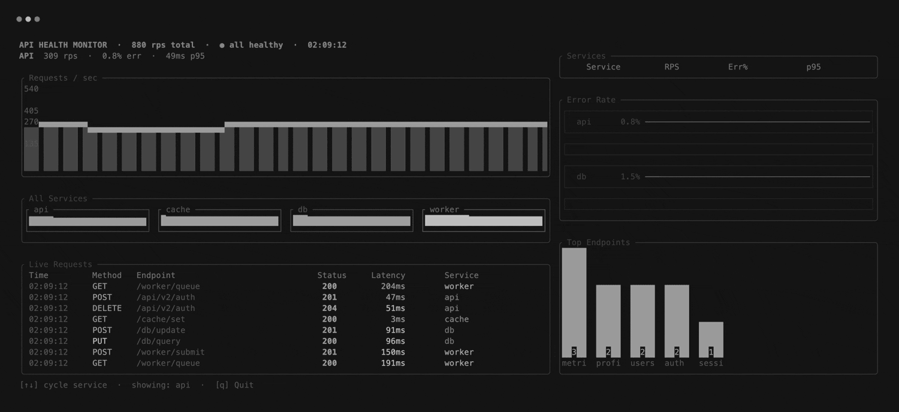{.showcase-mono .demo-dark}
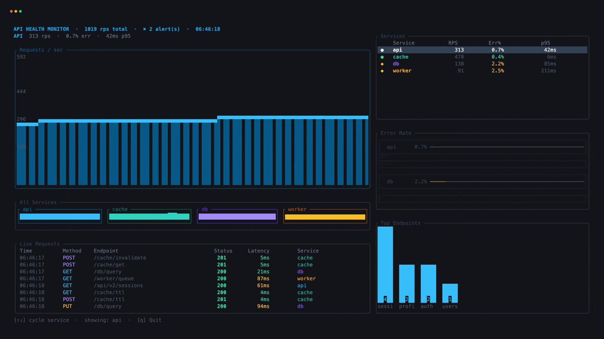{.showcase-color .demo-dark}
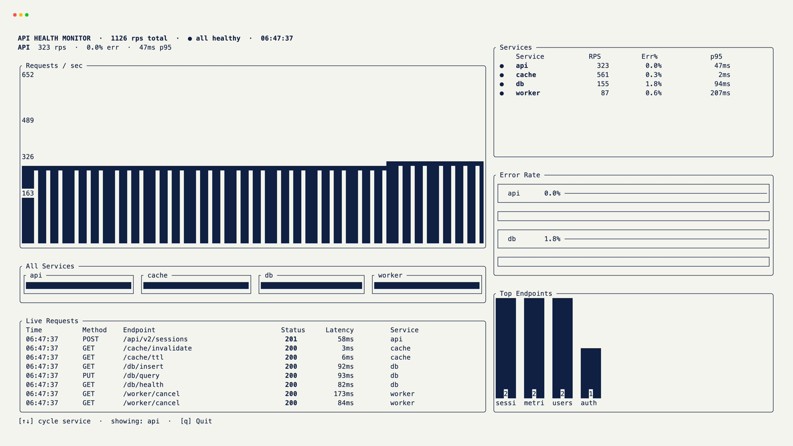{.showcase-mono .demo-light}
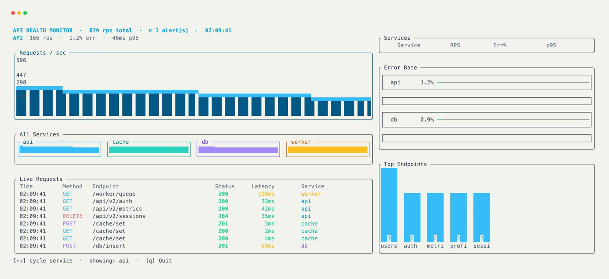{.showcase-color .demo-light}
</div>

<div class="xnano-showcase" markdown>
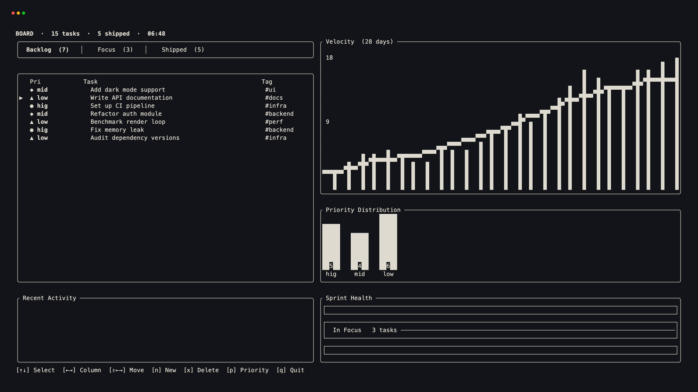{.showcase-mono .demo-dark}
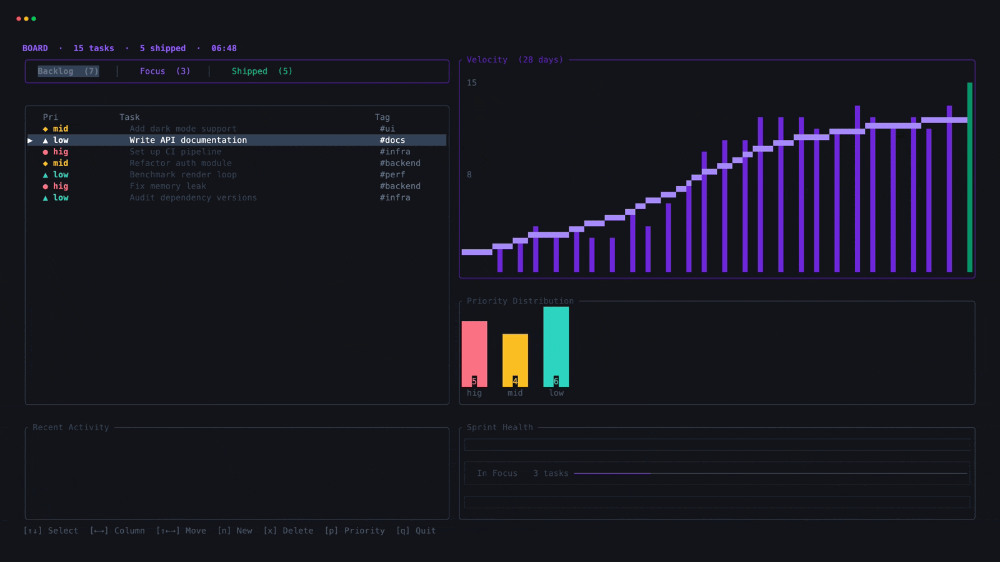{.showcase-color .demo-dark}
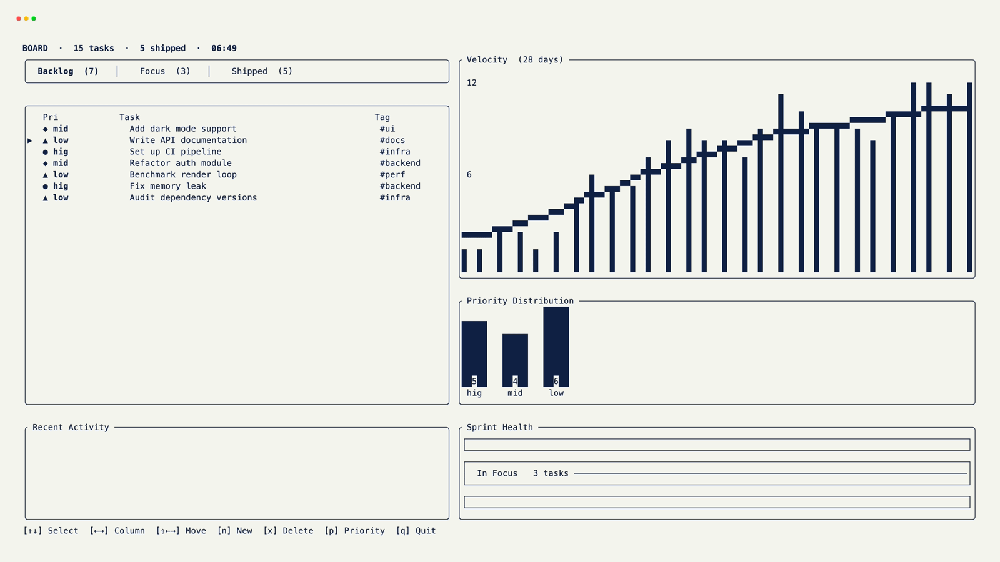{.showcase-mono .demo-light}
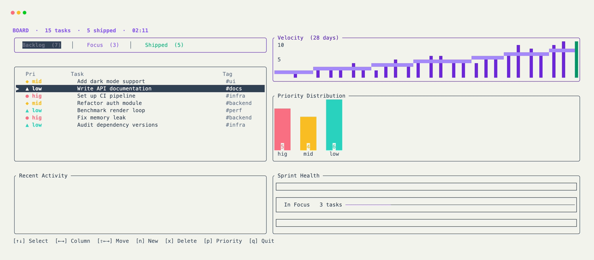{.showcase-color .demo-light}
</div>

<div class="xnano-showcase" markdown>
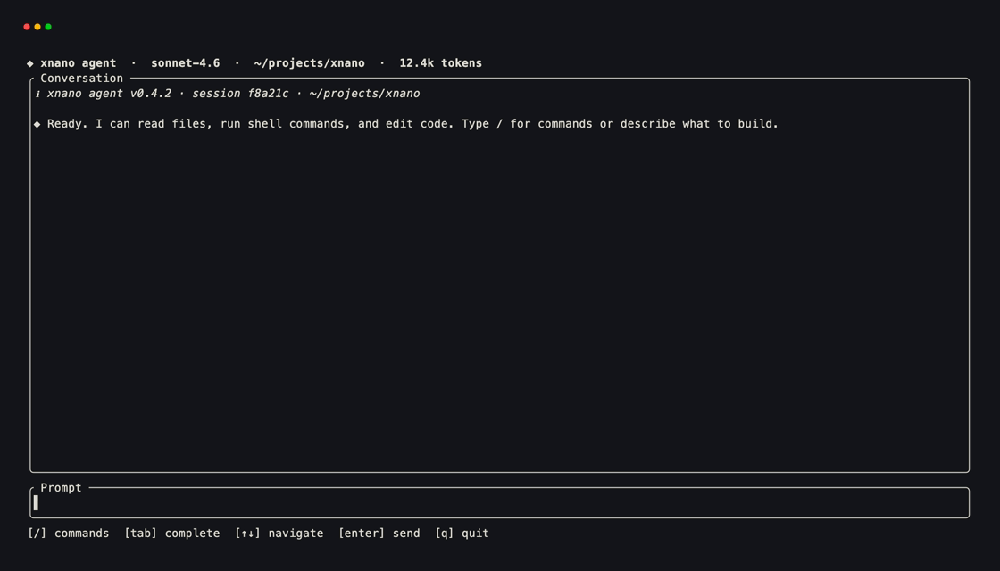{.showcase-mono .demo-dark}
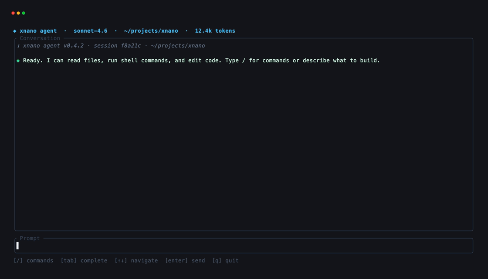{.showcase-color .demo-dark}
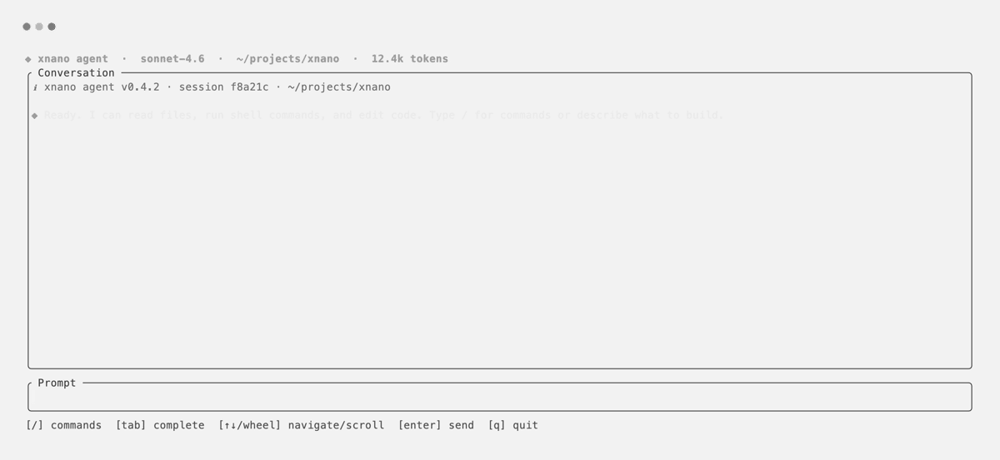{.showcase-mono .demo-light}
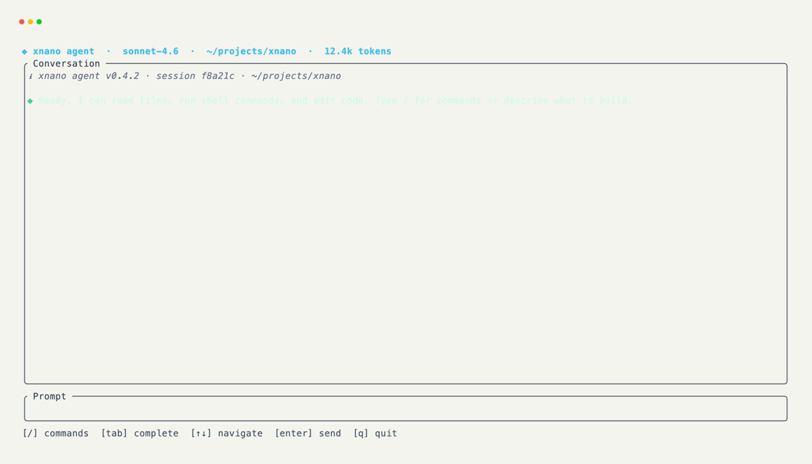{.showcase-color .demo-light}
</div>

---

## Installation

You can install xnano with your favorite package manager on python 3.10+.

=== "pip"

    ```bash
    pip install "xnano"
    ```

=== "uv"

    ```bash
    uv pip install "xnano"

    # or add to your project's dependencies
    # uv add xnano
    ```

=== "poetry"

    ```bash
    poetry install "xnano"

    # or add to your project's dependencies
    # poetry add xnano
    ```

=== "conda"

    ```bash
    conda install "xnano"
    ```

---

## Your first render

The easiest way to get started is the print-like `render()` helper — no
session, no event loop. It writes styled content to the terminal and returns.

```python
from xnano import render
from xnano.components.text import Text

render(
    Text("Hello from xnano!", color="violet", modifiers=["bold"])
)
```

<div class="xnano-demo" markdown>
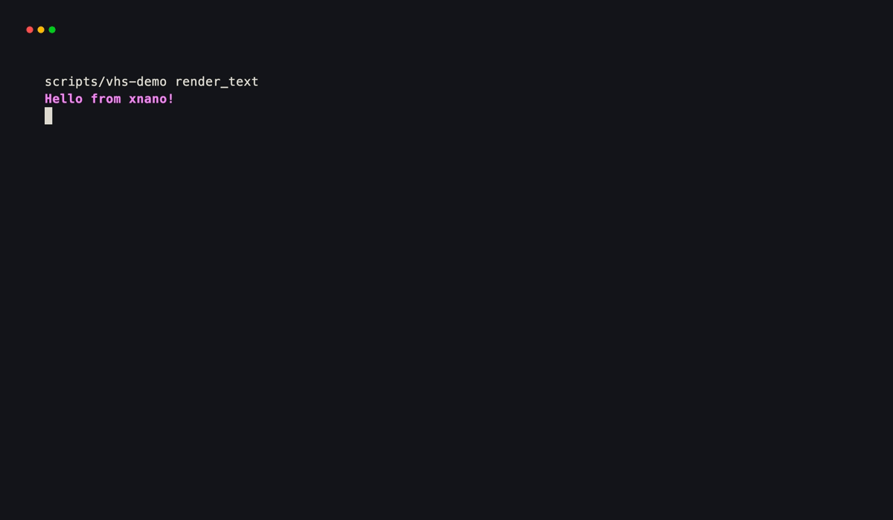{.demo-dark}
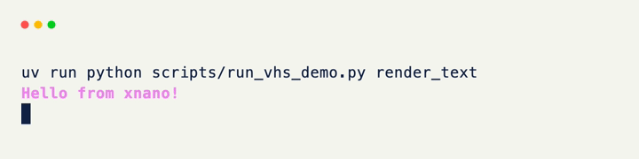{.demo-light}
</div>

You can pass multiple renderables too — they'll stack vertically:

```python
from xnano import render
from xnano.components.text import Text

render(
    Text("Success!", color="emerald-400", modifiers=["bold"]),
    Text("All 12 checks passed.", color="slate-400"),
)
```

<div class="xnano-demo" markdown>
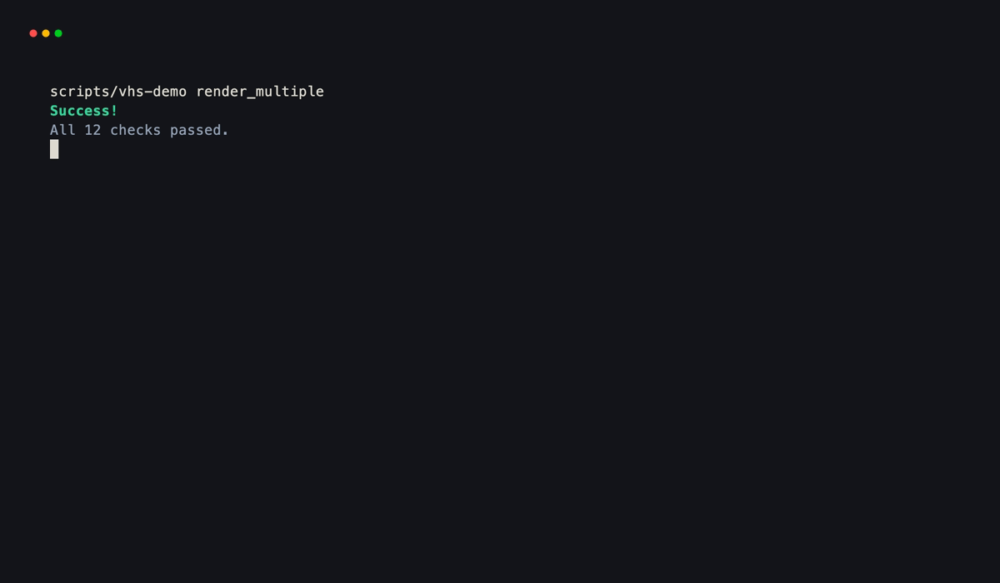{.demo-dark}
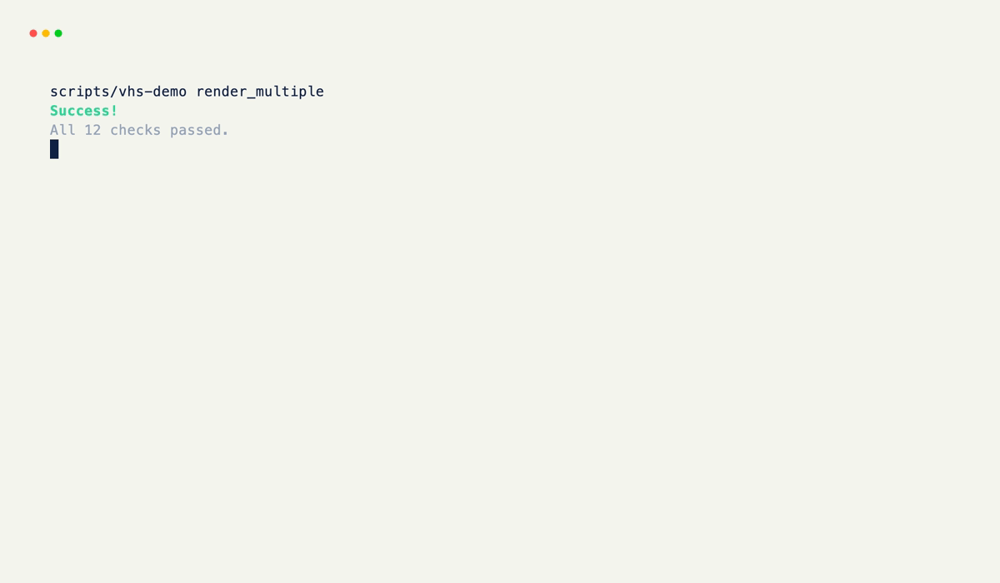{.demo-light}
</div>

---

## Building a layout

Layouts work like Pydantic models. Inherit from `BaseGrid`, add typed fields, and xnano handles the rest. Field order is layout order. (`Grid` remains available as an alias of `BaseGrid`.)

```python
from xnano import Field, BaseGrid, Terminal

class App(BaseGrid, direction="vertical"):
    header: str = Field(default="My App", height=1, color="white", background="violet")
    body:   str = Field(default="Content goes here.")
    footer: str = Field(default="[q] quit", height=1, color="slate-500")

Terminal().run(App())
```

<div class="xnano-demo" markdown>
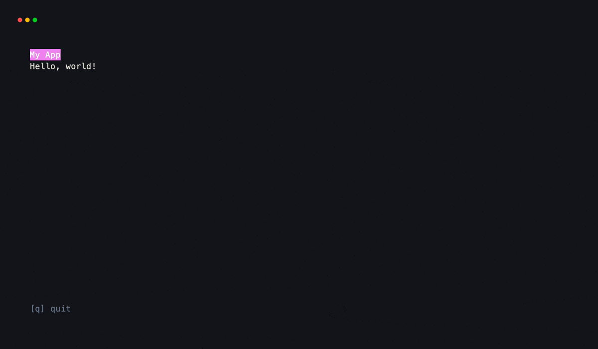{.demo-dark}
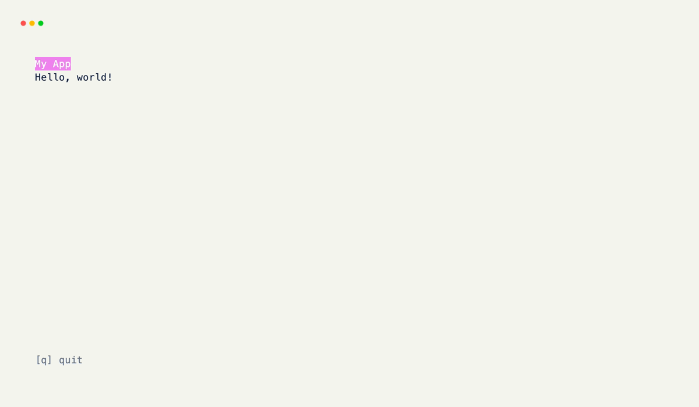{.demo-light}
</div>

Nest grids to build more complex layouts:

```python
class Sidebar(BaseGrid, direction="vertical"):
    nav:    str = Field(default="- Home\n- Settings", width="20%", border="rounded")
    detail: str = Field(default="Select an item", width="1fr")

class App(BaseGrid, direction="horizontal"):
    sidebar: Sidebar = Field(default_factory=Sidebar, width="25%")
    main:    str     = Field(default="Main area", width="1fr", border="rounded")

Terminal().run(App())
```

<div class="xnano-demo" markdown>
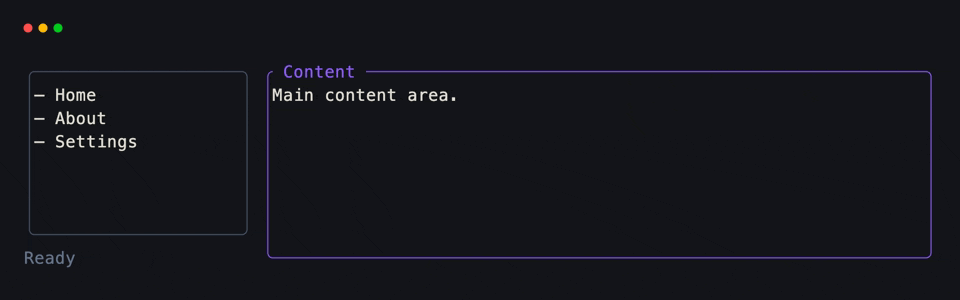{.demo-dark}
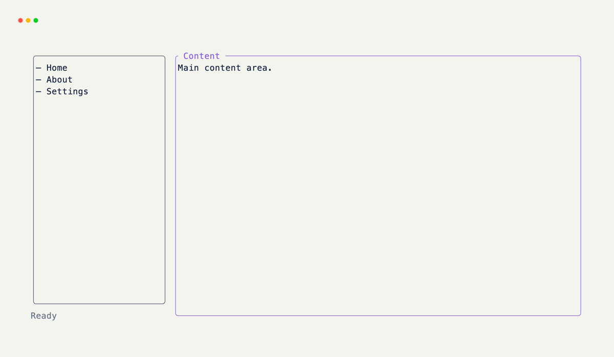{.demo-light}
</div>

---

## Responding to keys

Decorate a method with `@on_keyboard` and it fires when that key is pressed. Fields marked `state=True` trigger a re-render whenever they change.

```python
from xnano import Field, BaseGrid, Terminal
from xnano.events import on_keyboard

class Counter(BaseGrid, direction="vertical", gap=1):
    label: str = Field(default="Count: 0", height=1)
    hint:  str = Field(default="↑ / ↓ to count  ·  q to quit", height=1, color="slate-500")

    count: int = Field(default=0, state=True)

    @on_keyboard("up")
    def inc(self) -> None:
        self.count += 1
        self.label = f"Count: {self.count}"

    @on_keyboard("down")
    def dec(self) -> None:
        self.count -= 1
        self.label = f"Count: {self.count}"

    @on_keyboard("q")
    def quit(self, ctx) -> None:
        ctx.terminal.request_exit()

Terminal().run(Counter())
```

<div class="xnano-demo" markdown>
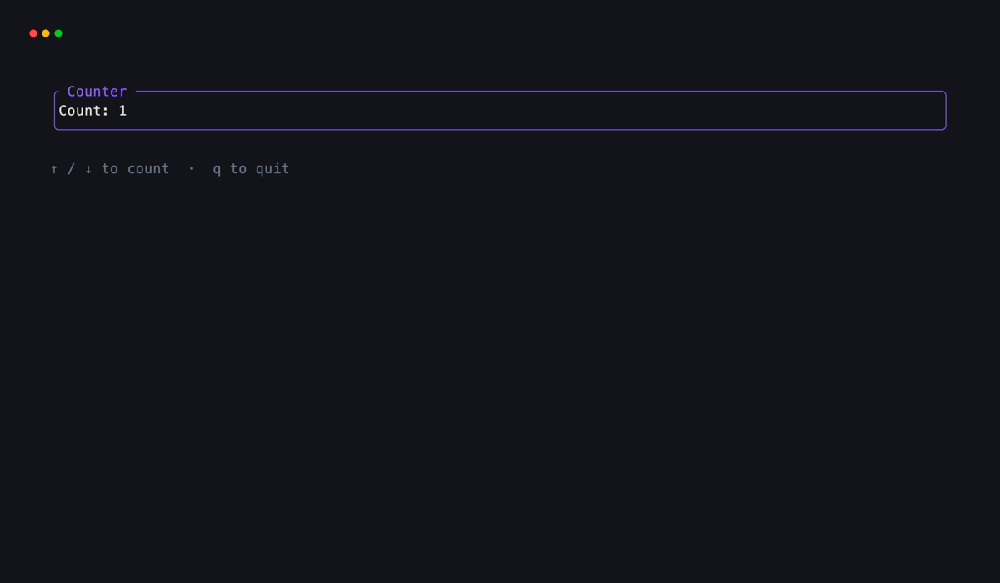{.demo-dark}
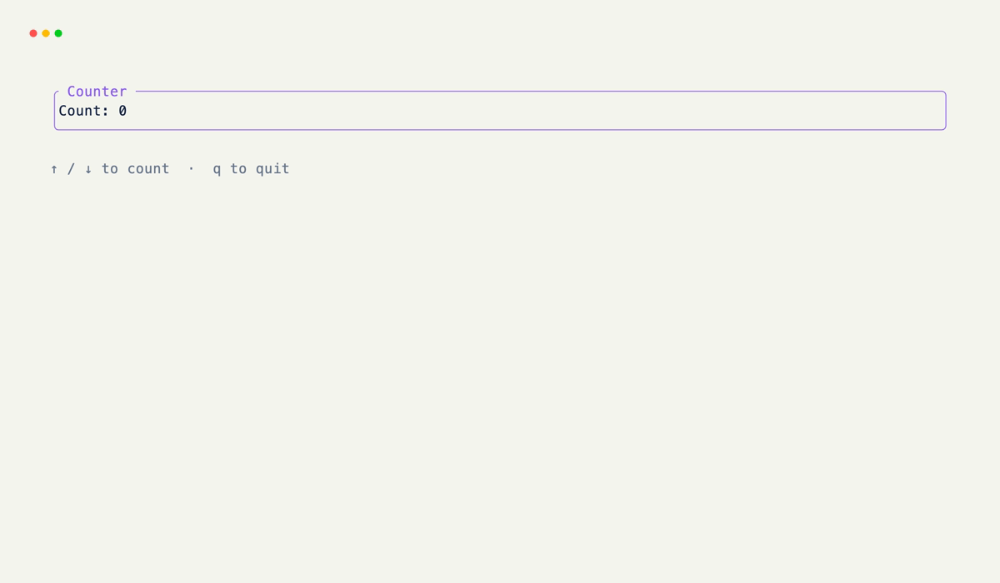{.demo-light}
</div>

You can also pass a `Context` object to get access to the terminal, keyboard event details, and more:

```python
@on_keyboard("enter")
def submit(self, ctx) -> None:
    key = ctx.keyboard      # crossterm KeyEvent
    term = ctx.terminal     # Terminal instance
```

---

## Tick-driven updates

Use `@on_tick` to run something on a repeating interval. Pass a number of milliseconds to `@on_tick` to override the default, or set `tick_interval` on `Terminal`.

```python
import time
from xnano import Field, BaseGrid, Terminal
from xnano.events import on_tick

class Clock(BaseGrid, direction="vertical"):
    display: str = Field(default="", height=3, border="rounded", title=" Time ")

    @on_tick(1000)
    def update(self) -> None:
        self.display = time.strftime("  %H:%M:%S")

Terminal().run(Clock())
```

<div class="xnano-demo" markdown>
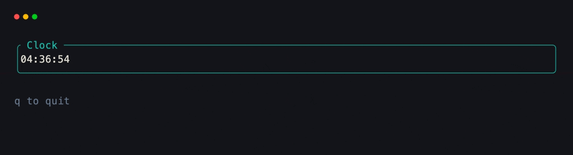{.demo-dark}
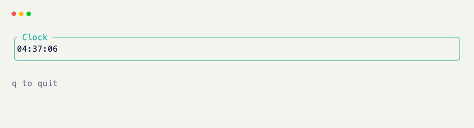{.demo-light}
</div>

For 60 fps animations, pass a short interval:

```python
Terminal(tick_interval=16).run(MyAnimatedApp())
```

---

## Sizing fields

Every field accepts `width=` and `height=` to control how much space it takes. You can use plain integers (cells), percentages, or fraction strings.

```python
class Layout(BaseGrid, direction="horizontal", gap=1):
    sidebar: str = Field(default="Sidebar", width="25%",  border="rounded")
    main:    str = Field(default="Content", width="1fr",  border="rounded")
    aside:   str = Field(default="Aside",   width="20%",  border="rounded")
```

| Value | Description |
|---|---|
| `3` | Fixed 3 cells |
| `"25%"` | 25% of the available space |
| `"1fr"` / `"2fr"` | A fractional share of what's left — `"2fr"` takes twice as much as `"1fr"` |
| `"fit"` | Shrink-wrap to content size |

Mix and match freely — xnano resolves everything in one pass:

```python
class App(BaseGrid, direction="vertical"):
    header: str = Field(default="Header", height=1)     # always 1 row
    body:   str = Field(default="Body",   height="1fr") # fills remaining space
    footer: str = Field(default="Footer", height=3)     # always 3 rows

Terminal().run(App())
```

<div class="xnano-demo" markdown>
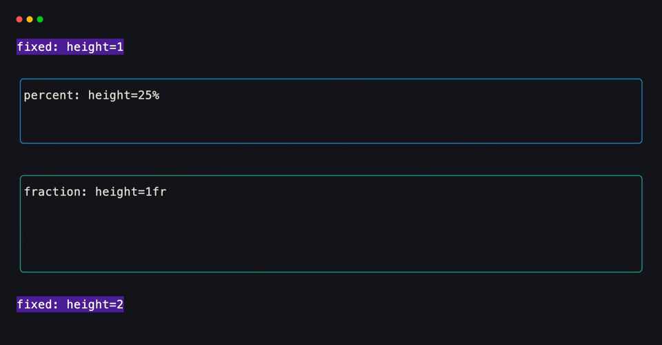{.demo-dark}
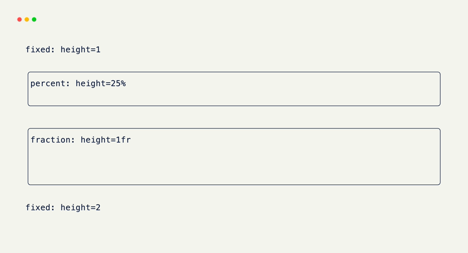{.demo-light}
</div>

---

## Styled text

Use `Text` to compose rich inline content with colors, modifiers, and nesting:

```python
from xnano import render
from xnano.components.text import Text

message = Text([
    Text("● ", color="emerald-400"),
    Text("Done: ", color="white", modifiers=["bold"]),
    Text("all tests passed\n", color="slate-300"),
])

render(message)
```

<div class="xnano-demo" markdown>
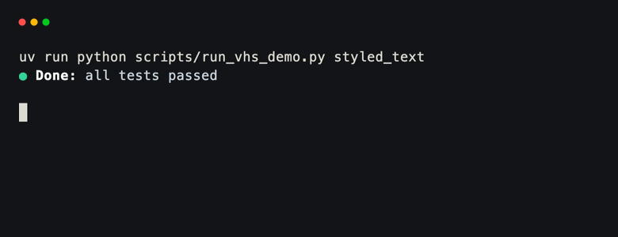{.demo-dark}
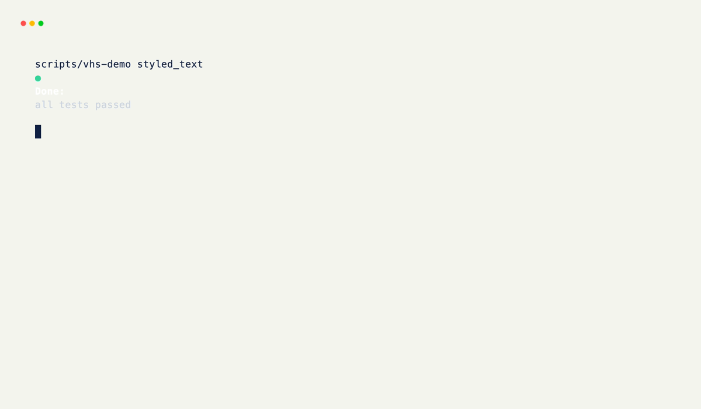{.demo-light}
</div>

Colors accept Tailwind names (`"violet-500"`), hex strings (`"#a78bfa"`), or plain names (`"white"`, `"red"`).

---

## Next steps

As of v1.0.4, the documentation for xnano is still a heavy work in progress. Complete
guides and tutorials will be available very soon.
