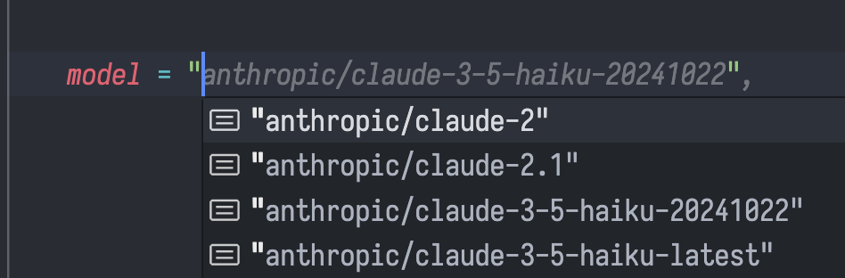

# **Generating LLM Completions**

```python
from xnano import completion
```

## **Introduction**

The [`completion`](#) function is the _'core'_ and beginning of the `xnano` library. It began as a simple wrapper around the [`LiteLLM`](https://github.com/BerriAI/litellm) completion method, using the [`Instructor`](https://github.com/jxnl/instructor) library to handle structured outputs. Since then it has been expanded to include a number of additional features.

## **Basic Usage**

The following examples will go over the simple uses of the `completion` function.

### __Generating a Completion with any [`LiteLLM`](https://github.com/BerriAI/litellm) Complatible Model__

```python
# Import the completion function
from xnano import completion

# Generate a completion
completion(
    messages = [
        {"role" : "system", "content" : "You are a helpful assistant, who only speaks in haiku."},
        {"role" : "user", "content" : "What is the weather in Tokyo?"},
    ],
    
    # Use any LiteLLM Compatible Model
    # Defaults to "openai/gpt-4o-mini"
    model = "anthropic/claude-3-5-haiku-latest",
)
```

<details>
    <summary>Output</summary>

```bash
ModelResponse(
    id='chatcmpl-cd564d79-78d8-417f-a22e-7ac50f7a2852',
    created=1732701410,
    model='claude-3-5-haiku-latest',
    object='chat.completion',
    system_fingerprint=None,
    choices=[
        Choices(
            finish_reason='stop',
            index=0,
            message=Message(
                content="Soft cherry blossoms\nWhisper of spring's gentle breath\nTokyo skies shine",
                role='assistant',
                tool_calls=None,
                function_call=None
            )
        )
    ],
    usage=Usage(
        completion_tokens=23,
        prompt_tokens=27,
        total_tokens=50,
        completion_tokens_details=None,
        prompt_tokens_details=PromptTokensDetailsWrapper(audio_tokens=None, cached_tokens=0, text_tokens=None, image_tokens=None),
        cache_creation_input_tokens=0,
        cache_read_input_tokens=0
    )
)
```
</details>

### __Passing Messages as a String__

One of the simple `ease-of-use` additions of the completion function is the ability to pass a string as a message. This will automatically be converted into a message with a `role` of `user`.

```python
from xnano import completion

completion(
    "What is the weather in Tokyo?"
)
```

## __Using Responses__

The response of the `completion` function returns a [`LiteLLM`](https://github.com/BerriAI/litellm) [`ModelResponse`](https://github.com/BerriAI/litellm/blob/main/litellm/types/utils.py) object. This object follows the same structure as the [`OpenAI`](#) [`ChatCompletion`](#) object, so it can be used in the same way.

Let's look at an example of how to access the response content:

```python
response_string = response.choices[0].message.content
```

If we were looking for tool calls, we could access them like this:

```python
response_tool_calls = response.choices[0].message.tool_calls
```

For a streamed response, the response object is a generator, so we would need to iterate over the `response` object to access the content.

```python
response_string = ""

for chunk in response:
    response_string += chunk.choices[0].delta.content
```

## __Simple Typing for Ease-Of-Use__

Some very simple ease-of-use additions that have been made to the `completion` function, is the addition of typing to most of the "_most common_" parameters, this allows for simple autocompletion and assistance during development.

<div class="grid cards" markdown>

- 

- 

</div>