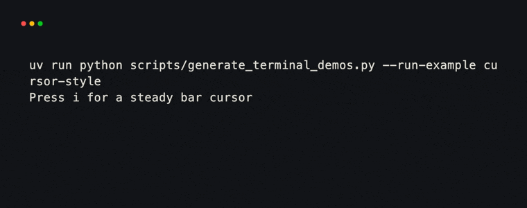
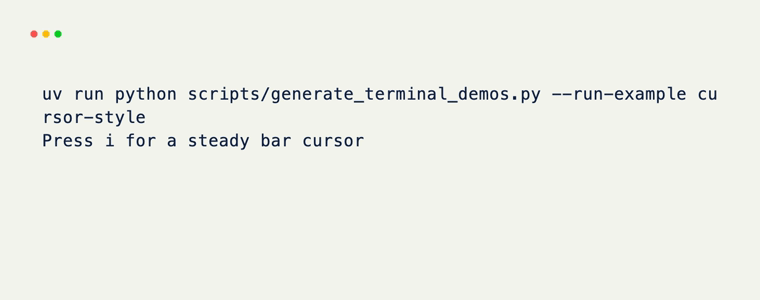
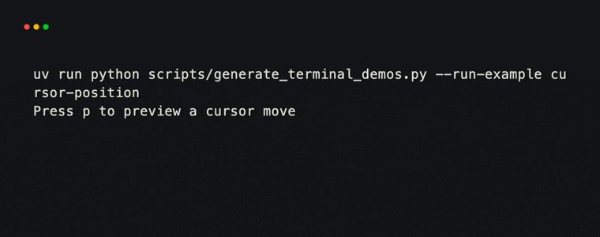
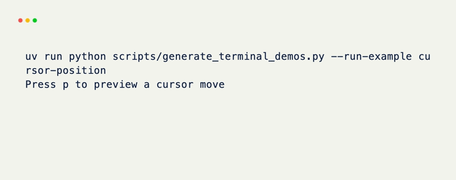

# Terminal cursor

`terminal.cursor` controls the terminal's live text cursor. It is created for
an active `Terminal`, and the same controller is available as `context.cursor`
inside hooks.

## Visibility and style

Set `visible` to show or hide the cursor. Set `style` to one of the supported
terminal cursor shapes:

| Style | Shape |
| --- | --- |
| `"default"` | Terminal default |
| `"blinking_block"`, `"steady_block"` | Block |
| `"blinking_underline"`, `"steady_underline"` | Underline |
| `"blinking_bar"`, `"steady_bar"` | Vertical bar |

```python title="cursor-style.py"
from xnano.hooks import on_keyboard


@on_keyboard("i")
def show_insert_cursor(context) -> None:
    context.cursor.visible = True
    context.cursor.style = "steady_bar"  # (1)!
```

1. Cursor style support depends on the terminal emulator. Unsupported styles
   may fall back to its default cursor.

<div class="xnano-demo" markdown>
{.demo-dark width="560"}
{.demo-light width="560"}
</div>

`enable_blinking()` and `disable_blinking()` change blinking without choosing
a new shape. Prefer a blinking or steady `style` when the shape and blink mode
should be set together.

## Position

Coordinates are zero-based: `(0, 0)` is the top-left cell of the terminal.
`get_position()` returns the current `(x, y)` coordinate.

```python title="cursor-position.py"
from xnano.hooks import on_keyboard


@on_keyboard("p")
def preview_cursor_position(context) -> None:
    context.cursor.save_position()       # (1)!
    context.cursor.move_to(4, 2)         # (2)!
    context.cursor.restore_position()    # (3)!
```

1. Store the current device cursor position.
2. Move to column `4`, row `2`.
3. Return to the stored position.

<div class="xnano-demo" markdown>
{.demo-dark width="560"}
{.demo-light width="560"}
</div>

Movement methods are also available when relative motion is clearer:

| Method | Movement |
| --- | --- |
| `move_up(count)`, `move_down(count)` | Rows relative to the cursor |
| `move_left(count)`, `move_right(count)` | Columns relative to the cursor |
| `move_to_column(x)`, `move_to_row(y)` | One absolute axis |
| `move_to_next_line(count)` | Down to the beginning of a line |
| `move_to_previous_line(count)` | Up to the beginning of a line |

The renderer owns the cursor while painting a frame. Direct movement is best
for a focused input, an integration with an external prompt, or work performed
between frames. A later repaint may place the cursor again.
