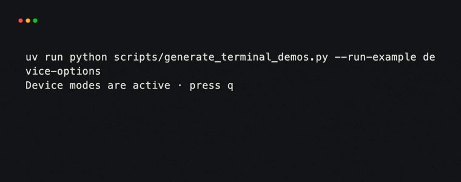
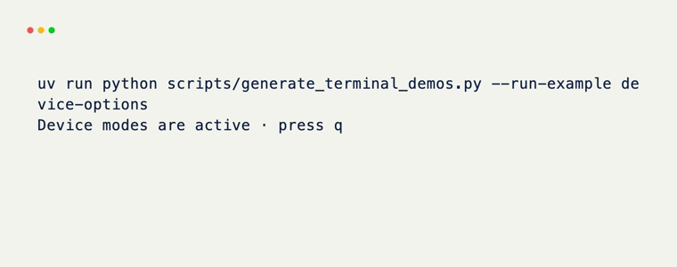
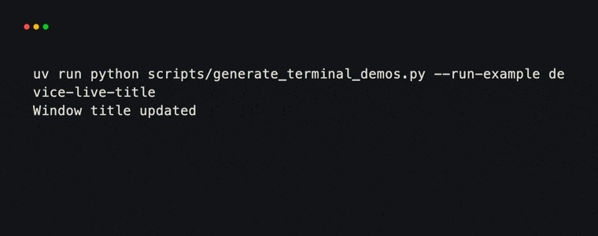
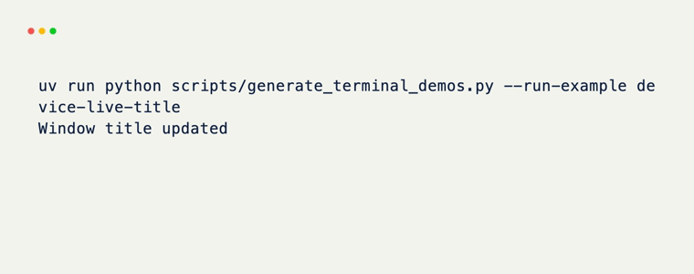
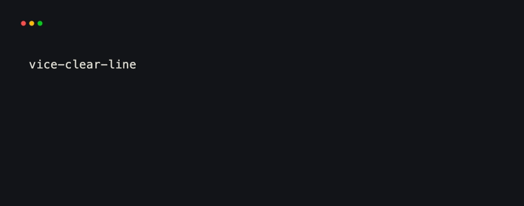
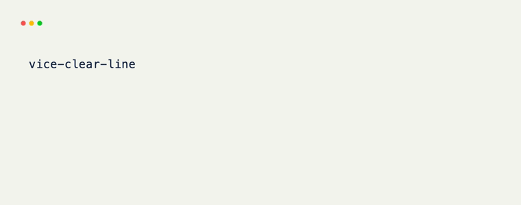

# Terminal device

`terminal.device` controls settings owned by the terminal emulator. It is
available only from a live `Terminal`; do not construct `TerminalDevice`
yourself.

For common settings, prefer the matching `Terminal` option. This lets xnano
enable the mode when the session starts and disable it during teardown.

```python title="device-options.py"
from xnano.tui import Terminal

with Terminal(
    title="Inspector",          # (1)!
    mouse_events=True,          # (2)!
    bracketed_paste=True,
    synchronized_updates=True,
) as terminal:
    terminal.run(App())
```

1. The initial title is applied when the native session opens.
2. Mouse capture is enabled for the session and restored afterward.

<div class="xnano-demo" markdown>
{.demo-dark width="560"}
{.demo-light width="560"}
</div>

## Change a live device

The device properties are readable and writable. Assigning a value changes
the native terminal immediately.

| Property | Effect when `True` |
| --- | --- |
| `raw_mode` | Sends input directly without line buffering |
| `alternate_screen` | Uses a separate full-screen buffer |
| `line_wrap` | Wraps text at the right edge |
| `mouse_capture` | Reports mouse input |
| `bracketed_paste` | Marks pasted text as a single paste sequence |
| `focus_change` | Reports terminal focus changes |
| `synchronized_updates` | Holds updates until the synchronized update ends |

Changing raw mode or the screen buffer while xnano is rendering can alter the
session it is managing. Reserve those properties for integrations that need
direct control. Runtime changes such as a title update are safe and useful:

```python title="live-title.py"
from xnano.events import on_keyboard


@on_keyboard("t")
def update_title(context) -> None:
    context.device.set_title("Tasks · updated")  # (1)!
```

1. `context.device` forwards to the same controller as
   `context.terminal.device`.

<div class="xnano-demo" markdown>
{.demo-dark width="560"}
{.demo-light width="560"}
</div>

## Clear and scroll

`clear()` accepts one of six regions:

| Value | Region cleared |
| --- | --- |
| `"all"` | Visible terminal |
| `"purge"` | Visible terminal and saved scrollback, when supported |
| `"from_cursor_down"` | Cursor through the bottom of the screen |
| `"from_cursor_up"` | Top of the screen through the cursor |
| `"current_line"` | Entire current line |
| `"until_new_line"` | Cursor through the end of the current line |

`scroll_up(count)` and `scroll_down(count)` scroll by terminal rows. These are
device operations, not layout scrolling. For scrollable application content,
keep the offset in state and render the visible rows from that state.

```python title="clear-line.py"
from xnano.events import on_keyboard


@on_keyboard("c")
def clear_current_line(context) -> None:
    context.device.clear("current_line")  # (1)!
    context.device.scroll_up(1)
```

1. A hook runs while the native terminal session is active.

<div class="xnano-demo" markdown>
{.demo-dark width="560"}
{.demo-light width="560"}
</div>
