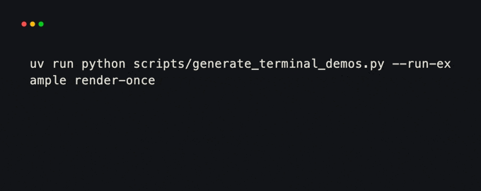
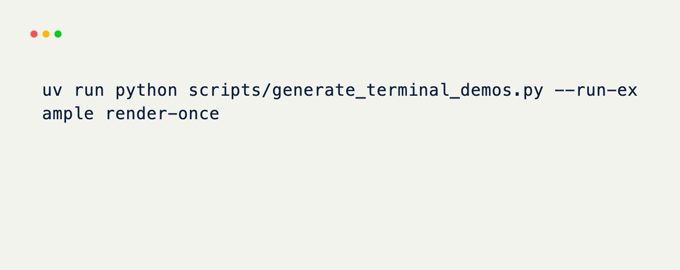
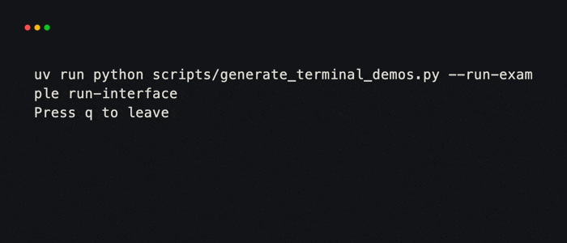
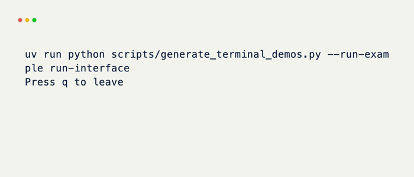
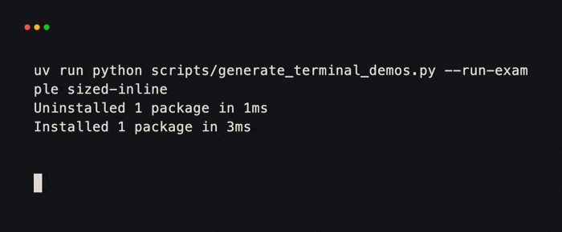
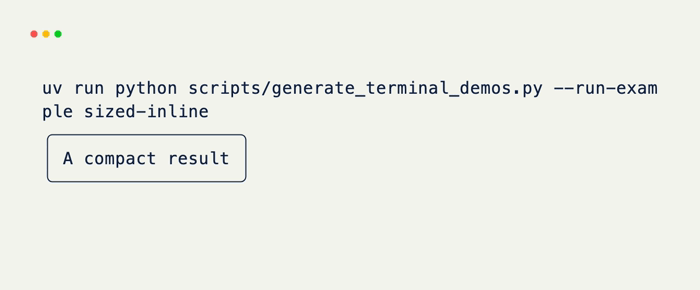
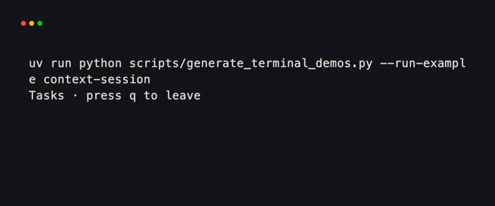
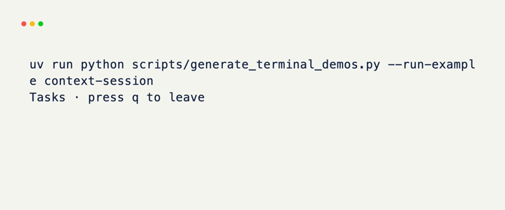

# Terminal

`Terminal` is the boundary between an xnano interface and the terminal that
displays it. It opens the native session, chooses a viewport, renders content,
dispatches events, and restores the terminal when the session ends.

Most programs need one `Terminal` and one of two methods:

=== "Render once"

    Use `render()` for a one-frame session result — a status message or command
    result that returns to the shell. The frame is only held while the process
    stays alive, so short scripts usually sleep after painting.

    For print-like output with no session, prefer
    `from xnano._renderable import render`.

    ```python title="status.py"
    import time

    from xnano.components.text import Text
    from xnano.tui import Terminal

    Terminal().render(
        Text("Build complete", color="emerald-400"),
        Text("12 tests passed", color="slate-400"),
        gap=1,
    )
    time.sleep(3)
    ```

    <div class="xnano-demo" markdown>
    {.demo-dark width="500"}
    {.demo-light width="500"}
    </div>

=== "Run an interface"

    Use `run()` when content must stay active and respond to keyboard, mouse,
    resize, or tick events.

    ```python title="app.py"
    from xnano.fields import Field
    from xnano.grid import BaseGrid
    from xnano.events import on_keyboard
    from xnano.tui import Terminal


    class App(BaseGrid):
        message: str = Field(default="Press q to leave")

        @on_keyboard("q")
        def close_app(self, context) -> None:
            context.terminal.request_exit()  # (1)!


    Terminal().run(App())
    ```

    1. `request_exit()` finishes the current loop iteration, then lets xnano
       restore the device cleanly.

    <div class="xnano-demo" markdown>
    {.demo-dark width="520"}
    {.demo-light width="520"}
    </div>

## Viewports and sizing

The content and `height` decide how the session attaches to the screen.

| Call | Default viewport |
| --- | --- |
| `Terminal().render(content)` | Inline and fitted to the content |
| `Terminal().run(content)` | Inline and fitted to non-grid content |
| `Terminal().run(grid)` | Full screen |
| `Terminal(height=8).run(content)` | An eight-row inline viewport |

`width` controls the root box inside that viewport. It accepts the same sizing
forms as fields, including cell counts, `"fit"`, percentages, and fractions.
A grid has no intrinsic height, so `height="fit"` on a grid falls back to the
full screen and emits a warning. Use a fixed height for an inline grid.

```python title="sized.py"
import time

from xnano.tui import Terminal

Terminal(width=36, height=3).render(
    "A compact result",
    border="rounded",  # (1)!
    padding=(0, 1),
)
time.sleep(3)
```

1. Styling passed to `render()` or `run()` wraps non-grid content in the same
   field styling used by a grid.

<div class="xnano-demo" markdown>
{.demo-dark width="520"}
{.demo-light width="520"}
</div>

## Session options

Options on `Terminal` configure the whole session:

| Option | Purpose |
| --- | --- |
| `state` | Makes one application state object available to every context |
| `title` | Sets the terminal window title when the session opens |
| `mouse_events` | Enables mouse event delivery |
| `bracketed_paste` | Enables paste events as one bracketed input |
| `synchronized_updates` | Groups screen updates on terminals that support it |
| `tick_interval` | Sets the minimum interval between ticks in milliseconds |

Use a context manager when code needs access to the live terminal before or
after `run()`. Calling `run()` or `render()` directly also enters and restores
the session automatically.

```python title="session.py"
from xnano.tui import Terminal

with Terminal(title="Tasks", mouse_events=True) as terminal:
    terminal.run(App())
```

<div class="xnano-demo" markdown>
{.demo-dark width="540"}
{.demo-light width="540"}
</div>

## Tools available during a session

<div class="grid cards" markdown>

-   :fontawesome-solid-i-cursor: **[Cursor](cursor.md)**

    Control visibility, shape, and position of the live cursor.

-   :material-monitor-dashboard: **[Device](device.md)**

    Control terminal modes, screen clearing, scrolling, and the window title.

</div>

For automated rendering tests, `Terminal.offscreen(cols=..., rows=...)`
creates an in-memory session. After rendering, `get_output()` returns the
buffer as text.
